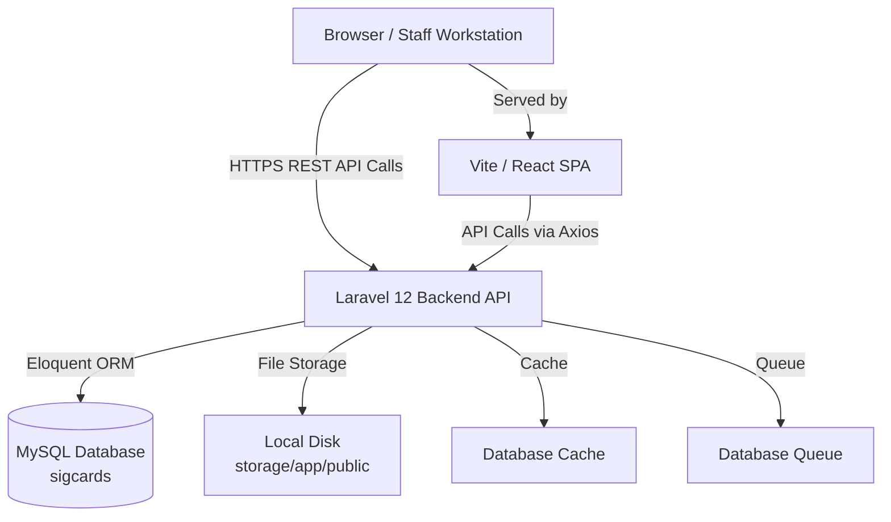
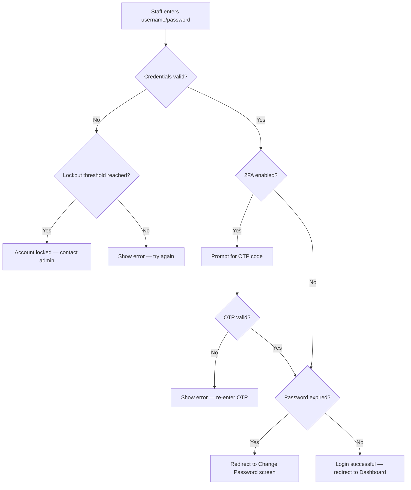
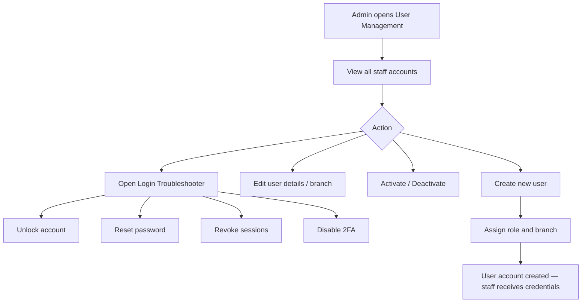
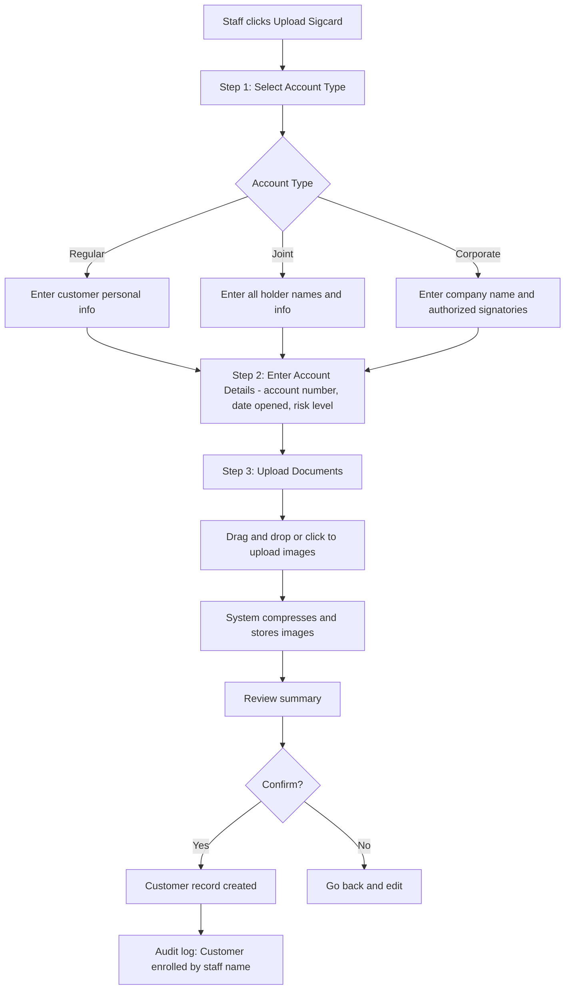
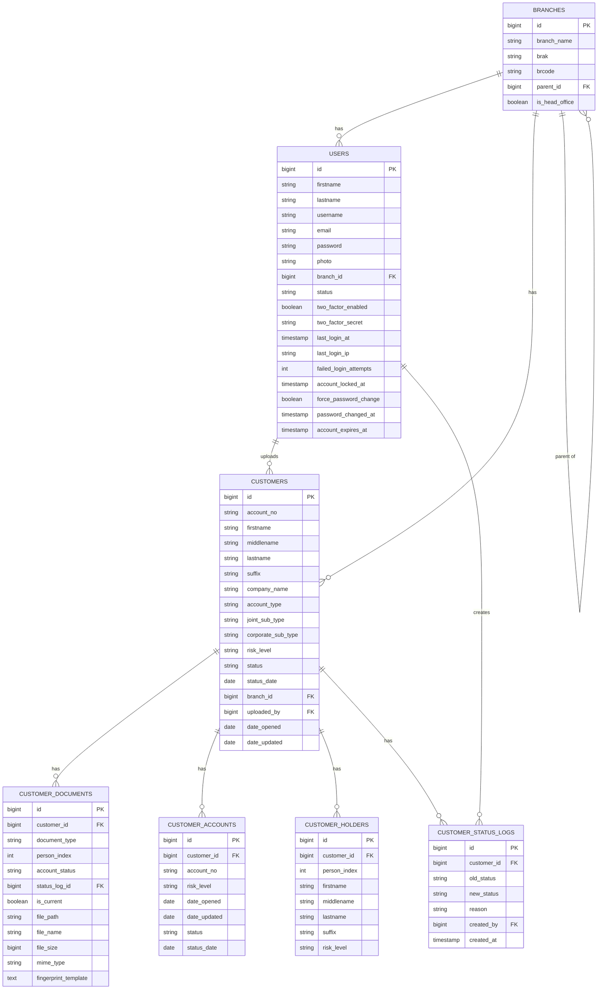
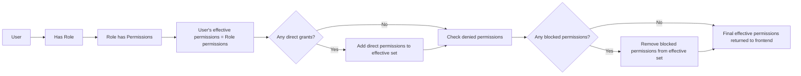
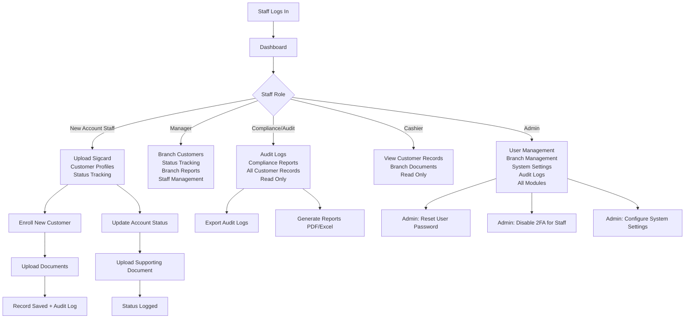

# SYSTEM DOCUMENTATION

---

## DIGICUR — Digital Signature Card Management System

---

| Field | Details |
|---|---|
| **System Name** | DIGICUR — Digital Signature Card Management System |
| **Version** | 1.0.0 |
| **Prepared By** | Systems Documentation Unit |
| **Date** | June 2, 2026 |
| **Organization** | RBT Bank Inc. (Rural Bank of Talisayan, Misamis Oriental, Philippines) |
| **Classification** | Internal — Confidential |

---

## Document Control

### Version History

| Version | Date | Author | Description |
|---|---|---|---|
| 1.0.0 | June 2, 2026 | Systems Documentation Unit | Initial release — full system documentation |

### Approval Information

| Role | Name | Signature | Date |
|---|---|---|---|
| IT Administrator | _Information Required_ | __________________ | __________ |
| Branch Manager | _Information Required_ | __________________ | __________ |
| Compliance Officer | _Information Required_ | __________________ | __________ |
| BSP Authorized Signatory | _Information Required_ | __________________ | __________ |

---

## Table of Contents

- [Chapter 1: Introduction](#chapter-1-introduction)
- [Chapter 2: System Overview](#chapter-2-system-overview)
- [Chapter 3: User Roles and Permissions](#chapter-3-user-roles-and-permissions)
- [Chapter 4: System Requirements](#chapter-4-system-requirements)
- [Chapter 5: Installation and Deployment Guide](#chapter-5-installation-and-deployment-guide)
- [Chapter 6: System Modules](#chapter-6-system-modules)
- [Chapter 7: User Guide](#chapter-7-user-guide)
- [Chapter 8: Database Design](#chapter-8-database-design)
- [Chapter 9: Security](#chapter-9-security)
- [Chapter 10: Reports](#chapter-10-reports)
- [Chapter 11: Backup and Recovery](#chapter-11-backup-and-recovery)
- [Chapter 12: Maintenance](#chapter-12-maintenance)
- [Chapter 13: Troubleshooting Guide](#chapter-13-troubleshooting-guide)
- [Chapter 14: Frequently Asked Questions](#chapter-14-frequently-asked-questions)
- [Chapter 15: Change Log](#chapter-15-change-log)
- [Appendices](#appendices)

---

## Chapter 1: Introduction

### 1.1 Purpose

This document is the official System Documentation for **DIGICUR** — the Digital Signature Card Management System of **RBT Bank Inc.** (Rural Bank of Talisayan, Misamis Oriental, Philippines). It provides a complete technical and functional reference for the design, configuration, operation, and maintenance of the system.

This document is intended to serve as the primary reference for all stakeholders involved in the operation, administration, audit, and compliance review of DIGICUR.

### 1.2 Scope

This documentation covers:

- Full system architecture and technology stack
- All user roles, permissions, and access levels
- All functional modules and their business rules
- Database design and entity relationships
- Security controls, authentication, and audit mechanisms
- Installation, deployment, and configuration procedures
- Step-by-step user guides for all roles
- Reporting capabilities and compliance features
- Backup, recovery, and maintenance procedures
- Troubleshooting and support reference

This documentation applies to all environments: **Development**, **Staging**, and **Production**.

### 1.3 Objectives

The objectives of DIGICUR are:

1. To digitize and centrally manage signature cards (sigcards) and related account-opening documents for all branches of RBT Bank Inc.
2. To enforce BSP-compliant controls over document handling, account status tracking, and audit trail generation.
3. To provide role-based access control (RBAC) that restricts system access to authorized personnel only.
4. To maintain a complete, tamper-evident audit log of all actions performed in the system.
5. To support compliance review by BSP examiners and internal compliance officers through structured reporting and log export.
6. To reduce paper-based document risk by storing digitized signature card images securely on the bank's servers.

### 1.4 Intended Audience

| Audience | Use of This Document |
|---|---|
| **Bank Management** | System overview, capabilities, benefits |
| **Branch Managers** | User guide, role capabilities, reporting |
| **New Account Staff (Users)** | User guide for customer enrollment and document upload |
| **Cashiers** | User guide for branch-scoped customer record access |
| **Compliance Officers** | Compliance module, audit logs, reports, security |
| **IT Administrators** | Full technical reference, installation, maintenance |
| **BSP Examiners / Auditors** | Security controls, audit trail, compliance reports |
| **Developers** | API reference, database design, architecture |

### 1.5 Definitions and Acronyms

| Term | Definition |
|---|---|
| **DIGICUR** | Digital Signature Card Management System — the internal name of this system |
| **Sigcard** | Signature Card — a physical/digital document bearing a depositor's signature, required by BSP for account opening |
| **BSP** | Bangko Sentral ng Pilipinas — the central bank of the Philippines, the primary regulator of rural banks |
| **NAIS** | New Account Information Sheet — a BSP-required document collected at account opening |
| **RBAC** | Role-Based Access Control — restricting system access based on assigned roles |
| **2FA / TOTP** | Two-Factor Authentication / Time-Based One-Time Password — a second security layer requiring a 6-digit code from an authenticator app |
| **API** | Application Programming Interface — the communication layer between the frontend and backend |
| **JWT / Token** | JSON Web Token / Bearer Token — the credential used to authenticate API requests after login |
| **Sanctum** | Laravel Sanctum — the authentication package used for token-based API security |
| **Spatie** | Third-party Laravel package provider used for RBAC (laravel-permission) and audit logging (activitylog) |
| **ERD** | Entity Relationship Diagram — a visual map of database table relationships |
| **Dormant** | A bank account with no customer-initiated transactions for a regulatory period |
| **Escheat** | Transfer of dormant unclaimed funds to the BSP under Unclaimed Balances Law |
| **ITF** | In Trust For — a joint account type where one party holds assets for another (typically a minor) |
| **RBT Bank** | Rural Bank of Talisayan — the operating bank institution |
| **HO** | Head Office — the main administrative branch of the bank |
| **SPA** | Single Page Application — the React-based frontend architecture used by DIGICUR |
| **OTP** | One-Time Password — the 6-digit code generated by an authenticator app for 2FA |

---

## Chapter 2: System Overview

### 2.1 System Description

DIGICUR is a web-based, multi-branch signature card management system built specifically for RBT Bank Inc. It replaces the manual, paper-based process of storing and retrieving depositor signature cards with a centralized, secure digital platform accessible from any authorized device within the bank's network.

The system manages the full lifecycle of customer accounts and their associated BSP-required documents — from initial enrollment and document upload, through account status changes (active, dormant, escheat, closed, reactivated), to compliance reporting and audit trail generation.

### 2.2 Business Purpose

RBT Bank Inc. is a BSP-supervised rural bank operating across multiple branches in Misamis Oriental, Philippines. The bank is required to:

- Maintain physical or digital signature cards for every depositor account
- Produce these records on demand during BSP examinations
- Track account status changes with supporting documentation
- Maintain an audit trail of who accessed or modified which records
- Report dormant and escheated accounts in accordance with BSP regulations

DIGICUR fulfills all of these requirements in a single, integrated platform.

### 2.3 Key Features

| Feature | Description |
|---|---|
| **Multi-Branch Support** | 11 branches supported; each branch's data is scoped to authorized staff |
| **Role-Based Access Control** | 6 distinct roles with granular permission management |
| **Document Upload & Management** | Upload, view, and replace sigcards, NAIS forms, privacy consent documents |
| **Account Type Support** | Regular, Joint (ITF and Non-ITF), Corporate (Corporate and Sole Proprietorship) |
| **Account Status Tracking** | Active, Dormant, Escheat, Closed, Reactivated — with supporting document upload |
| **Thumbmark Search** | Biometric-assisted customer search by fingerprint image on the sigcard front |
| **Two-Factor Authentication** | TOTP-based 2FA for all staff accounts using any standard authenticator app |
| **Audit Logging** | Full BSP-compliant tamper-evident activity log for all system actions |
| **Compliance Reports** | Exportable reports with branch-level and system-level summaries |
| **Admin System Settings** | Configurable session timeout, password policy, login attempt limits |
| **Dynamic Branding** | System name and logo configurable from admin settings |
| **PDF / Excel Export** | Reports exportable to PDF and Excel formats |

### 2.4 Benefits

| Benefit | Impact |
|---|---|
| **Centralized Document Storage** | No more physical file room searching — any authorized staff finds documents in seconds |
| **BSP Compliance** | Audit trails, status documentation, and report exports directly support BSP examination readiness |
| **Access Control** | Only authorized personnel access customer records; all actions are logged |
| **Reduced Risk** | Digital storage eliminates fire, flood, and misplacement risk for physical sigcard documents |
| **Branch Isolation** | Cashiers and branch users see only their branch's customers |
| **Faster Account Processing** | Staff process account enrollments and status changes entirely through the system |

### 2.5 System Architecture Overview

DIGICUR follows a **decoupled client-server architecture**:



| Layer | Technology | Purpose |
|---|---|---|
| **Frontend** | React 19 + Vite 7 + Tailwind CSS 4 | User interface (SPA) |
| **Backend** | Laravel 12 (PHP) | REST API, business logic, authentication |
| **Database** | MySQL | Persistent data storage |
| **Authentication** | Laravel Sanctum | Token-based API authentication |
| **Authorization** | Spatie Laravel Permission | Role and permission management |
| **Audit Logging** | Spatie Laravel ActivityLog | BSP-compliant audit trail |
| **Image Processing** | Intervention Image 3 | Sigcard image compression and processing |
| **HTTP Client** | Axios | Frontend-to-API communication |
| **State Management** | TanStack Query (React Query) | Server state caching and synchronization |
| **Charts** | ApexCharts + Chart.js | Dashboard analytics visualizations |
| **PDF Export** | jsPDF + jsPDF-AutoTable | Report PDF generation |
| **Excel Export** | XLSX / XLSX-JS-Style | Report Excel generation |

---

## Chapter 3: User Roles and Permissions

### 3.1 Role Overview

DIGICUR implements six (6) distinct user roles. Each role has a defined scope of access and a specific set of permissions.

| Role | Code | Layout | Scope | Typical User |
|---|---|---|---|---|
| **Administrator** | `admin` | Sidebar (AppLayout) | Full system access | IT Administrator |
| **Manager** | `manager` | Top Navigation | Branch-level management | Branch Manager |
| **New Account Staff** | `user` | Top Navigation (UserLayout) | Customer enrollment & docs | New Account Clerk |
| **Cashier** | `cashier` | Top Navigation | Read-only branch customer view | Teller / Cashier |
| **Compliance/Audit Officer** | `compliance-audit` | Sidebar | Read-only compliance view | Compliance Officer |
| **Audit** | `audit` | Sidebar | Read-only audit view | Internal/External Auditor |

### 3.2 Permission Matrix

The table below summarizes the access level of each role across the major system functions.

| Function | Admin | Manager | User | Cashier | Compliance | Audit |
|---|---|---|---|---|---|---|
| **Login / Logout** | ✅ | ✅ | ✅ | ✅ | ✅ | ✅ |
| **2FA Setup** | ✅ | ✅ | ✅ | ✅ | ✅ | ✅ |
| **View Own Profile** | ✅ | ✅ | ✅ | ✅ | ✅ | ✅ |
| **Change Own Password** | ✅ | ✅ | ✅ | ✅ | ✅ | ✅ |
| **View Dashboard** | ✅ | ✅ | ✅ | ✅ | ✅ | ✅ |
| **Enroll New Customer** | ✅ | ✅ | ✅ | ❌ | ❌ | ❌ |
| **Upload Sigcard Documents** | ✅ | ✅ | ✅ | ❌ | ❌ | ❌ |
| **View Customer Records** | ✅ All | ✅ Branch | ✅ Branch | ✅ Branch | ✅ All | ✅ All |
| **Edit Customer Information** | ✅ | ✅ | ✅ | ❌ | ❌ | ❌ |
| **Update Account Status** | ✅ | ✅ | ✅ | ❌ | ❌ | ❌ |
| **Replace Documents** | ✅ | ✅ | ✅ | ❌ | ❌ | ❌ |
| **Delete Customer / Documents** | ✅ | ❌ | ❌ | ❌ | ❌ | ❌ |
| **View Branch Documents** | ✅ | ✅ | ❌ | ✅ | ✅ | ✅ |
| **Manage Users** | ✅ | ✅ Limited | ❌ | ❌ | ❌ | ❌ |
| **Reset User Passwords** | ✅ | ✅ | ❌ | ❌ | ❌ | ❌ |
| **Disable User 2FA** | ✅ | ❌ | ❌ | ❌ | ❌ | ❌ |
| **Manage Roles & Permissions** | ✅ | ❌ | ❌ | ❌ | ❌ | ❌ |
| **View Audit Logs** | ✅ | ❌ | ❌ | ❌ | ✅ | ✅ |
| **Export Audit Logs** | ✅ | ❌ | ❌ | ❌ | ✅ | ✅ |
| **View Compliance Reports** | ✅ | ✅ | ❌ | ❌ | ✅ | ✅ |
| **Generate Reports** | ✅ | ✅ | ❌ | ❌ | ✅ | ✅ |
| **Manage System Settings** | ✅ | ❌ | ❌ | ❌ | ❌ | ❌ |
| **Manage Branches** | ✅ | ❌ | ❌ | ❌ | ❌ | ❌ |
| **Thumbmark Search** | ✅ | ✅ | ✅ | ✅ | ✅ | ✅ |

### 3.3 Role Descriptions

#### Administrator

The Administrator has unrestricted access to all system functions. This role is intended for the IT Administrator or designated System Administrator of the bank.

**Responsibilities:**
- Create, update, activate, deactivate, and delete staff user accounts
- Assign and manage roles and permissions
- Configure system-wide settings (session timeout, password policy, branding)
- Manage branch records
- Monitor audit logs and security events
- Reset staff passwords and 2FA
- Perform system backup and restore

**Restrictions:** None — this role has full access to the entire system.

#### Manager

The Manager role is designed for Branch Managers. They oversee branch-level operations and have authority to manage customer records and approve actions within their branch.

**Responsibilities:**
- View and manage customer records for their branch
- Enroll new customers and upload documents
- Update account statuses with supporting documentation
- Generate branch-level compliance reports
- Activate, deactivate, unlock, or reset passwords of branch staff

**Restrictions:**
- Cannot manage system-wide settings
- Cannot manage roles or global permissions
- Cannot view audit logs (compliance-only)
- Cannot delete customers

#### User (New Account Staff)

The User role is assigned to New Account Staff or Customer Associates responsible for the frontline customer enrollment process.

**Responsibilities:**
- Enroll new customers using the Upload Sigcard wizard
- Upload sigcard images and related documents
- View and edit customer records within their branch
- Update account status (with required supporting document)

**Restrictions:**
- Cannot manage other staff accounts
- Cannot view audit logs or compliance reports
- Cannot delete customer records or documents permanently
- Cannot access other branches' records

#### Cashier

The Cashier role provides a read-only view of customer records for branch tellers. Cashiers can look up customer information but cannot modify any records.

**Responsibilities:**
- Look up customer records by name or account number
- View sigcard documents for identity verification during transactions
- View branch document index

**Restrictions:**
- Cannot enroll new customers
- Cannot upload, edit, or replace any documents
- Cannot update account status
- Cannot access records from other branches

#### Compliance/Audit Officer

This role provides read-only access to all customer records, audit logs, and compliance reports across all branches. Intended for the bank's internal compliance officer.

**Responsibilities:**
- Review audit logs for all system actions
- Generate and export compliance reports
- View customer records across all branches for examination
- Monitor security events and login attempts

**Restrictions:**
- Read-only access — cannot create, edit, or delete any customer records
- Cannot manage users, roles, or system settings

#### Audit

Similar to the Compliance role, the Audit role is for internal or external auditors requiring read-only access to records and logs.

**Responsibilities:**
- Review audit logs
- View compliance reports
- View customer records for audit sampling

**Restrictions:** Same as Compliance — read-only throughout the system.

---

## Chapter 4: System Requirements

### 4.1 Hardware Requirements

#### Server Requirements (Production)

| Component | Minimum | Recommended |
|---|---|---|
| **Processor** | Dual-core 2.0 GHz | Quad-core 2.5 GHz or higher |
| **Memory (RAM)** | 4 GB | 8 GB or higher |
| **Storage** | 50 GB HDD | 200 GB SSD (for document storage growth) |
| **Network** | 10 Mbps LAN | 100 Mbps LAN with UPS-protected switch |
| **Operating System** | Ubuntu 22.04 LTS / Windows Server 2019 | Ubuntu 22.04 LTS |

> **Note:** Storage requirements will grow over time as scanned document images accumulate. Plan for approximately 500 KB–2 MB per customer record (sigcard images compressed). For 10,000 customers, estimate 5–20 GB of document storage.

#### Client Workstation Requirements

| Component | Minimum |
|---|---|
| **Processor** | Intel Core i3 or equivalent |
| **Memory (RAM)** | 4 GB |
| **Display** | 1366 × 768 resolution |
| **Network** | Connected to the bank's local area network (LAN) |

### 4.2 Software Requirements

#### Server Software

| Software | Version | Purpose |
|---|---|---|
| **PHP** | 8.2 or higher | Laravel backend runtime |
| **Laravel** | 12.x | Backend framework |
| **MySQL** | 8.0 or higher | Database server |
| **Composer** | 2.x | PHP dependency manager |
| **Node.js** | 18.x or higher | Frontend build tool runtime |
| **NPM** | 9.x or higher | Frontend package manager |
| **Nginx / Apache** | Latest stable | Web server / reverse proxy |

#### Client Browser Requirements

| Browser | Minimum Version |
|---|---|
| **Google Chrome** | 100 or higher (Recommended) |
| **Microsoft Edge** | 100 or higher |
| **Mozilla Firefox** | 100 or higher |
| **Safari** | 15 or higher |

> **Note:** Internet Explorer is **not supported**. Staff workstations should have Google Chrome or Microsoft Edge installed.

#### Authenticator App (for 2FA)

| App | Platform |
|---|---|
| **Google Authenticator** | Android, iOS |
| **Microsoft Authenticator** | Android, iOS |
| **Authy** | Android, iOS, Desktop |
| **Any TOTP-compatible app** | RFC 6238 compliant |

---

## Chapter 5: Installation and Deployment Guide

### 5.1 Prerequisites

Before installation, ensure the following are available:

- [ ] PHP 8.2+ installed with extensions: `pdo_mysql`, `mbstring`, `openssl`, `tokenizer`, `xml`, `ctype`, `json`, `bcmath`, `gd`
- [ ] MySQL 8.0+ running and accessible
- [ ] Composer 2.x installed globally
- [ ] Node.js 18+ and NPM installed
- [ ] A web server (Nginx recommended) configured
- [ ] An empty MySQL database created (e.g., `sigcards`)
- [ ] A database user with full privileges on the `sigcards` database

### 5.2 Backend Setup

```bash
# 1. Navigate to the backend directory
cd /var/www/sigcard/backend

# 2. Install PHP dependencies
composer install --no-dev --optimize-autoloader

# 3. Copy the environment file
cp .env.example .env

# 4. Generate application encryption key
php artisan key:generate

# 5. Edit .env — set database credentials, URLs, and settings
nano .env
```

**Required `.env` values to configure:**

```ini
APP_NAME=DIGICUR
APP_ENV=production
APP_DEBUG=false
APP_URL=https://your-server-domain.com/api

FRONTEND_URL=https://your-server-domain.com

DB_CONNECTION=mysql
DB_HOST=127.0.0.1
DB_PORT=3306
DB_DATABASE=sigcards
DB_USERNAME=your_db_user
DB_PASSWORD=your_secure_password

SESSION_DRIVER=database
CACHE_STORE=database
QUEUE_CONNECTION=database

SANCTUM_STATEFUL_DOMAINS=your-server-domain.com
```

### 5.3 Database Setup

```bash
# Run all migrations (creates all tables)
php artisan migrate

# Seed initial data (roles, permissions, branches, test users)
php artisan db:seed

# Create storage symlink for file access
php artisan storage:link
```

### 5.4 Frontend Setup

```bash
# Navigate to frontend directory
cd /var/www/sigcard/frontend

# Copy the environment file
cp .env.example .env

# Edit the frontend .env
nano .env
```

**Required frontend `.env` values:**

```ini
VITE_API_URL=https://your-server-domain.com/api
```

```bash
# Install Node dependencies
npm install

# Build for production
npm run build
```

The built files will be in `frontend/dist/`. Serve this directory as the web root.

### 5.5 Web Server Configuration (Nginx)

```nginx
server {
    listen 80;
    server_name your-server-domain.com;
    root /var/www/sigcard/frontend/dist;
    index index.html;

    # Frontend — React SPA
    location / {
        try_files $uri $uri/ /index.html;
    }

    # Backend API
    location /api {
        proxy_pass http://127.0.0.1:8000;
        proxy_set_header Host $host;
        proxy_set_header X-Real-IP $remote_addr;
    }

    # File storage
    location /storage {
        alias /var/www/sigcard/backend/storage/app/public;
    }
}
```

### 5.6 Queue Worker (for background jobs)

```bash
# Start the queue worker (use a process manager like Supervisor in production)
php artisan queue:work --sleep=3 --tries=3
```

### 5.7 Verification Procedures

After deployment, verify the following:

- [ ] Navigate to the login page — it loads without errors
- [ ] Log in with `admin@sigcard.com` using the seeded admin password
- [ ] Verify the Admin Dashboard loads and shows branch/user counts
- [ ] Navigate to System Settings and confirm the app name shows as "DIGICUR"
- [ ] Upload a test customer sigcard document and confirm it saves
- [ ] Check Audit Logs to confirm the upload action was recorded
- [ ] Log out and confirm the session is terminated

---

## Chapter 6: System Modules

### 6.1 Authentication Module

#### Description

The Authentication Module controls all login, logout, session management, and two-factor authentication functions. It is the security gateway to the entire system.

#### Features

- Username/email and password login
- Time-based One-Time Password (TOTP) two-factor authentication
- Session auto-expiry based on admin-configured timeout
- Automatic token refresh while the user is active
- Account lockout after configurable number of failed attempts
- Force password change on first login or after admin reset
- Password expiry enforcement (configurable)

#### Business Rules

1. A staff member must have an active account (`status = active`) to log in.
2. A suspended or inactive account cannot log in and is shown an appropriate message.
3. After a configurable number of failed login attempts (default: 5), the account is locked and must be unlocked by an admin or manager.
4. If 2FA is enabled on an account, the user must provide the correct 6-digit OTP after entering their password.
5. Sessions expire after the configured timeout period of inactivity. The user is automatically logged out.
6. If a staff member's password has expired (based on admin-set password expiry days), they are forced to change it before accessing the system.

#### Workflow



#### Inputs

- Email or username
- Password
- OTP code (if 2FA is enabled)

#### Outputs

- Authentication token (stored in browser)
- User session established
- Audit log entry: "User logged in"

#### Validation Rules

| Field | Rule |
|---|---|
| Email/Username | Required, must match an existing active user account |
| Password | Required, minimum 8 characters, must contain uppercase, lowercase, number, special character |
| OTP | Required if 2FA enabled; must be a valid 6-digit TOTP code within the 30-second window |

---

### 6.2 User Management Module

#### Description

The User Management Module allows Administrators (and Managers with limited scope) to manage staff accounts. This includes creating accounts, assigning roles, locking/unlocking accounts, and resolving login issues.

#### Features

- Create, edit, activate, deactivate, and delete staff accounts
- Assign branches to staff accounts
- Assign and manage roles and permissions
- Login Troubleshooter: unlock accounts, revoke sessions, reset passwords, disable 2FA
- Security column showing online status, 2FA status, and active session count
- Online Now tab — shows which staff are currently logged in
- User-specific permission blocking (deny individual permissions from a role)

#### Business Rules

1. Each staff account must be assigned to exactly one branch.
2. Each staff account must have exactly one role assigned.
3. An admin can grant additional individual permissions to a user beyond their role, or block specific permissions that their role normally grants.
4. Only Admins can disable a user's 2FA (for account recovery when the user has lost their authenticator app).
5. Deleted users are removed from the system. All their actions remain in the audit log.
6. A user's `force_password_change` flag is automatically set when an admin resets their password, requiring them to set a new password on next login.

#### Workflow



#### Inputs

- First name, last name, username, email, password
- Branch assignment
- Role assignment
- Status (active / inactive / suspended)

#### Outputs

- Staff account created or updated
- Audit log entry for every change
- Email notification (if mail configured)

---

### 6.3 Customer Management Module

#### Description

The Customer Management Module is the core operational module of DIGICUR. It handles the complete lifecycle of depositor accounts — enrollment, document management, status changes, and account additions.

#### Features

- Customer enrollment wizard (Upload Sigcard) supporting three account types
- View, search, and filter customer records by name, account number, branch, status, account type, risk level
- Edit customer personal information
- Upload, view, and replace signature card documents
- Update account status with mandatory supporting document
- Add multiple linked accounts to a customer profile
- Joint account holder management (for Joint accounts)
- Corporate account management with company name
- Thumbmark biometric search

#### Account Types

| Type | Sub-types | Description |
|---|---|---|
| **Regular** | — | Single individual depositor account |
| **Joint** | ITF, Non-ITF | Two or more depositors sharing an account; ITF = In Trust For (one party is typically a minor) |
| **Corporate** | Corporate, Sole Proprietorship | Business entity account; Sole Proprietorship includes the proprietor's name |

#### Account Status Values

| Status | Meaning |
|---|---|
| **Active** | Account is in good standing |
| **Dormant** | No customer-initiated transactions for the regulatory period |
| **Escheat** | Dormant funds transferred to BSP under the Unclaimed Balances Law |
| **Closed** | Account permanently closed |
| **Reactivated** | Previously dormant or closed account restored to active status |

#### Business Rules

1. Every customer enrollment must include at minimum: a Sigcard Front image and account information.
2. Changing an account status from Active requires uploading a supporting document (e.g., BSP form for dormancy declaration).
3. The status change history is permanently recorded in the Status Log — it cannot be deleted.
4. Joint accounts require information for all account holders (minimum 2).
5. ITF accounts require designation of the beneficiary (the "For" party).
6. Corporate sub-type "Sole Proprietorship" requires the proprietor's name.
7. Each customer may have multiple linked accounts (e.g., savings + time deposit).
8. A customer record cannot be deleted if it has associated documents — documents must be removed first (Admin only).

#### Document Types per Account Type

| Document | Regular | Joint | Corporate |
|---|---|---|---|
| Sigcard Front | ✅ Required | ✅ Per holder | ✅ Required |
| Sigcard Back | Optional | Optional per holder | Optional |
| NAIS Front | Optional | Optional | Optional |
| NAIS Back | Optional | Optional | Optional |
| Privacy Consent Front | Optional | Optional | Optional |
| Privacy Consent Back | Optional | Optional | Optional |
| Status Documents | When status changes | When status changes | When status changes |

#### Workflow — New Customer Enrollment



#### Inputs

- Customer name (first, middle, last, suffix)
- Account number, date opened, date updated
- Account type and sub-type
- Risk level (Low, Medium, High)
- Branch assignment
- Document images (JPEG, PNG, PDF)
- Joint holder details (if Joint account)
- Company name (if Corporate)

#### Outputs

- Customer record saved in the database
- Documents stored on server (compressed)
- Customer profile accessible to authorized staff
- Audit log entry

#### Validation Rules

| Field | Rule |
|---|---|
| First Name | Required |
| Last Name | Required |
| Account Number | Required, alphanumeric |
| Date Opened | Required, valid date |
| Account Type | Required, must be Regular, Joint, or Corporate |
| Risk Level | Required, must be Low Risk, Medium Risk, or High Risk |
| Branch | Required |
| Sigcard Front | Required for enrollment; must be image or PDF file |
| Document File Size | Maximum 10 MB per file |

---

### 6.4 Branch Management Module

#### Description

The Branch Management Module allows the Administrator to manage the bank's branch records. Branch assignments control which customers and staff are visible to each user.

#### Features

- Create, edit, and delete branch records
- View branch hierarchy (parent-child relationships for sub-branches)
- Mark a branch as Head Office (excluded from operational branch lists)
- Branch abbreviation (brak) and numeric code (brcode) management

#### Branches (Seeded)

| Branch Name | Abbreviation | Code |
|---|---|---|
| Head Office | HO | 00 |
| Branch 1 | (per seeder) | 01 |
| Branch 2–10 | (per seeder) | 02–10 |
| Claveria BLU | Claveria-BLU | 10 |

> **Note:** Head Office (`is_head_office = true`) is excluded from branch selection dropdowns for customer assignments, as no customer accounts are filed at the Head Office.

#### Business Rules

1. Each branch must have a unique abbreviation (brak) and a unique numeric code (brcode).
2. The Head Office branch cannot be selected as a customer's branch.
3. Deleting a branch is blocked if users or customers are assigned to it.
4. A branch may have a parent branch (for sub-branch hierarchy reporting).

---

### 6.5 System Settings Module

#### Description

The System Settings Module allows the Administrator to configure system-wide behavior, security policies, and branding without modifying code.

#### Configurable Settings

| Setting | Description | Default |
|---|---|---|
| **System Name** | Full name of the system displayed on screen | DIGICUR |
| **System Abbreviation** | Short name shown in navigation and footer | DIGICUR |
| **System Logo** | Uploaded image used on login screen and navbar | Bank default logo |
| **Session Timeout** | Minutes of inactivity before auto-logout | 120 minutes |
| **Token Expiration** | API token lifetime in minutes | 120 minutes |
| **Max Login Attempts** | Failed attempts before account lockout | 5 |
| **Password Expiry Enabled** | Whether passwords have an expiry period | Disabled |
| **Password Expiry Days** | Days before a password must be changed | 90 days |

#### Business Rules

1. Changes to session timeout take effect for new sessions only — existing sessions use the previous setting.
2. The logo must be an image file (JPEG, PNG). It is resized and stored on the server.
3. Password expiry enforcement applies to all roles when enabled.

---

### 6.6 Compliance and Audit Module

#### Description

The Compliance and Audit Module provides read-only access to the system's full activity history, customer records across all branches, and exportable compliance reports. It is designed to support BSP examination readiness and internal audit functions.

#### Features

- Full audit log with filtering by date range, action type, user, and record type
- Export audit logs to PDF or Excel
- Compliance reports by branch, account type, and status
- Risk assessment summaries
- Security event log (login attempts, lockouts)
- Customer record review across all branches

#### Audit Log — Recorded Events

Every action in the system generates an audit log entry. The following events are captured:

| Event | Recorded Information |
|---|---|
| User login | Username, IP address, timestamp, user agent |
| User logout | Username, timestamp |
| Failed login attempt | Username attempted, IP address, timestamp |
| Account locked | Username, reason, timestamp |
| Customer enrolled | Staff name, customer name, branch, account type |
| Document uploaded | Staff name, customer name, document type |
| Document replaced | Staff name, customer name, document type, reason |
| Account status changed | Staff name, customer name, old status, new status |
| Customer information edited | Staff name, customer name, fields changed |
| User account created | Admin name, new user details |
| User account modified | Admin name, user modified, changes made |
| Password reset | Admin name, user whose password was reset |
| 2FA enabled/disabled | User name, action, timestamp |
| Role/permission changed | Admin name, user affected, changes |
| System settings changed | Admin name, setting changed, old/new values |

#### Business Rules

1. Audit logs are read-only — no user can edit or delete audit log entries.
2. Audit logs are retained indefinitely (no automatic purge).
3. The Compliance and Audit Officer can export logs filtered by any combination of date, user, action type, and record type.
4. All exported logs include the generation timestamp and the name of the staff member who generated the export.

---

### 6.7 Reports Module

#### Description

The Reports Module generates structured summaries of customer data, account status distributions, document completeness, and branch-level statistics. Reports support both internal management review and BSP compliance submissions.

#### Available Reports

| Report | Description | Available To |
|---|---|---|
| **Branch Summary** | Account counts, status breakdown per branch | Admin, Manager, Compliance |
| **Account Status Report** | Count of Active, Dormant, Escheat, Closed accounts | Admin, Manager, Compliance |
| **Document Completeness** | Customers with missing required documents | Admin, Compliance |
| **Risk Level Distribution** | Customer breakdown by Low, Medium, High risk | Admin, Manager, Compliance |
| **New Enrollments** | Customers enrolled within a date range | Admin, Manager, Compliance |
| **Dormant Accounts Report** | List of dormant accounts with last activity date | Admin, Manager, Compliance |
| **Escheat Report** | Accounts escheated to BSP within a period | Admin, Compliance |

#### Export Formats

- **PDF** — formatted report with bank letterhead and report metadata
- **Excel** — tabular data suitable for further analysis

---

### 6.8 Dashboard Module

#### Description

Each role has a dedicated dashboard screen that displays key statistics and quick-access links relevant to that role.

#### Dashboard Contents by Role

| Metric | Admin | Manager | User | Cashier | Compliance |
|---|---|---|---|---|---|
| Total Customers | ✅ System-wide | ✅ Branch | ✅ Branch | ✅ Branch | ✅ System-wide |
| Active / Dormant / Escheat / Closed counts | ✅ | ✅ | ✅ | ❌ | ✅ |
| Total Staff Online | ✅ | ❌ | ❌ | ❌ | ❌ |
| Recent Enrollments | ✅ | ✅ | ✅ | ❌ | ✅ |
| Recent Audit Events | ✅ | ❌ | ❌ | ❌ | ✅ |
| Branch Count | ✅ | ❌ | ❌ | ❌ | ✅ |
| Charts / Graphs | ✅ | ✅ | ✅ | ❌ | ✅ |

---

## Chapter 7: User Guide

### 7.1 Logging In

1. Open your web browser and navigate to the system URL provided by your IT administrator.
2. The DIGICUR login screen appears.
3. Enter your **email address** or **username** and **password** in the respective fields.
4. Click the **Sign In** button.
5. If Two-Factor Authentication (2FA) is enabled on your account, a second screen will ask for your 6-digit verification code. Open your authenticator app, find the DIGICUR entry, and type the 6-digit code shown. Click **Verify**.
6. If your password has expired, you will be taken to the Change Password screen before you can proceed.
7. After successful login, you are taken to your role's Dashboard.

**Expected Result:** Dashboard screen loads showing your name, branch, and key statistics.

---

### 7.2 First-Time Login and Password Change

1. On your first login, enter the temporary password provided by your administrator.
2. The system will display a **"You must change your password"** prompt.
3. Enter your new password. It must:
   - Be at least 8 characters
   - Contain at least one uppercase letter (A–Z)
   - Contain at least one lowercase letter (a–z)
   - Contain at least one number (0–9)
   - Contain at least one special character (e.g., `!`, `@`, `#`, `$`)
4. Confirm the new password in the second field.
5. Click **Save New Password**.

**Expected Result:** System logs you in and takes you to your Dashboard.

---

### 7.3 Setting Up Two-Factor Authentication (2FA)

1. After logging in, click your name or profile picture in the navigation bar.
2. Select **My Profile** from the menu.
3. Scroll to the **Two-Factor Authentication** section.
4. Click **Enable 2FA**.
5. A QR code appears on screen. Open your authenticator app (Google Authenticator, Microsoft Authenticator, or Authy) on your phone.
6. In the app, tap the **+** or **Add Account** button, then scan the QR code shown on screen.
7. The app will display a 6-digit code. Enter that code in the confirmation field and click **Confirm**.
8. 2FA is now active on your account.

**Expected Result:** A success message confirms 2FA is enabled. From your next login, you will be asked for the OTP code after entering your password.

> **Important:** If you lose access to your authenticator app, contact your administrator immediately. They can disable 2FA for you so you can log in again.

---

### 7.4 Enrolling a New Customer (Upload Sigcard)

This procedure is for **New Account Staff, Managers, and Admins** only.

1. Click **Upload Sigcard** in the navigation menu.
2. **Step 1 — Account Type:** Select the account type:
   - **Regular** — for a single depositor
   - **Joint** — for two or more depositors (select ITF or Non-ITF sub-type)
   - **Corporate** — for a business or sole proprietorship
3. Click **Next**.
4. **Step 2 — Customer Information:**
   - Enter the depositor's first name, middle name (optional), last name, and suffix (if any).
   - For Joint accounts, enter all account holder names.
   - For Corporate (Sole Proprietorship), also enter the proprietor's name.
   - Enter the **Account Number**, **Date Opened**, **Risk Level**, and confirm the **Branch**.
5. Click **Next**.
6. **Step 3 — Upload Documents:**
   - Click the upload area or drag and drop the **Sigcard Front** image (required).
   - Optionally upload Sigcard Back, NAIS Front, NAIS Back, Privacy Consent Front, and Privacy Consent Back.
   - For Joint accounts, upload documents for each account holder separately.
7. **Step 4 — Review:** Check all information. Click **Back** to correct anything.
8. Click **Submit** to save the customer record.

**Expected Result:** A success message appears. The customer now appears in the Customer Profiles list.

---

### 7.5 Searching for a Customer

1. Click **Customer Profiles** in the navigation menu.
2. Use the **Search** bar to type the customer's name or account number.
3. Use the filter dropdowns to narrow results by:
   - **Branch** (Admin/Compliance: all branches; others: their branch only)
   - **Account Type** (Regular, Joint, Corporate)
   - **Status** (Active, Dormant, Escheat, Closed, Reactivated)
   - **Risk Level** (Low, Medium, High)
4. Click on any customer row to view their full profile.

---

### 7.6 Viewing a Customer Record

1. From the Customer Profiles list, click the customer's name or the **View** button.
2. The customer profile screen shows:
   - Personal information and account details
   - Account type and sub-type
   - Current account status and status history
   - All uploaded documents (thumbnails for images)
   - All linked accounts
   - Audit trail of changes to this record
3. Click any document thumbnail to view the full image in a viewer.

---

### 7.7 Updating Account Status

This procedure is for **New Account Staff, Managers, and Admins** only.

1. Open the customer's profile and click **Edit** or navigate to the Edit screen.
2. Locate the **Account Status** section.
3. Select the new status from the dropdown (e.g., Dormant, Closed).
4. A prompt will require you to upload a **supporting document** (e.g., a BSP dormancy declaration form, or a closure request form).
5. Upload the document using the file picker.
6. Enter a reason or note in the text field.
7. Click **Save Status Change**.

**Expected Result:** The account status is updated. The change is recorded in the Status Log with the date, the staff member's name, and the supporting document.

---

### 7.8 Replacing a Document

1. Open the customer's profile and click **Edit** or go to the Documents section.
2. Find the document you want to replace and click **Replace**.
3. Upload the new document image.
4. The old document is archived (marked as no longer current) and the new one becomes the active document.

**Expected Result:** The customer profile now shows the new document. The old version remains in the system for audit purposes.

---

### 7.9 Managing Users (Administrators)

1. In the Admin sidebar, click **User Management**.
2. The user list shows all staff accounts with status, branch, role, and security details.
3. To **create a new user**, click the **Add User** button and fill in the form.
4. To **edit a user**, click the pencil icon next to their name.
5. To **resolve login problems**, click the wrench icon to open the **Login Troubleshooter**:
   - **Unlock Account** — if the staff member is locked out after too many failed attempts
   - **Reset Password** — generates a temporary password; staff must change it on next login
   - **Revoke All Sessions** — forces all devices to log out (useful if a device is lost or shared)
   - **Disable 2FA** — for account recovery when the staff member has lost their authenticator app

---

### 7.10 Viewing Audit Logs (Admins and Compliance Officers)

1. In the navigation menu, click **Audit Logs**.
2. The log shows all system activity in reverse chronological order (newest first).
3. Use the filters to narrow by:
   - Date range
   - User (who performed the action)
   - Action type (login, create, update, delete, etc.)
   - Record type (customer, user, document, etc.)
4. To **export** the log, click the **Export** button and select PDF or Excel.

---

### 7.11 Generating Reports (Admins, Managers, and Compliance Officers)

1. In the navigation menu, click **Reports**.
2. Select the report type from the list.
3. Set the filters: date range, branch, account type, status.
4. Click **Generate Report**.
5. The report preview screen shows the formatted report.
6. Click **Download PDF** or **Download Excel** to save the report.

---

## Chapter 8: Database Design

### 8.1 Database Overview

| Item | Value |
|---|---|
| **Database Engine** | MySQL 8.0 |
| **Database Name** | `sigcards` |
| **Character Set** | `utf8mb4` |
| **Collation** | `utf8mb4_unicode_ci` |
| **ORM** | Laravel Eloquent |

### 8.2 Entity Relationship Diagram



### 8.3 Table Definitions

#### `users`

| Field | Type | Description |
|---|---|---|
| `id` | BIGINT (PK) | Auto-increment primary key |
| `firstname` | VARCHAR(255) | Staff first name |
| `lastname` | VARCHAR(255) | Staff last name |
| `username` | VARCHAR(255), UNIQUE | Login username |
| `email` | VARCHAR(255), UNIQUE | Staff email address |
| `password` | VARCHAR(255) | Bcrypt-hashed password |
| `photo` | VARCHAR(255), NULL | Profile photo file path |
| `branch_id` | BIGINT (FK) | Assigned branch |
| `status` | ENUM | `active`, `inactive`, `suspended` |
| `last_login_at` | TIMESTAMP, NULL | Last successful login timestamp |
| `last_login_ip` | VARCHAR(45), NULL | IP address of last login |
| `last_login_user_agent` | TEXT, NULL | Browser/device of last login |
| `failed_login_attempts` | INT | Count of consecutive failed logins |
| `account_locked_at` | TIMESTAMP, NULL | When the account was locked |
| `two_factor_enabled` | BOOLEAN | Whether 2FA is active |
| `two_factor_secret` | VARCHAR(255), NULL | Encrypted TOTP secret key |
| `two_factor_recovery_codes` | TEXT, NULL | Encrypted backup recovery codes |
| `force_password_change` | BOOLEAN | Forces password change on next login |
| `password_changed_at` | TIMESTAMP, NULL | When password was last changed |
| `account_expires_at` | TIMESTAMP, NULL | Account expiry date (if set) |
| `session_id` | VARCHAR(255), NULL | Current session identifier |
| `session_expires_at` | TIMESTAMP, NULL | Session expiry time |
| `created_at` | TIMESTAMP | Record creation time |
| `updated_at` | TIMESTAMP | Record last modification time |

#### `branches`

| Field | Type | Description |
|---|---|---|
| `id` | BIGINT (PK) | Auto-increment primary key |
| `branch_name` | VARCHAR(255) | Full branch name |
| `brak` | VARCHAR(255), UNIQUE | Branch abbreviation/code (e.g., HO) |
| `brcode` | VARCHAR(255), UNIQUE | Numeric branch code (e.g., 00) |
| `parent_id` | BIGINT (FK), NULL | Parent branch ID (for sub-branches) |
| `is_head_office` | BOOLEAN | True if this is the Head Office |
| `created_at` | TIMESTAMP | Record creation time |
| `updated_at` | TIMESTAMP | Record last modification time |

#### `customers`

| Field | Type | Description |
|---|---|---|
| `id` | BIGINT (PK) | Auto-increment primary key |
| `account_no` | VARCHAR(255) | Depositor account number |
| `firstname` | VARCHAR(255) | Depositor first name |
| `middlename` | VARCHAR(255), NULL | Depositor middle name |
| `lastname` | VARCHAR(255) | Depositor last name |
| `suffix` | VARCHAR(50), NULL | Name suffix (Jr., Sr., III) |
| `company_name` | VARCHAR(255), NULL | Company name (Corporate accounts) |
| `account_type` | VARCHAR(50) | `Regular`, `Joint`, `Corporate` |
| `joint_sub_type` | VARCHAR(50), NULL | `ITF` or `Non-ITF` (Joint only) |
| `corporate_sub_type` | VARCHAR(50), NULL | `Corporate` or `Sole Proprietorship` |
| `risk_level` | VARCHAR(50) | `Low Risk`, `Medium Risk`, `High Risk` |
| `status` | VARCHAR(50) | `active`, `dormant`, `escheat`, `closed`, `reactivated` |
| `status_date` | DATE, NULL | Date of last status change |
| `status_updated_at` | TIMESTAMP, NULL | Timestamp of last status change |
| `date_opened` | DATE | Date account was opened |
| `date_updated` | DATE, NULL | Date account was last updated |
| `photo` | VARCHAR(255), NULL | Customer photo file path |
| `branch_id` | BIGINT (FK) | Branch where account is held |
| `uploaded_by` | BIGINT (FK) | Staff user who enrolled this customer |
| `created_at` | TIMESTAMP | Record creation time |
| `updated_at` | TIMESTAMP | Record last modification time |

#### `customer_documents`

| Field | Type | Description |
|---|---|---|
| `id` | BIGINT (PK) | Auto-increment primary key |
| `customer_id` | BIGINT (FK) | Parent customer record |
| `document_type` | VARCHAR(50) | `sigcard_front`, `sigcard_back`, `nais_front`, `nais_back`, `privacy_front`, `privacy_back`, `other` |
| `person_index` | INT, NULL | For Joint accounts: which holder (0 = first, 1 = second, etc.) |
| `account_status` | VARCHAR(50), NULL | Account status when this document was uploaded |
| `status_log_id` | BIGINT (FK), NULL | Link to status change that triggered this document |
| `is_current` | BOOLEAN | True if this is the active version (not replaced) |
| `file_path` | VARCHAR(500) | Server path to the stored file |
| `file_name` | VARCHAR(255) | Original uploaded file name |
| `file_size` | BIGINT | File size in bytes |
| `mime_type` | VARCHAR(100) | File MIME type (e.g., image/jpeg) |
| `fingerprint_template` | TEXT, NULL | Extracted thumbmark biometric data (hidden from API) |
| `created_at` | TIMESTAMP | Upload timestamp |
| `updated_at` | TIMESTAMP | Record last modification time |

#### `customer_accounts`

| Field | Type | Description |
|---|---|---|
| `id` | BIGINT (PK) | Auto-increment primary key |
| `customer_id` | BIGINT (FK) | Parent customer record |
| `account_no` | VARCHAR(255) | Account number |
| `risk_level` | VARCHAR(50) | Risk level for this specific account |
| `date_opened` | DATE | Date this account was opened |
| `date_updated` | DATE, NULL | Date this account was last updated |
| `status` | VARCHAR(50) | Account status |
| `status_date` | DATE, NULL | Date of last status change |
| `created_at` | TIMESTAMP | Record creation time |
| `updated_at` | TIMESTAMP | Record last modification time |

#### `customer_holders`

| Field | Type | Description |
|---|---|---|
| `id` | BIGINT (PK) | Auto-increment primary key |
| `customer_id` | BIGINT (FK) | Parent customer record |
| `person_index` | INT | Order of the account holder (0 = primary) |
| `firstname` | VARCHAR(255) | Holder first name |
| `middlename` | VARCHAR(255), NULL | Holder middle name |
| `lastname` | VARCHAR(255) | Holder last name |
| `suffix` | VARCHAR(50), NULL | Name suffix |
| `risk_level` | VARCHAR(50), NULL | Individual holder risk level |
| `created_at` | TIMESTAMP | Record creation time |
| `updated_at` | TIMESTAMP | Record last modification time |

#### `customer_status_logs`

| Field | Type | Description |
|---|---|---|
| `id` | BIGINT (PK) | Auto-increment primary key |
| `customer_id` | BIGINT (FK) | Affected customer record |
| `old_status` | VARCHAR(50) | Previous status before the change |
| `new_status` | VARCHAR(50) | New status after the change |
| `reason` | TEXT, NULL | Staff-entered reason for the status change |
| `created_by` | BIGINT (FK) | Staff user who made the change |
| `created_at` | TIMESTAMP | When the change was made |
| `updated_at` | TIMESTAMP | Record modification time |

### 8.4 Supporting Tables (Third-Party Packages)

| Table | Package | Purpose |
|---|---|---|
| `roles` | Spatie Permission | Stores role definitions |
| `permissions` | Spatie Permission | Stores individual permission records |
| `model_has_roles` | Spatie Permission | Links users to roles |
| `model_has_permissions` | Spatie Permission | Links direct permissions to users |
| `role_has_permissions` | Spatie Permission | Links permissions to roles |
| `user_denied_permissions` | Custom | Stores individually blocked permissions per user |
| `activity_log` | Spatie ActivityLog | Full audit trail of all system events |
| `personal_access_tokens` | Laravel Sanctum | API authentication tokens |
| `cache` | Laravel | Database-backed cache storage |
| `jobs` | Laravel | Database-backed queue jobs |

---

## Chapter 9: Security

### 9.1 Authentication

DIGICUR uses **Laravel Sanctum** for token-based API authentication. After a successful login, the server issues a **Bearer token** that the browser stores and sends with every subsequent API request. This token has a configurable expiration period.

- Tokens are stored in the `personal_access_tokens` table.
- Each device login creates a separate token — a user can be logged in on multiple devices simultaneously (up to the session limit).
- Tokens expire after the configured period. Expired tokens are automatically rejected.
- On logout, the token is deleted from the database immediately.

### 9.2 Authorization

Authorization is implemented using **Spatie Laravel Permission** with a custom per-user permission blocking layer.



The frontend `hasPermission()` function checks against the effective permissions list returned by `/api/auth/me`.

### 9.3 Password Policy

| Policy | Value | Configurable |
|---|---|---|
| Minimum length | 8 characters | No (hardcoded) |
| Uppercase required | Yes | No |
| Lowercase required | Yes | No |
| Number required | Yes | No |
| Special character required | Yes | No |
| Bcrypt rounds | 12 | No |
| Password expiry | Configurable in System Settings | Yes |
| Default expiry days | 90 days | Yes |
| Force change on admin reset | Yes | No |

### 9.4 Session Management

- Sessions are managed via API tokens with a configurable expiration window.
- The frontend monitors session timeout and will automatically log the user out when the token expires.
- Active session count is visible in the User Management security column.
- Admins can revoke all tokens for a user via the Login Troubleshooter (forces all devices to log out).
- Individual tokens (specific device sessions) can also be revoked.

### 9.5 Two-Factor Authentication (2FA)

- DIGICUR implements **RFC 6238 TOTP** (Time-Based One-Time Password) 2FA.
- The 2FA secret key is generated server-side and stored encrypted in the database.
- A QR code is displayed during setup for scanning with any TOTP-compatible authenticator app.
- OTP codes are valid for a 30-second time window (± 1 window for clock drift tolerance).
- If a user loses access to their authenticator app, an Administrator can disable 2FA for their account via the Login Troubleshooter.

### 9.6 Account Lockout

- After a configurable number of consecutive failed login attempts (default: 5), the account is locked.
- Locked accounts display a message directing the staff member to contact their administrator.
- Admins and Managers can unlock accounts via User Management → Login Troubleshooter.
- Failed login attempts are reset to zero upon a successful login.

### 9.7 Audit Logging

All actions in the system generate an immutable audit log entry via **Spatie Laravel ActivityLog**. Log entries include:

- The action performed (created, updated, deleted, logged in, etc.)
- The subject record (which customer, user, or setting was affected)
- The causer (which staff member performed the action)
- The timestamp
- A JSON diff of changed fields (for update actions)

Audit logs **cannot be deleted** by any user in the system, including Administrators.

### 9.8 Data Protection

| Protection Measure | Implementation |
|---|---|
| **Password hashing** | Bcrypt with 12 rounds |
| **Token storage** | Hashed in database; plaintext only shown once at creation |
| **2FA secret** | Encrypted at rest |
| **Fingerprint template** | Hidden from all API responses (not transmitted to browser) |
| **File storage** | Stored outside web root; served through Laravel's file serving |
| **HTTPS** | Required in production (enforced at web server level) |
| **CORS** | Restricted to configured frontend domain only |
| **SQL Injection** | Prevented by Eloquent ORM parameterized queries |
| **XSS** | Prevented by React's default output escaping |

### 9.9 Access Control Summary

- All API routes (except `/api/auth/login`, `/api/config`, and `/api/bsp/compliance-info`) require a valid Bearer token.
- Role-based middleware checks are applied at the route level in `routes/api.php`.
- Branch-scoping is applied in controller logic for Manager, User, and Cashier roles.

---

## Chapter 10: Reports

### 10.1 Branch Summary Report

| Item | Detail |
|---|---|
| **Purpose** | Provides a count of customers and account status breakdown per branch |
| **Parameters** | Optional: date range for new enrollments |
| **Filters** | All branches or specific branch |
| **Output Format** | PDF, Excel |
| **Generated By** | Admin, Manager (branch-scoped), Compliance Officer |

### 10.2 Account Status Report

| Item | Detail |
|---|---|
| **Purpose** | Lists accounts by status (Active, Dormant, Escheat, Closed, Reactivated) |
| **Parameters** | Date range, branch |
| **Filters** | Status, account type, risk level |
| **Output Format** | PDF, Excel |
| **Generated By** | Admin, Manager, Compliance Officer |

### 10.3 Dormant Accounts Report

| Item | Detail |
|---|---|
| **Purpose** | Lists all accounts with Dormant status — supports BSP dormancy reporting |
| **Parameters** | As-of date, branch |
| **Filters** | Branch, date dormancy declared |
| **Output Format** | PDF, Excel |
| **Generated By** | Admin, Manager, Compliance Officer |
| **BSP Relevance** | Supports compliance with BSP regulations on dormant account monitoring |

### 10.4 Escheat Report

| Item | Detail |
|---|---|
| **Purpose** | Lists accounts escheated to the BSP within a reporting period |
| **Parameters** | Date range |
| **Filters** | Branch |
| **Output Format** | PDF, Excel |
| **Generated By** | Admin, Compliance Officer |
| **BSP Relevance** | Direct support for Unclaimed Balances Law reporting requirements |

### 10.5 Risk Level Distribution Report

| Item | Detail |
|---|---|
| **Purpose** | Summarizes customer risk classification across the bank |
| **Parameters** | As-of date |
| **Filters** | Branch, account type |
| **Output Format** | PDF, Excel |
| **Generated By** | Admin, Manager, Compliance Officer |
| **BSP Relevance** | Supports Anti-Money Laundering (AMLA) risk-based compliance |

### 10.6 Audit Log Export

| Item | Detail |
|---|---|
| **Purpose** | Exports a filtered subset of the system audit trail |
| **Parameters** | Date range, user, action type, record type |
| **Filters** | All audit log filter options |
| **Output Format** | PDF, Excel |
| **Generated By** | Admin, Compliance Officer, Audit Officer |
| **BSP Relevance** | Provides evidence of system access controls for BSP examination |

---

## Chapter 11: Backup and Recovery

### 11.1 Backup Scope

| Item | What to Backup |
|---|---|
| **Database** | Full MySQL dump of the `sigcards` database |
| **Document Files** | All files in `backend/storage/app/public/` |
| **Environment Config** | `backend/.env` (secured — contains credentials) |
| **Application Code** | The full application directory (or maintain via Git) |

### 11.2 Backup Procedures

#### Database Backup (Manual)

```bash
# Export the full database
mysqldump -u root -p sigcards > sigcards_backup_$(date +%Y%m%d).sql

# Compress the backup
gzip sigcards_backup_$(date +%Y%m%d).sql
```

#### File Storage Backup (Manual)

```bash
# Archive all document files
tar -czf sigcards_files_$(date +%Y%m%d).tar.gz /var/www/sigcard/backend/storage/app/public/
```

#### System Backup via Admin Panel

The Admin Dashboard includes a **System Backup** function (Admin → Data Management):

1. Log in as Administrator.
2. Navigate to **Data Management**.
3. Click **Create Backup**.
4. The system generates a database snapshot and stores it on the server.
5. Download the backup file to an external drive or network location.

### 11.3 Recommended Backup Schedule

| Frequency | Backup Type | Storage Location |
|---|---|---|
| **Daily** | Database dump | Local server + external drive |
| **Weekly** | Full backup (database + files) | External drive + offsite/cloud |
| **Monthly** | Full archival backup | Offsite storage (bank safe, cloud) |

### 11.4 Restore Procedures

#### Database Restore

```bash
# Stop the application if possible
# Restore from backup file
gunzip sigcards_backup_YYYYMMDD.sql.gz
mysql -u root -p sigcards < sigcards_backup_YYYYMMDD.sql
```

#### File Storage Restore

```bash
# Restore document files from archive
tar -xzf sigcards_files_YYYYMMDD.tar.gz -C /var/www/sigcard/backend/storage/app/public/

# Fix file permissions
chown -R www-data:www-data /var/www/sigcard/backend/storage/
chmod -R 775 /var/www/sigcard/backend/storage/
```

### 11.5 Disaster Recovery

In the event of a server failure:

1. Provision a new server meeting the requirements in Chapter 4.
2. Follow the Installation Guide in Chapter 5.
3. Restore the database from the most recent backup.
4. Restore document files from the most recent file backup.
5. Copy the `.env` file from secure storage to the server.
6. Verify the system using the Verification Procedures in Chapter 5.7.
7. Notify all branch staff of the restored access.

**Recovery Time Objective (RTO):** Estimated 2–4 hours from a complete server failure with a recent backup available.

---

## Chapter 12: Maintenance

### 12.1 Regular Monitoring

| Check | Frequency | How |
|---|---|---|
| Server disk space | Weekly | Check storage used by `backend/storage/app/public/` |
| Database size | Weekly | `SHOW TABLE STATUS FROM sigcards;` in MySQL |
| Queue status | Daily | `php artisan queue:monitor` |
| Audit log volume | Monthly | Check activity_log table row count |
| Failed jobs | Weekly | `php artisan queue:failed` |
| Online users | Daily | Admin → User Management → Online Now tab |

### 12.2 Log Review

- **Audit Logs:** Review monthly through the Admin → Audit Logs screen or Compliance Reports.
- **System Logs:** Laravel application logs are stored in `backend/storage/logs/laravel.log`. Review weekly for errors.
- **Login Attempts:** Review the security events through Admin → Audit Logs for suspicious patterns (many failed attempts from one IP, etc.).

### 12.3 Database Maintenance

```bash
# Optimize all tables
php artisan db:show

# MySQL optimization
mysqlcheck -u root -p --optimize sigcards

# Clear old queue records (completed jobs)
php artisan queue:flush
```

### 12.4 System Updates

When a new version of DIGICUR is released:

1. Take a full backup (database + files) before any update.
2. Pull the new application code (via Git or file transfer).
3. Run `composer install --no-dev --optimize-autoloader` (backend).
4. Run `php artisan migrate` (run new migrations).
5. Run `php artisan config:cache && php artisan route:cache` (performance optimization).
6. Run `npm install && npm run build` (frontend).
7. Clear application cache: `php artisan cache:clear`.
8. Verify the system using the Verification Procedures.

### 12.5 Cache Management

```bash
# Clear all cached data
php artisan cache:clear

# Clear compiled routes
php artisan route:clear

# Clear compiled config
php artisan config:clear

# Rebuild caches for production
php artisan config:cache
php artisan route:cache
```

---

## Chapter 13: Troubleshooting Guide

| Problem | Possible Cause | Resolution |
|---|---|---|
| **Cannot log in — "Invalid credentials"** | Wrong email/password entered | Verify email and password. Use Forgot Password if available. Contact admin for reset. |
| **Cannot log in — "Account is locked"** | Too many failed login attempts | Contact your Administrator or Branch Manager to unlock the account. |
| **Cannot log in — "Account is inactive"** | Account was deactivated by admin | Contact your Administrator to reactivate the account. |
| **2FA code not accepted** | Code has expired (30-second window) | Wait for the next code to appear in the authenticator app, then enter it quickly. |
| **Lost authenticator app / cannot get 2FA code** | Phone lost, app deleted, or app reset | Contact your Administrator. They can disable 2FA so you can log in with just your password. |
| **Page says "Session expired, please log in again"** | Session timeout reached | Log in again. Contact admin to increase session timeout if this happens too frequently. |
| **Documents not loading / showing broken image** | File storage misconfigured or file missing | Contact IT. Run `php artisan storage:link` on the server if the storage symlink is broken. |
| **Upload fails — "File too large"** | Document image exceeds 10 MB limit | Compress the image before uploading. Use a scanner setting of 200 DPI instead of 600 DPI. |
| **Customer not found in search** | Customer enrolled at a different branch | If you have cross-branch access, remove branch filter. Otherwise, contact admin. |
| **Status change not saving** | Supporting document not uploaded | A supporting document is required when changing account status. Upload the document first. |
| **Report not generating** | Date range too wide or server timeout | Narrow the date range or break the report into smaller periods. |
| **"Unauthorized" error on a page** | User does not have the required permission | Contact your Administrator to verify your role and permissions. |
| **Audit log shows unexpected actions** | Possible unauthorized access | Report to the Compliance Officer immediately. Review login attempt logs. |
| **System is slow** | High server load or disk space low | Contact IT. Check server resources and database query performance. |
| **Queue not processing** | Queue worker stopped | IT should restart the queue worker: `php artisan queue:work` |
| **Cannot access the system at all** | Server is down or network issue | Contact IT. Check that the server is running and the network connection is active. |

---

## Chapter 14: Frequently Asked Questions

**Q: Who do I contact if I cannot log in?**
A: Contact your branch Administrator or IT Administrator. They can unlock accounts, reset passwords, and resolve 2FA issues.

**Q: Can I use the system from home or outside the bank?**
A: Only if access from outside the bank's network is authorized by IT and the server is accessible. By default, the system is configured for internal LAN access only.

**Q: What happens to a customer record if I accidentally upload the wrong document?**
A: Use the **Replace Document** function. The old document is kept in the system for audit purposes and the new one becomes the active version. Do not delete documents — replacements preserve the audit trail.

**Q: Can I delete a customer record?**
A: Only Administrators can delete customer records. For data integrity and BSP compliance, deletion is strongly discouraged. Contact your compliance officer before deleting any customer record.

**Q: How long are audit logs kept?**
A: Audit logs are kept indefinitely. There is no automatic purge. This is by design for BSP compliance.

**Q: What does "Dormant" mean in the system?**
A: A Dormant account is one where no customer-initiated transactions have occurred for the regulatory period defined by BSP. Marking an account as Dormant in DIGICUR records this status digitally and requires a supporting document.

**Q: What is "Escheat"?**
A: Escheat is the process of transferring unclaimed dormant account balances to the Bangko Sentral ng Pilipinas under the Unclaimed Balances Law (R.A. 3936, as amended). When an account is escheated, it is marked in the system and supporting documentation is attached.

**Q: What is an ITF account?**
A: ITF stands for "In Trust For." It is a type of Joint account where one depositor holds the account in trust for another party (typically a minor or a beneficiary). The system tracks both parties separately.

**Q: What is 2FA and do I have to use it?**
A: 2FA (Two-Factor Authentication) adds a second layer of security by requiring a 6-digit code from your phone app in addition to your password. While it is optional for most roles, it is strongly recommended and may be required by management for compliance reasons.

**Q: Can two people be logged in on the same account at the same time?**
A: Yes, the system allows multiple sessions (devices). However, if the session limit is reached, new logins are blocked until an existing session is revoked. Admins can revoke sessions via the Login Troubleshooter.

**Q: How do I report a security issue or suspicious activity?**
A: Report immediately to your Branch Manager and the Compliance Officer. The Compliance Officer can review the audit logs to trace any unauthorized access.

**Q: Can I change my username or email?**
A: Contact your Administrator. Admins can update user account information including email addresses.

**Q: What image formats are accepted for document uploads?**
A: The system accepts JPEG, PNG, and PDF files. Maximum file size is 10 MB per file. For best results, scan documents at 200 DPI in JPEG format.

---

## Chapter 15: Change Log

| Version | Date | Change Description |
|---|---|---|
| 1.0.0 | June 2, 2026 | Initial system release — full documentation |

> This chapter will be updated as system updates are released.

---

## Appendices

### Appendix A: Screenshots Placeholder

> Screenshot images are to be added by the IT Administrator after system deployment.

| Screen | Placeholder |
|---|---|
| Login Screen |  |
| Admin Dashboard |  |
| Customer Profiles List |  |
| Upload Sigcard Wizard |  |
| Customer View |  |
| User Management |  |
| Login Troubleshooter |  |
| Audit Logs |  |
| System Settings |  |
| Compliance Dashboard |  |
| Report Preview |  |

---

### Appendix B: System Flow Diagram



---

### Appendix C: Data Dictionary

| Term | Field Name | Table | Values |
|---|---|---|---|
| Account Type | `account_type` | `customers` | `Regular`, `Joint`, `Corporate` |
| Joint Sub-Type | `joint_sub_type` | `customers` | `ITF`, `Non-ITF` |
| Corporate Sub-Type | `corporate_sub_type` | `customers` | `Corporate`, `Sole Proprietorship` |
| Account Status | `status` | `customers` | `active`, `dormant`, `escheat`, `closed`, `reactivated` |
| Risk Level | `risk_level` | `customers` | `Low Risk`, `Medium Risk`, `High Risk` |
| Document Type | `document_type` | `customer_documents` | `sigcard_front`, `sigcard_back`, `nais_front`, `nais_back`, `privacy_front`, `privacy_back`, `other` |
| User Status | `status` | `users` | `active`, `inactive`, `suspended` |
| Is Current | `is_current` | `customer_documents` | `true` = active version; `false` = replaced/archived |
| Person Index | `person_index` | `customer_holders`, `customer_documents` | `0` = primary holder; `1` = second holder, etc. |
| Is Head Office | `is_head_office` | `branches` | `true` = excluded from customer branch selection |

---

### Appendix D: Glossary

| Term | Definition |
|---|---|
| **AMLA** | Anti-Money Laundering Act — Philippine law requiring banks to monitor and report suspicious transactions |
| **Bearer Token** | A security credential issued after login that authorizes API requests |
| **Bcrypt** | A secure password hashing algorithm used to store passwords |
| **BSP** | Bangko Sentral ng Pilipinas — central monetary authority of the Philippines |
| **CORS** | Cross-Origin Resource Sharing — a browser security policy controlling which domains can communicate |
| **Dormancy** | State of an account with no customer-initiated transactions for a defined period |
| **Eloquent ORM** | Laravel's database abstraction layer that maps PHP objects to database tables |
| **Escheat** | Transfer of unclaimed dormant balances to the BSP |
| **HTTPS** | Hypertext Transfer Protocol Secure — encrypted web communication |
| **ITF** | In Trust For — a joint account type held by one party on behalf of another |
| **Laravel** | A PHP web application framework used for the DIGICUR backend |
| **NAIS** | New Account Information Sheet — BSP-required account opening document |
| **RBAC** | Role-Based Access Control — permission system based on assigned roles |
| **React** | JavaScript library used to build the DIGICUR user interface |
| **REST API** | Representational State Transfer API — the communication protocol between the frontend and backend |
| **RFC 6238** | The technical standard defining Time-Based One-Time Password (TOTP) |
| **Sanctum** | Laravel Sanctum — the authentication package managing API tokens |
| **Sigcard** | Signature Card — the BSP-required document bearing the depositor's signature |
| **TOTP** | Time-Based One-Time Password — the 6-digit code generated by authenticator apps for 2FA |
| **Vite** | A modern frontend build tool used to compile the React application |

---

### Appendix E: References

| Reference | Description |
|---|---|
| BSP Manual of Regulations for Banks (MORB) | Primary regulatory reference for Philippine bank operations |
| R.A. 3936 (Unclaimed Balances Law), as amended | Legal basis for dormancy and escheat procedures |
| Anti-Money Laundering Act (R.A. 9160, as amended) | Risk classification and suspicious transaction reporting |
| Laravel 12 Documentation | https://laravel.com/docs/12.x |
| Spatie Laravel Permission | https://spatie.be/docs/laravel-permission |
| Spatie Laravel ActivityLog | https://spatie.be/docs/laravel-activitylog |
| RFC 6238 — TOTP Standard | https://datatracker.ietf.org/doc/html/rfc6238 |
| React 19 Documentation | https://react.dev |

---

*End of Document*

---

**Document Classification:** Internal — Confidential
**Prepared by:** Systems Documentation Unit — RBT Bank Inc.
**Date:** June 2, 2026
**Version:** 1.0.0
