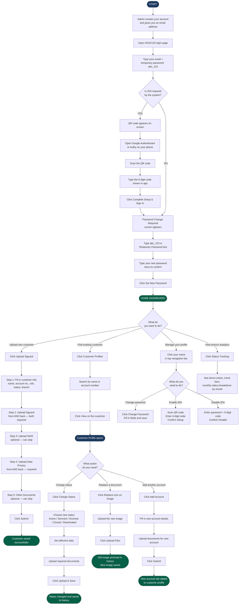

# DIGICUR — Customer Associate User Manual
### Rural Bank of Talisayan (RBT Bank Inc.) · Digital Customer Record System (DIGICUR)

---

> **Who this is for:** Customer Associates and New Account staff who handle customer records and account documents.
> This manual walks you through everything — from the very first time you log in, all the way to enrolling customers, uploading all required documents, and looking up records.

---

## Table of Contents

1. [What Is DIGICUR?](#1-what-is-digicur)
2. [Logging In for the First Time](#2-logging-in-for-the-first-time)
3. [Changing Your Password](#3-changing-your-password)
4. [Two-Factor Authentication (2FA)](#4-two-factor-authentication-2fa)
5. [Your Dashboard — The Home Screen](#5-your-dashboard--the-home-screen)
6. [The Navigation Bar](#6-the-navigation-bar)
7. [Uploading a New Customer](#7-uploading-a-new-customer)
   - [Regular Account](#regular-account)
   - [Joint Account](#joint-account)
   - [Corporate Account](#corporate-account)
8. [Looking Up Customer Records](#8-looking-up-customer-records)
9. [Viewing a Customer's Full Profile](#9-viewing-a-customers-full-profile)
10. [Changing an Account Status](#10-changing-an-account-status)
11. [Replacing or Adding Documents](#11-replacing-or-adding-documents)
12. [Adding Another Account to an Existing Customer](#12-adding-another-account-to-an-existing-customer)
13. [Status Tracking Page](#13-status-tracking-page)
14. [Your Profile Page](#14-your-profile-page)
15. [Common Situations & What To Do](#15-common-situations--what-to-do)
16. [Flowchart — How the System Works (Text Version)](#16-flowchart--how-the-system-works-text-version)
17. [Flowchart — How the System Works (Diagram Version)](#17-flowchart--how-the-system-works-diagram-version)

---

## 1. What Is DIGICUR?

DIGICUR (Digital Customer Record System) is the bank's digital system for keeping all customer records and account documents organized, complete, and easy to find. Instead of handling paper files, everything is uploaded and stored digitally — signature cards, NAIS forms, Data Privacy forms, and any other supporting documents.

The system covers the full lifecycle of a customer record: from the moment a new account is opened, through any changes in account status, all the way to account closure. Every action you take is automatically recorded and timestamped for Bangko Sentral ng Pilipinas (BSP) compliance.

**Documents managed by DIGICUR:**
- **Signature Card** — the customer's signed signature card (front and back)
- **NAIS Form** — New Account Information Sheet (front and back)
- **Data Privacy Form** — customer consent form required by law (front and back)
- **Other Documents** — IDs, CIFs, supporting papers, and any additional files

**As a Customer Associate, you can:**
- Enroll new customers and upload all their required documents
- Look up any customer's complete record and view all their documents
- Change an account's status (Active, Dormant, Reactivated, Escheat, Closed)
- Replace or add documents when forms are updated or re-signed
- Add a second or third account to an existing customer

---

## 2. Logging In for the First Time

When the administrator creates your account, you will receive an **email address** that serves as your username.

### Steps to Log In

1. Open a web browser (Chrome, Edge, or Firefox recommended).
2. Go to the DIGICUR system address provided by your branch IT/admin.
3. You will see the **DIGICUR Sign In** screen — the RBT Bank Digital Customer Record System login page.

![Login Screen — enter your email and password]

4. Type your **email address** in the Email Address box.
5. In the Password box, type the **temporary password**:

   ```
   abc_123
   ```

6. Click the **Sign in** button.

> **What happens next:** Because this is a temporary password, the system will immediately ask you to create a new personal password. You cannot skip this step.

---

## 3. Changing Your Password

Right after your first login, a **Password Change Required** screen appears. You cannot go anywhere until you finish this.

### What you will see:

- A blue box reminding you: **"Your temporary password is: abc_123"**
- Three fields to fill in:
  1. **Temporary Password** — type `abc_123` here
  2. **New Password** — choose your own new password
  3. **Confirm New Password** — type the same new password again

### Password rules:
Your new password must have **at least 6 characters** and include:
- At least one **uppercase letter** (A, B, C…)
- At least one **lowercase letter** (a, b, c…)
- At least one **number** (1, 2, 3…)
- At least one **special character** (!, @, #, $, _…)

**Example of a good password:** `RbtBank@2025`

4. Click **Set New Password**.
5. If everything is correct, you will be taken directly to your **Home Dashboard**.

> **Tip:** Do not share your password with anyone. If you forget it, ask your branch admin to reset it.

---

## 4. Two-Factor Authentication (2FA)

Some bank accounts are set up to require **Two-Factor Authentication (2FA)**. This is an extra security step where, after typing your password, you also type a 6-digit code from an authenticator app on your phone (such as **Google Authenticator** or **Authy**).

### If 2FA is required on first login:

1. After typing your email and password, a QR code screen appears.
2. Open **Google Authenticator** or **Authy** on your phone.
3. Tap the **+** button to add a new account.
4. Scan the QR code shown on the screen.
5. Your app will show a 6-digit number that changes every 30 seconds.
6. Type that 6-digit number in the box on screen.
7. Click **Complete Setup & Sign In**.

### If you already have 2FA set up:

1. After typing your email and password, a screen asks for your **Authentication Code**.
2. Open your authenticator app, find RBT Bank / DIGICUR.
3. Type the current 6-digit code shown.
4. Click **Verify Code**.

> **Important:** The 6-digit code changes every 30 seconds. If it says "Invalid code," wait for the number to change on your app and try again.

---

## 5. Your Dashboard — The Home Screen

After logging in, you arrive at the **Home Dashboard**. Think of this as your personal summary board.

### What you see:

| Section | What it shows |
|---|---|
| **Summary Cards** (top row) | Total customers enrolled, total accounts, new uploads this month, documents saved |
| **Status Breakdown** | How many accounts are Active, Dormant, Escheat, and Closed |
| **Risk Level Breakdown** | How many accounts are Low Risk, Medium Risk, or High Risk |
| **Upload Trend Chart** | A month-by-month line chart of how many customers were enrolled |
| **Account Type Chart** | A donut chart showing Regular vs Joint vs Corporate accounts |
| **Recent Activity** | The last few customers that were uploaded or updated |
| **Quick Actions** | Shortcut buttons: Upload New Customer, View Customer Profiles |

### What you can do from the dashboard:
- Click **Upload New Customer** to start enrolling a new account holder
- Click **View Customer Profiles** to search for an existing customer
- Click any stat card to see a monthly breakdown drawer on the right side

---

## 6. The Navigation Bar

At the top of every screen, you will see a **dark navigation bar** with links to the main sections.

| Link | Where it takes you |
|---|---|
| **Home** | Your dashboard |
| **Upload Sigcard** | Start a new customer upload |
| **Customer Profiles** | Search and view all customers |
| **Status Tracking** | See monthly account status data |
| **Your name / avatar** | Opens your Profile page |

---

## 7. Uploading a New Customer

This is where you register a brand-new customer and upload all their documents. Click **Upload Sigcard** in the navigation bar, or click the **Upload New Customer** button on your dashboard.

You will go through a step-by-step wizard (like filling out a form one page at a time). A progress bar at the top shows you which step you are on.

**Before you start, have these ready:**
- A clear photo or scan of the customer's **Signature Card** (front and back) — required
- A photo/scan of the **NAIS form** — New Account Information Sheet (front and back) — optional but strongly recommended
- A photo/scan of the **Data Privacy form** — customer consent form (front and back) — required
- Any **other supporting documents** — IDs, CIFs, additional papers — optional

---

### Regular Account

A regular (individual) account goes through these steps:

#### Step 1 — Customer Information

Fill in the customer's personal details:
- **First Name**, **Middle Name** (optional), **Last Name**, **Suffix** (e.g., Jr., Sr.)
- **Account Type** — choose **Regular**
- **Risk Level** — choose Low Risk, Medium Risk, or High Risk
- **Account Status** — usually **Active** for new accounts
- **Account Number**
- **Date Opened**
- **Branch** — your branch should already be selected

Click **Next** when done.

#### Step 2 — Signature Card

- You will see two upload boxes: **Sigcard Front** and **Sigcard Back**
- Click the box (or drag the image file into it) to upload the front of the signature card
- Do the same for the back
- A green checkmark appears when the image is ready
- Both front and back are **required** before you can move on

Click **Next**.

#### Step 3 — NAIS Form *(Optional)*

- Upload the **NAIS Front** and **NAIS Back**
- If you do not have the NAIS form right now, you may click **Next** to skip

#### Step 4 — Data Privacy Form

- Upload the **Data Privacy Front** and **Data Privacy Back**
- Both are **required** — you cannot skip this step

Click **Next**.

#### Step 5 — Other Documents *(Optional)*

- You can drag and drop any additional files here (e.g., IDs, CIFs)
- These are optional
- Click the thumbnails to remove any file you added by mistake

#### Step 6 — Submit

- Click **Submit** to save everything
- A progress bar shows the upload percentage
- When finished, a green success message appears: **"Customer enrolled successfully!"**
- You are returned to the Customer Profiles list where you can find the new record

---

### Joint Account

A joint account is for **two or more account holders sharing one account**. After selecting **Joint** as the account type, you choose a sub-type:

| Sub-type | What it means |
|---|---|
| **ITF (In Trust For)** | All documents (signature cards, NAIS) are shared — one set covers all holders |
| **Non-ITF** | Each holder has their own Signature Card back and NAIS, but they share one Sigcard front and one Data Privacy form |

#### Step 1 — First Holder Information
- Fill in the first holder's details: name, risk level, status, account number, date opened

#### Step 2 — Additional Holder(s)
- Fill in the second holder's name (for ITF or Non-ITF)
- Add more holders if needed

#### Steps 3–6 — Documents
- **ITF:** Upload one shared Sigcard front/back, one shared NAIS, one shared Data Privacy form
- **Non-ITF:** Upload one shared Sigcard front, then one Sigcard back **per holder**, one NAIS **per holder**, and one shared Data Privacy form

> **Note:** The system labels each document clearly (e.g., "Sigcard Back — Holder 2") so you always know which upload box is for whom.

---

### Corporate Account

A corporate account is for businesses. After selecting **Corporate**, choose a sub-type:

| Sub-type | What it means |
|---|---|
| **Standard** | A corporation with multiple signatories (authorized signers) |
| **Sole Proprietorship** | Owned and operated by one person |

#### Standard Corporate
- Fill in the **company name** and business details
- Enter each **signatory's name** (the people authorized to sign)
- Upload one **Sigcard front per signatory** plus one Sigcard back per signatory
- One shared **Data Privacy form**
- Optional NAIS

#### Sole Proprietorship
- Fill in the **proprietor's name** and company name
- Upload one Sigcard front and back
- One Data Privacy form
- Optional NAIS

---

## 8. Looking Up Customer Records

Click **Customer Profiles** in the navigation bar to search for any customer.

### How to search:

- **Search by name or account number** — type in the search box at the top and press Enter
- **Filter by account type** — use the dropdown to show only Regular, Joint, or Corporate accounts
- **Filter by status** — show only Active, Dormant, Escheat, or Closed accounts
- **Filter by risk level** — show Low, Medium, or High Risk customers

### What you see in the list:

Each customer shows:
- Their name and account type badge (Regular / Joint / Corporate)
- Their account number
- Their status badge (green = Active, yellow = Dormant, red = Closed, etc.)
- Their risk level
- Their branch
- The date they were enrolled
- A **View** button to open their full profile

### Fingerprint / Thumbmark Search:

There is also a fingerprint button on the search bar. If a customer's signature card has a visible thumbmark on the front image, you can use this to search by fingerprint. This feature may not always find a match — it only works when the thumbmark is clearly visible in the uploaded image.

---

## 9. Viewing a Customer's Full Profile

Click the **View** button next to any customer in the list to open their full profile.

### What you see:

**Top section:**
- Customer's name, status badge, account type, risk level, and branch
- A colored avatar with their initials

**Customer Information Card:**
- All account details: account number, date opened, date enrolled, account type, sub-type

**Account Tabs** (for non-joint customers with multiple accounts):
- Horizontal tabs at the top of the documents section, one per account
- Click a tab to see that account's documents
- Each tab shows the account number and its status

**Documents Section:**
All documents on file for this customer are shown here in organized groups:
- **Signature Card** (front and back)
- **NAIS Form** — New Account Information Sheet (front and back, if uploaded)
- **Data Privacy Form** (front and back)
- **Other Documents** — any additional files uploaded for this customer
- Click any image to open it in a **full-screen viewer** — you can zoom in, zoom out, and use the arrow buttons to go through all the images

**Status Change History:**
- A collapsible timeline showing every time the account status was changed
- Who changed it, when they changed it, and what documents were uploaded at that time

**Audit History:**
- A record of every action taken on this customer record (created, edited, documents replaced, etc.)

### Action Buttons:

| Button | What it does |
|---|---|
| **Edit Info** | Change the customer's name, photo, or account details |
| **Change Status** | Update the account status (Active → Dormant, etc.) |
| **Add Account** | Add a new account for this customer (not available for joint accounts) |
| **Replace Document** | Swap out an uploaded image for a newer one |

---

## 10. Changing an Account Status

Accounts can be moved between statuses as needed:

| Status | What it means |
|---|---|
| **Active** | Account is open and in good standing |
| **Dormant** | No activity for a long time (per BSP rules) |
| **Reactivated** | A previously dormant account that is active again |
| **Escheat** | Funds have been transferred to BSP (legally required for long-dormant accounts) |
| **Closed** | Account has been closed |

### How to change a status:

1. Open the customer's profile (see Section 9)
2. Click **Change Status**
3. A panel appears — choose the new status from the buttons
4. Select the **effective date** (the date the status change took effect)
5. Choose which documents you need to upload with this status change:
   - **Signature Card** — updated or re-signed signature card
   - **NAIS Form** — updated New Account Information Sheet
   - **Data Privacy Form** — re-signed consent form
   - **Other Documents** — any additional supporting papers
6. Upload the required documents using the drag-and-drop boxes
7. Click **Upload & Save**

> **Important:** The system saves the old documents and keeps them in the Status Change History. You can always go back and see what documents were on file at the time of a previous status change.

> **Dormant accounts:** When an account is marked Dormant, the images are shown with a blurred overlay as a reminder. You can still click to view them when needed.

---

## 11. Replacing or Adding Documents

### Replacing a document (updated signature card, new NAIS, re-signed Data Privacy form, etc.):

1. Open the customer's profile
2. Find the document you want to replace
3. Click the **Replace** icon (pencil/swap icon) on the image
4. An edit screen opens — click the current image to replace it, or drag a new file into the box
5. Click **Upload Files** when ready

> The old document is automatically moved to the **Status Change History** archive. It is never deleted — it is just stored in the history for BSP compliance.

### Adding more documents (other docs):

1. Open the customer's profile
2. In the **Other Documents** section, click **Add Documents**
3. Pick the files you want to add (you can add multiple at once)
4. They appear as numbered thumbnails
5. Click **Upload Files** to save

---

## 12. Adding Another Account to an Existing Customer

A regular (individual) customer can have more than one account. For example, a customer may have both a savings account and a time deposit account.

1. Open the customer's profile
2. Click **Add Account**
3. A step-by-step wizard opens (similar to the upload wizard)
4. Fill in the new account's details (account number, risk level, status, date opened)
5. Upload the signature card and documents for the new account
6. Click **Submit**

> After saving, a new tab appears at the top of the customer's documents section for the new account.

---

## 13. Status Tracking Page

Click **Status Tracking** in the navigation bar to see a full overview of account statuses across all customers in your branch.

### What you see:

- **Donut charts** showing the breakdown of customers by status and by account type
- **Risk Level chart** showing the distribution of Low / Medium / High Risk accounts
- **Monthly bar chart** showing how statuses changed over the last 12 months — click any bar to drill down into that month
- **Trend arrows** showing whether the count went up or down compared to last month

This page is useful for monitoring how many accounts went dormant or were reactivated in a given month, and for preparing branch reports.

---

## 14. Your Profile Page

Click your **name or avatar** in the top-right corner of the navigation bar to go to your Profile page.

### What you can do here:

#### View your account information
- Your name, email, branch, role, and the date you last logged in

#### Change your password
1. Click **Change Password**
2. Type your **Current Password**
3. Type a **New Password** (follow the password rules in Section 3)
4. Type the new password again to confirm
5. Click **Update Password**

#### Enable Two-Factor Authentication (2FA)
If 2FA is not yet set up on your account:
1. Click **Enable Two-Factor Authentication**
2. A QR code appears on screen
3. Open **Google Authenticator** or **Authy** on your phone
4. Scan the QR code
5. Type the 6-digit code shown in your app
6. Click **Confirm Setup**

From now on, every time you log in, you will need both your password and the 6-digit code from your phone.

#### Disable Two-Factor Authentication
If 2FA is set up and you need to turn it off:
1. Click **Disable Two-Factor Authentication**
2. Type your password and the current 6-digit code from your app
3. Click **Confirm Disable**

---

## 15. Common Situations & What To Do

### I typed the wrong password too many times.
The system will temporarily lock you out. A countdown timer will appear telling you how many seconds to wait. Once it counts down to zero, you can try again.

### The "Next" button is grayed out and I cannot move to the next step.
Something in the current step is missing or incomplete. Check that:
- All **required fields** are filled in
- Both front **and** back of the signature card are uploaded (not just one)
- Both front **and** back of the Data Privacy form are uploaded

### I uploaded the wrong image.
- If you have not submitted yet: click the image in the upload box. It will let you pick a new file to replace it.
- If you already submitted: open the customer's profile, find the document, and click **Replace** to swap it out.

### I cannot find the customer in the Customer Profiles list.
- Try searching by account number instead of name
- Check if there is a filter active (account type, status, risk level) — clear the filters and search again
- The customer may not be enrolled yet — you may need to upload them as a new customer

### The session timed out and I was logged out.
The system automatically logs you out after a period of inactivity (set by the admin) to protect customer data. Just log in again. Any uploaded-but-not-submitted work may be lost, so always click **Submit** before stepping away.

### A customer's account images are blurry/covered.
This means the account is marked **Dormant**. The blur is intentional — it is a visual reminder that the account is inactive. You can still click the image to view it fully in the image viewer.

---

## 16. Flowchart — How the System Works (Text Version)

This is a step-by-step text flowchart showing the full journey from first login to completing an upload.

```
START
  |
  v
[You receive your email address from the Admin]
  |
  v
[Open the DIGICUR login page]
  |
  v
[Type your email + temporary password: abc_123]
  |
  v
[Click Sign In]
  |
  +----- Is 2FA required on first login? ----YES----> [Scan QR code with authenticator app]
  |                                                           |
  |                                                    [Enter 6-digit code]
  |                                                           |
  NO                                                   [Complete Setup]
  |                                                           |
  v                                                           v
[Password Change Required screen appears] <-----------------+
  |
  v
[Type: abc_123 in "Temporary Password" box]
  |
  v
[Type your chosen new password (twice)]
  |
  v
[Click Set New Password]
  |
  v
[HOME DASHBOARD]
  |
  |--- Want to enroll a new customer? ----> [Click Upload Sigcard]
  |                                                |
  |                                         [Step 1: Customer Info]
  |                                                |
  |                                         [Step 2: Upload Sigcard front + back]
  |                                                |
  |                                         [Step 3: Upload NAIS (optional)]
  |                                                |
  |                                         [Step 4: Upload Data Privacy (required)]
  |                                                |
  |                                         [Step 5: Other Docs (optional)]
  |                                                |
  |                                         [Click Submit]
  |                                                |
  |                                         [SUCCESS — customer saved]
  |
  |--- Want to find an existing customer? -> [Click Customer Profiles]
  |                                                |
  |                                         [Type name or account number]
  |                                                |
  |                                         [Click View on the customer]
  |                                                |
  |                                         [CUSTOMER PROFILE opens]
  |                                                |
  |                   +----------------------------+----------------------------+
  |                   |                            |                            |
  |            [Change Status]            [Replace Document]           [Add Account]
  |                   |                            |                            |
  |            [Choose new status]         [Upload new image]         [Fill in new account info]
  |                   |                            |                            |
  |            [Upload documents]          [Click Upload]             [Upload documents]
  |                   |                            |                            |
  |            [Click Save]               [Saved to history]          [Click Submit]
  |
  |--- Want to see your profile? ---------> [Click your name in top bar]
  |                                                |
  |                                         [View info / Change password / Manage 2FA]
  |
  v
END OF SESSION — Click your name > Log Out to sign out safely
```

---

## 17. Flowchart — How the System Works (Diagram Version)

The diagram below shows the same flow visually. This uses **Mermaid** format and will render as a diagram when viewed in compatible tools such as GitHub, VS Code with Mermaid extension, or any Mermaid-compatible viewer.



---

## Quick Reference Card

| Task | Where to go |
|---|---|
| Enroll a new customer | Navigation bar → Upload Sigcard |
| Find a customer | Navigation bar → Customer Profiles |
| View documents | Customer Profiles → View → scroll down |
| Change account status | Customer Profile → Change Status button |
| Replace a document | Customer Profile → Replace icon on image |
| Add another account | Customer Profile → Add Account button |
| Change your password | Click your name → Profile → Change Password |
| Enable/Disable 2FA | Click your name → Profile → 2FA section |
| See branch analytics | Navigation bar → Status Tracking |
| Log out | Click your name → Log Out |

---

## Document Requirements Summary

DIGICUR manages four types of customer documents. The table below shows what is required when enrolling a new customer.

| Document | Required? | Notes |
|---|---|---|
| **Signature Card — Front** | **Yes** | Clear photo or scan; signature must be legible |
| **Signature Card — Back** | **Yes** | Back side of the same card |
| **NAIS Form** (New Account Information Sheet) | Optional | Strongly recommended for BSP compliance; upload front and back |
| **Data Privacy Form** | **Yes** | Customer consent form; both front and back required |
| **Other Documents** | Optional | IDs, CIFs, special authorizations, any supporting papers |

> Documents marked **Optional** can be uploaded later by going to the customer's profile and clicking **Add Documents** or **Replace**.

---

*Last updated: May 2026 · DIGICUR v1.0 · RBT Bank Inc. — Rural Bank of Talisayan, Misamis Oriental*
