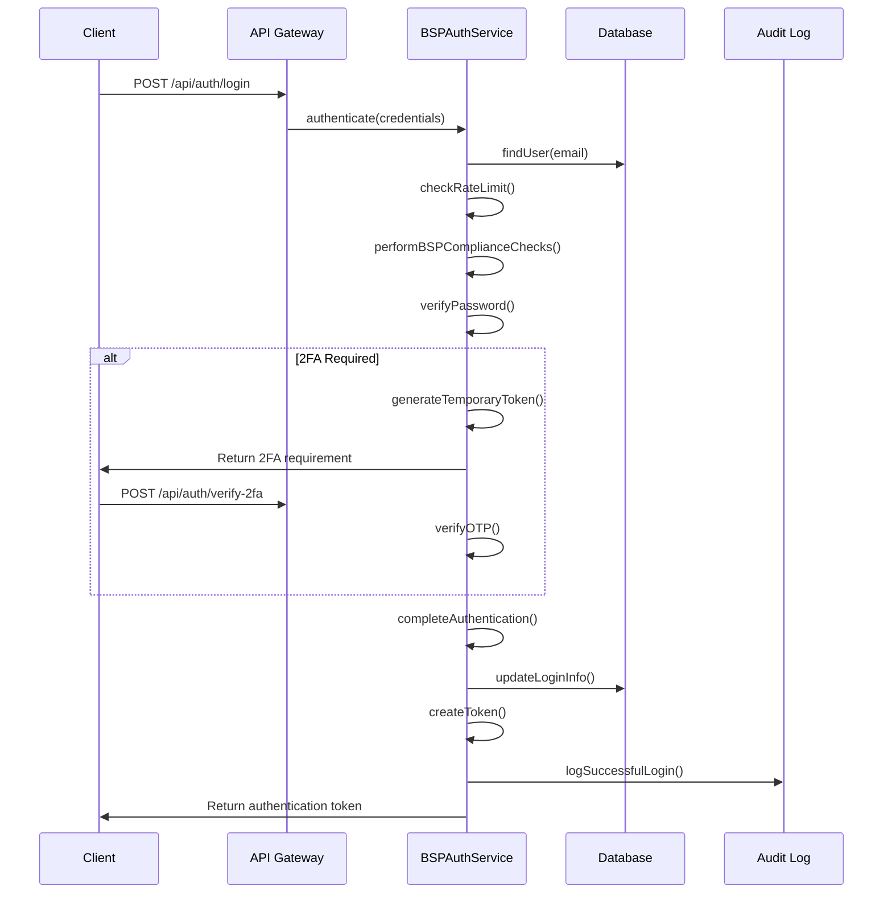

# BSP-Compliant Banking Authentication System Documentation

## Table of Contents
1. [Overview](#overview)
2. [BSP Compliance Features](#bsp-compliance-features)
3. [Architecture](#architecture)
4. [Authentication System](#authentication-system)
5. [Role-Based Access Control](#role-based-access-control)
6. [API Endpoints](#api-endpoints)
7. [Security Features](#security-features)
8. [Audit & Monitoring](#audit--monitoring)
9. [Installation & Setup](#installation--setup)
10. [Usage Examples](#usage-examples)
11. [Testing](#testing)
12. [Maintenance](#maintenance)

---

## Overview

This Laravel-based banking authentication system is designed to meet the cybersecurity requirements of the **Bangko Sentral ng Pilipinas (BSP)** as outlined in BSP Circular 951, 982, and other relevant regulations. The system implements comprehensive security controls, audit logging, and role-based access management specifically tailored for banking institutions.

### Key Features
- **BSP Circular 951 & 982 Compliance**
- **Multi-Factor Authentication (MFA)**
- **Advanced Password Policies**
- **Role-Based Access Control (RBAC)**
- **Comprehensive Audit Logging**
- **Session Management & Timeout Controls**
- **Risk-Based Authentication**
- **Account Lockout Protection**
- **Real-time Security Monitoring**

---

## BSP Compliance Features

### Security Standards Implemented

| BSP Requirement | Implementation | Status |
|-----------------|----------------|---------|
| Multi-Factor Authentication | SMS/TOTP-based 2FA | ✅ Implemented |
| Password Complexity | 12+ chars, mixed case, numbers, symbols | ✅ Implemented |
| Account Lockout | 5 failed attempts, 30-min lockout | ✅ Implemented |
| Session Management | 30-minute timeout, concurrent session limits | ✅ Implemented |
| Audit Logging | Comprehensive activity tracking | ✅ Implemented |
| Role Segregation | Principle of least privilege | ✅ Implemented |
| Risk Assessment | IP, time, behavior-based analysis | ✅ Implemented |
| Data Encryption | Password hashing, sensitive data encryption | ✅ Implemented |

### Regulatory Compliance Matrix

```
BSP Circular 951 (IT Risk Management):
✓ Access Control Management
✓ Authentication & Authorization
✓ System Security Monitoring
✓ Incident Response Procedures

BSP Circular 982 (Cybersecurity Framework):
✓ Identity & Access Management
✓ Data Protection Controls
✓ Logging & Monitoring
✓ Risk Assessment & Management
```

---

## Architecture

### System Components

```
┌─────────────────────────────────────────┐
│              Frontend Client            │
│         (React/Vue/Angular)             │
└─────────────┬───────────────────────────┘
              │ HTTPS/API Calls
              ▼
┌─────────────────────────────────────────┐
│           Laravel API Gateway           │
│    ┌─────────────────────────────┐      │
│    │     Authentication Layer    │      │
│    │   - Sanctum Tokens         │      │
│    │   - Rate Limiting          │      │
│    │   - CORS Handling          │      │
│    └─────────────────────────────┘      │
└─────────────┬───────────────────────────┘
              │
              ▼
┌─────────────────────────────────────────┐
│         Role-Based Middleware           │
│    ┌─────────────────────────────┐      │
│    │     RoleMiddleware          │      │
│    │   - User Authentication     │      │
│    │   - Account Status Check    │      │
│    │   - Permission Validation   │      │
│    │   - Session Management      │      │
│    └─────────────────────────────┘      │
└─────────────┬───────────────────────────┘
              │
              ▼
┌─────────────────────────────────────────┐
│           Controllers Layer             │
│  ┌─────────┐ ┌────────────┐ ┌─────────┐ │
│  │  Auth   │ │   Admin    │ │Manager  │ │
│  │Controller│ │ Controller │ │Controller│ │
│  └─────────┘ └────────────┘ └─────────┘ │
│  ┌─────────┐ ┌────────────┐             │
│  │  User   │ │Compliance  │             │
│  │Controller│ │ Controller │             │
│  └─────────┘ └────────────┘             │
└─────────────┬───────────────────────────┘
              │
              ▼
┌─────────────────────────────────────────┐
│           Services Layer                │
│    ┌─────────────────────────────┐      │
│    │      BSPAuthService         │      │
│    │   - Authentication Logic    │      │
│    │   - Password Validation     │      │
│    │   - Session Management      │      │
│    │   - Risk Assessment         │      │
│    └─────────────────────────────┘      │
└─────────────┬───────────────────────────┘
              │
              ▼
┌─────────────────────────────────────────┐
│            Data Layer                   │
│  ┌─────────┐ ┌────────────┐ ┌─────────┐ │
│  │  User   │ │   Roles    │ │Activity │ │
│  │ Model   │ │ & Perms    │ │  Logs   │ │
│  └─────────┘ └────────────┘ └─────────┘ │
│                    │                    │
│              ┌─────────────┐            │
│              │  Database   │            │
│              │   (MySQL)   │            │
│              └─────────────┘            │
└─────────────────────────────────────────┘
```

---

## Authentication System

### BSPAuthService Implementation

The core authentication service implements all BSP requirements:

#### Key Features
- **Password Complexity Validation**: 12+ characters with mixed case, numbers, and symbols
- **Account Lockout Policy**: 5 failed attempts trigger 30-minute lockout
- **Session Timeout**: 30-minute inactivity timeout
- **Concurrent Session Limiting**: Maximum 3 active sessions per user
- **Risk-Based Authentication**: IP, time, and behavior analysis

#### Authentication Flow



### Password Policy Implementation

```php
// BSP-Compliant Password Requirements
- Minimum 12 characters
- At least 1 uppercase letter
- At least 1 lowercase letter
- At least 1 number
- At least 1 special character
- No repeated characters (3+ consecutive)
- Cannot reuse last 5 passwords
- Expires every 90 days
```

---

## Role-Based Access Control

### Role Hierarchy

```
┌─────────────────────────────────────────┐
│                 ADMIN                   │
│           Full System Access            │
│    ┌─────────────────────────────┐      │
│    │ • User Management (CRUD)    │      │
│    │ • Role & Permission Mgmt    │      │
│    │ • System Administration     │      │
│    │ • Security Monitoring       │      │
│    │ • Audit Log Management      │      │
│    │ • System Backup/Restore     │      │
│    └─────────────────────────────┘      │
└─────────────┬───────────────────────────┘
              │
              ▼
┌─────────────────────────────────────────┐
│               MANAGER                   │
│        Supervisory Operations           │
│    ┌─────────────────────────────┐      │
│    │ • Transaction Approvals     │      │
│    │ • User Management (Limited) │      │
│    │ • Branch Operations         │      │
│    │ • Customer Management       │      │
│    │ • Financial Reports         │      │
│    │ • Risk Assessment Approval  │      │
│    └─────────────────────────────┘      │
└─────────────┬───────────────────────────┘
              │
              ▼
┌─────────────────────────────────────────┐
│                USER                     │
│         Standard Operations             │
│    ┌─────────────────────────────┐      │
│    │ • Transaction Processing    │      │
│    │ • Account Management        │      │
│    │ • Customer Service          │      │
│    │ • Basic Reporting           │      │
│    └─────────────────────────────┘      │
└─────────────────────────────────────────┘

┌─────────────────────────────────────────┐
│           COMPLIANCE-AUDIT              │
│         Independent Oversight           │
│    ┌─────────────────────────────┐      │
│    │ • Full Audit Log Access     │      │
│    │ • Compliance Reporting      │      │
│    │ • Risk Assessment Creation  │      │
│    │ • Security Event Monitoring │      │
│    │ • Regulatory Report Export  │      │
│    │ • Read-Only Data Access     │      │
│    └─────────────────────────────┘      │
└─────────────────────────────────────────┘
```

### Permissions Matrix

| Permission | Admin | Manager | User | Compliance |
|------------|-------|---------|------|------------|
| view-users | ✅ | ✅ (Branch) | ❌ | ✅ (Read-only) |
| create-users | ✅ | ❌ | ❌ | ❌ |
| edit-users | ✅ | ✅ (Branch) | ❌ | ❌ |
| delete-users | ✅ | ❌ | ❌ | ❌ |
| approve-transactions | ✅ | ✅ | ❌ | ❌ |
| view-audit-logs | ✅ | ✅ (Branch) | ❌ | ✅ (Full) |
| export-audit-logs | ✅ | ❌ | ❌ | ✅ |
| view-compliance-reports | ✅ | ✅ | ❌ | ✅ |
| create-risk-assessments | ✅ | ❌ | ❌ | ✅ |
| manage-system-settings | ✅ | ❌ | ❌ | ❌ |

---

## API Endpoints

### Authentication Endpoints

```http
# User Authentication
POST   /api/auth/login                 # Login with credentials
POST   /api/auth/verify-2fa            # Verify 2FA code
POST   /api/auth/logout               # Logout user
GET    /api/auth/me                   # Get current user info
POST   /api/auth/change-password      # Change user password

# Two-Factor Authentication
POST   /api/auth/enable-2fa           # Enable 2FA
POST   /api/auth/disable-2fa          # Disable 2FA
GET    /api/auth/active-sessions      # View active sessions

# Admin Registration (Admin Only)
POST   /api/auth/register             # Register new user (admin only)
```

### Admin Endpoints

```http
# User Management
GET    /api/admin/users               # Get all users
POST   /api/admin/users               # Create new user
PUT    /api/admin/users/{id}          # Update user
DELETE /api/admin/users/{id}          # Delete user
POST   /api/admin/users/{id}/activate # Activate user
POST   /api/admin/users/{id}/deactivate # Deactivate user
POST   /api/admin/users/{id}/unlock   # Unlock user account
POST   /api/admin/users/{id}/reset-password # Reset user password

# Role Management
GET    /api/admin/roles               # Get all roles
POST   /api/admin/roles               # Create role
PUT    /api/admin/roles/{id}          # Update role
DELETE /api/admin/roles/{id}          # Delete role
POST   /api/admin/users/{id}/roles    # Assign role to user
DELETE /api/admin/users/{id}/roles/{role} # Remove role from user

# Permission Management
GET    /api/admin/permissions         # Get all permissions
POST   /api/admin/permissions         # Create permission
POST   /api/admin/roles/{id}/permissions # Assign permission to role

# System Administration
GET    /api/admin/system-settings     # Get system settings
PUT    /api/admin/system-settings     # Update system settings
GET    /api/admin/system-logs         # Get system logs
POST   /api/admin/system/backup       # Create system backup
POST   /api/admin/system/restore      # Restore from backup

# Audit & Security
GET    /api/admin/audit-logs          # Get audit logs
GET    /api/admin/login-attempts      # Get login attempts
GET    /api/admin/security-events     # Get security events
```

### Manager Endpoints

```http
# User Management (Branch Limited)
GET    /api/manager/users             # Get branch users
PUT    /api/manager/users/{id}        # Update user
POST   /api/manager/users/{id}/activate # Activate user
POST   /api/manager/users/{id}/deactivate # Deactivate user
POST   /api/manager/users/{id}/reset-password # Reset password
POST   /api/manager/users/{id}/unlock # Unlock user

# Transaction Management
GET    /api/manager/transactions      # Get transactions
GET    /api/manager/transactions/pending-approval # Get pending transactions
POST   /api/manager/transactions/{id}/approve # Approve transaction
POST   /api/manager/transactions/{id}/reject # Reject transaction

# Account Operations
GET    /api/manager/accounts          # Get accounts
GET    /api/manager/accounts/{id}/balance # Get account balance
POST   /api/manager/transfers/approve # Approve transfer
GET    /api/manager/statements/{account} # Generate statement

# Customer Management
GET    /api/manager/customers         # Get customers
PUT    /api/manager/customers/{id}    # Update customer
POST   /api/manager/customers/{id}/verify # Verify customer
POST   /api/manager/customers/{id}/approve-application # Approve application

# Reports & Analytics
GET    /api/manager/reports           # Get available reports
POST   /api/manager/reports/generate  # Generate report
GET    /api/manager/reports/financial # Get financial reports

# Branch Operations
GET    /api/manager/branch-operations # Get branch operations
GET    /api/manager/branch-reports    # Get branch reports
POST   /api/manager/branch-transactions/{id}/approve # Approve branch transaction

# Compliance (Limited)
GET    /api/manager/audit-logs        # Get audit logs (branch scope)
GET    /api/manager/compliance-reports # Get compliance reports
GET    /api/manager/risk-assessments  # Get risk assessments
POST   /api/manager/risk-assessments/{id}/approve # Approve risk assessment
```

### User Endpoints

```http
# Transaction Operations
GET    /api/user/transactions         # Get user transactions
POST   /api/user/transactions         # Create transaction
GET    /api/user/transactions/history # Get transaction history

# Account Management
GET    /api/user/accounts             # Get accessible accounts
GET    /api/user/accounts/{id}/balance # Get account balance
GET    /api/user/accounts/{id}/statement # Generate account statement

# Customer Service
GET    /api/user/customers            # Get customers (limited)
PUT    /api/user/customers/{id}       # Update customer info
GET    /api/user/customers/{id}/documents # Get customer documents

# Reporting
GET    /api/user/reports              # Get available reports
POST   /api/user/reports/generate     # Generate report
```

### Compliance Endpoints

```http
# Audit Management
GET    /api/compliance/audit-logs     # Get comprehensive audit logs
POST   /api/compliance/audit-logs/export # Export audit logs

# Compliance Reporting
GET    /api/compliance/compliance-reports # Get compliance reports
POST   /api/compliance/compliance-reports/generate # Generate compliance report

# Risk Assessment
GET    /api/compliance/risk-assessments # Get risk assessments
POST   /api/compliance/risk-assessments # Create risk assessment
PUT    /api/compliance/risk-assessments/{id} # Update risk assessment

# Read-Only Data Access
GET    /api/compliance/users          # Get users (read-only)
GET    /api/compliance/transactions   # Get transactions (read-only)
GET    /api/compliance/accounts       # Get accounts (read-only)
GET    /api/compliance/customers      # Get customers (read-only)

# Specialized Reporting
GET    /api/compliance/reports        # Get compliance reports
POST   /api/compliance/reports/generate # Generate specialized report
POST   /api/compliance/reports/export # Export report
GET    /api/compliance/reports/financial # Get financial reports
GET    /api/compliance/reports/regulatory # Get regulatory reports

# Security Monitoring
GET    /api/compliance/security/login-attempts # Get login attempts
GET    /api/compliance/security/system-logs # Get system logs
GET    /api/compliance/security/events # Get security events

# Branch Compliance
GET    /api/compliance/branch-data    # Get branch data
GET    /api/compliance/branch-reports # Get branch reports
```

### Public Information Endpoint

```http
# BSP Compliance Information
GET    /api/bsp/compliance-info       # Get BSP compliance status
```

---

## Security Features

### Multi-Factor Authentication (MFA)

```php
// 2FA Implementation
1. SMS-based OTP (Primary)
2. TOTP (Google Authenticator) Support
3. Backup Recovery Codes
4. Device Trust Management
5. Risk-based MFA Triggers
```

### Session Security

```php
// Session Management Features
- 30-minute inactivity timeout
- Maximum 3 concurrent sessions
- Device fingerprinting
- Secure token generation
- Automatic session cleanup
- Cross-device session monitoring
```

### Rate Limiting & Protection

```php
// Protection Mechanisms
- Login attempt rate limiting (5 attempts per 15 minutes)
- API request rate limiting
- Brute force protection
- IP-based blocking
- Geographic anomaly detection
- Suspicious activity monitoring
```

### Data Protection

```php
// Encryption & Hashing
- Bcrypt password hashing (cost factor 12)
- AES-256 encryption for sensitive data
- Secure token generation (SHA-256)
- Database field encryption
- Secure data transmission (HTTPS only)
```

---

## Audit & Monitoring

### Comprehensive Activity Logging

Every user action is logged with the following information:

```json
{
  "id": "activity_id",
  "log_name": "default",
  "description": "User logged in successfully",
  "subject_type": "App\\Models\\User",
  "subject_id": 1,
  "causer_type": "App\\Models\\User",
  "causer_id": 1,
  "properties": {
    "ip": "192.168.1.100",
    "user_agent": "Mozilla/5.0...",
    "action": "/api/auth/login",
    "method": "POST",
    "bsp_compliance": {
      "risk_score": 15,
      "risk_factors": ["different_ip"],
      "authentication_method": "password_2fa"
    }
  },
  "created_at": "2024-01-15T10:30:00Z"
}
```

### Security Event Categories

| Event Type | Description | Risk Level |
|------------|-------------|------------|
| authentication | Login/logout activities | Low-High |
| authorization | Permission checks | Medium |
| data_access | Sensitive data viewing | Medium-High |
| configuration_change | System setting modifications | High |
| user_management | User CRUD operations | High |
| financial_transaction | Money movement activities | Critical |
| compliance_violation | Policy violations | Critical |

### Real-time Monitoring

```php
// Monitored Activities
- Failed login attempts
- Account lockouts
- Permission escalations
- Unusual access patterns
- High-value transactions
- Data export activities
- Configuration changes
- Policy violations
```

---

## Installation & Setup

### System Requirements

```
- PHP 8.3+
- Laravel 12
- MySQL 8.0+
- Redis (recommended for sessions)
- SSL Certificate (required for production)
```

### Installation Steps

1. **Clone Repository**
```bash
git clone <repository-url>
cd sigcard-backend
```

2. **Install Dependencies**
```bash
composer install
npm install
```

3. **Environment Configuration**
```bash
cp .env.example .env
php artisan key:generate
```

4. **Database Setup**
```bash
php artisan migrate
php artisan db:seed --class=BSPRolesAndPermissionsSeeder
```

5. **Storage Configuration**
```bash
php artisan storage:link
```

6. **Queue Configuration** (Optional)
```bash
php artisan queue:work
```

### Environment Variables

```env
# Application
APP_NAME="BSP Banking System"
APP_ENV=production
APP_DEBUG=false
APP_URL=https://your-domain.com

# Database
DB_CONNECTION=mysql
DB_HOST=127.0.0.1
DB_PORT=3306
DB_DATABASE=sigcard_banking
DB_USERNAME=your_username
DB_PASSWORD=your_password

# Authentication
SANCTUM_STATEFUL_DOMAINS=your-frontend-domain.com
SESSION_LIFETIME=30

# BSP Configuration
BSP_MAX_LOGIN_ATTEMPTS=5
BSP_LOCKOUT_DURATION=30
BSP_PASSWORD_EXPIRY_DAYS=90
BSP_SESSION_TIMEOUT_MINUTES=30
BSP_MAX_CONCURRENT_SESSIONS=3

# Two-Factor Authentication
2FA_SMS_PROVIDER=twilio
TWILIO_SID=your_twilio_sid
TWILIO_TOKEN=your_twilio_token
TWILIO_FROM=+1234567890

# Logging
LOG_CHANNEL=daily
LOG_LEVEL=info
ACTIVITY_LOG_RETENTION_DAYS=2555  # 7 years for BSP compliance

# Mail Configuration
MAIL_MAILER=smtp
MAIL_HOST=your-mail-host
MAIL_PORT=587
MAIL_USERNAME=your-email
MAIL_PASSWORD=your-password
MAIL_ENCRYPTION=tls
MAIL_FROM_ADDRESS=noreply@your-domain.com
```

---

## Usage Examples

### Authentication Flow

```javascript
// 1. Login Request
const loginResponse = await fetch('/api/auth/login', {
  method: 'POST',
  headers: {
    'Content-Type': 'application/json',
    'Accept': 'application/json'
  },
  body: JSON.stringify({
    email: 'user@sigcard.com',
    password: 'SecurePassword123!',
    device_id: 'unique-device-identifier'
  })
});

const loginData = await loginResponse.json();

// 2. Handle 2FA if required
if (loginData.data.status === 'two_factor_required') {
  const twoFAResponse = await fetch('/api/auth/verify-2fa', {
    method: 'POST',
    headers: {
      'Content-Type': 'application/json',
      'Accept': 'application/json'
    },
    body: JSON.stringify({
      temporary_token: loginData.data.temporary_token,
      otp_code: '123456'
    })
  });
}

// 3. Use authentication token
const token = loginData.data.token;
localStorage.setItem('auth_token', token);
```

### Making Authenticated Requests

```javascript
// Standard API Request with Authentication
const response = await fetch('/api/admin/users', {
  method: 'GET',
  headers: {
    'Authorization': `Bearer ${localStorage.getItem('auth_token')}`,
    'Accept': 'application/json',
    'Content-Type': 'application/json'
  }
});

const data = await response.json();

// Check for BSP compliance information
if (data.bsp_compliance) {
  console.log('BSP Compliance Status:', data.bsp_compliance);
}
```

### Creating a New User (Admin)

```javascript
const createUserResponse = await fetch('/api/admin/users', {
  method: 'POST',
  headers: {
    'Authorization': `Bearer ${token}`,
    'Content-Type': 'application/json'
  },
  body: JSON.stringify({
    name: 'John Doe',
    email: 'john.doe@sigcard.com',
    password: 'SecurePassword123!@#',
    employee_id: 'EMP001',
    department: 'Operations',
    branch_code: 'BR001',
    employee_position: 'Banking Officer',
    phone_number: '+63912345678',
    roles: ['user']
  })
});
```

### Transaction Approval (Manager)

```javascript
const approveTransaction = await fetch('/api/manager/transactions/TXN-123/approve', {
  method: 'POST',
  headers: {
    'Authorization': `Bearer ${token}`,
    'Content-Type': 'application/json'
  },
  body: JSON.stringify({
    comments: 'Verified customer identity and transaction purpose',
    override_limits: false
  })
});
```

### Generating Compliance Reports

```javascript
const complianceReport = await fetch('/api/compliance/compliance-reports/generate', {
  method: 'POST',
  headers: {
    'Authorization': `Bearer ${token}`,
    'Content-Type': 'application/json'
  },
  body: JSON.stringify({
    report_type: 'bsp_compliance',
    date_from: '2024-01-01',
    date_to: '2024-01-31',
    branch_codes: ['BR001', 'BR002'],
    include_recommendations: true,
    format: 'pdf'
  })
});
```

---

## Testing

### Running Tests

```bash
# Run all tests
php artisan test

# Run specific test file
php artisan test tests/Feature/AuthControllerTest.php

# Run tests with coverage
php artisan test --coverage

# Run specific test method
php artisan test --filter=testUserCanLoginWithValidCredentials
```

### Test Categories

1. **Authentication Tests**
   - Login/logout functionality
   - 2FA verification
   - Password policies
   - Session management

2. **Authorization Tests**
   - Role-based access control
   - Permission checks
   - Middleware functionality

3. **API Endpoint Tests**
   - CRUD operations
   - Input validation
   - Error handling
   - Response formats

4. **Security Tests**
   - Rate limiting
   - Account lockout
   - Injection prevention
   - Data validation

5. **Compliance Tests**
   - Audit logging
   - BSP requirement verification
   - Data retention policies

### Sample Test

```php
<?php

namespace Tests\Feature;

use Tests\TestCase;
use App\Models\User;
use Illuminate\Foundation\Testing\RefreshDatabase;

class BSPAuthenticationTest extends TestCase
{
    use RefreshDatabase;

    public function test_user_can_login_with_valid_credentials()
    {
        $user = User::factory()->create([
            'email' => 'test@example.com',
            'password' => bcrypt('SecurePassword123!')
        ]);

        $response = $this->postJson('/api/auth/login', [
            'email' => 'test@example.com',
            'password' => 'SecurePassword123!',
            'device_id' => 'test-device'
        ]);

        $response->assertStatus(200)
                ->assertJsonStructure([
                    'success',
                    'message',
                    'data' => [
                        'token',
                        'user',
                        'expires_at'
                    ],
                    'bsp_compliance'
                ]);
    }

    public function test_account_locks_after_failed_attempts()
    {
        $user = User::factory()->create([
            'email' => 'test@example.com',
            'password' => bcrypt('correct-password')
        ]);

        // Make 5 failed login attempts
        for ($i = 0; $i < 5; $i++) {
            $this->postJson('/api/auth/login', [
                'email' => 'test@example.com',
                'password' => 'wrong-password',
                'device_id' => 'test-device'
            ]);
        }

        // 6th attempt should be blocked
        $response = $this->postJson('/api/auth/login', [
            'email' => 'test@example.com',
            'password' => 'correct-password',
            'device_id' => 'test-device'
        ]);

        $response->assertStatus(423)  // HTTP 423 Locked
                ->assertJson([
                    'success' => false,
                    'message' => 'Account is temporarily locked. Try again later.',
                    'bsp_compliance' => [
                        'account_lockout_check' => true,
                        'access_denied_logged' => true
                    ]
                ]);
    }
}
```

---

## Maintenance

### Daily Maintenance Tasks

1. **Monitor System Health**
```bash
# Check application status
php artisan app:status

# Monitor failed login attempts
php artisan bsp:security-report --daily

# Check audit log integrity
php artisan audit:verify
```

2. **Security Monitoring**
```bash
# Review security events
php artisan security:review --yesterday

# Check for suspicious activities
php artisan bsp:risk-assessment --auto

# Validate compliance status
php artisan bsp:compliance-check
```

### Weekly Maintenance Tasks

1. **User Account Review**
```bash
# Check expired passwords
php artisan users:check-password-expiry

# Review inactive accounts
php artisan users:review-inactive --days=30

# Audit user permissions
php artisan permissions:audit
```

2. **System Cleanup**
```bash
# Clean expired sessions
php artisan sessions:cleanup

# Archive old audit logs
php artisan logs:archive --older-than=90-days

# Optimize database
php artisan db:optimize
```

### Monthly Maintenance Tasks

1. **Compliance Reporting**
```bash
# Generate monthly BSP compliance report
php artisan bsp:monthly-report

# Export audit logs for regulatory submission
php artisan audit:export --monthly

# Review risk assessments
php artisan risk:monthly-review
```

2. **Security Assessment**
```bash
# Run security vulnerability scan
php artisan security:scan

# Update security policies
php artisan policies:review

# Test backup and recovery procedures
php artisan backup:test-restore
```

### Monitoring & Alerts

#### Key Metrics to Monitor

1. **Authentication Metrics**
   - Failed login attempt rate
   - Account lockout frequency
   - 2FA bypass attempts
   - Session timeout violations

2. **System Performance**
   - API response times
   - Database query performance
   - Memory usage
   - CPU utilization

3. **Security Indicators**
   - Unauthorized access attempts
   - Permission escalation attempts
   - Data export activities
   - Configuration changes

4. **Compliance Metrics**
   - Audit log completeness
   - Password policy violations
   - Role segregation compliance
   - Data retention adherence

#### Alert Thresholds

```php
// Critical Alerts (Immediate Response)
- Multiple failed admin login attempts (>3 in 10 minutes)
- Unauthorized system configuration changes
- Database connection failures
- Audit log tampering attempts

// Warning Alerts (Monitor Closely)
- High failed login attempt rate (>10 per hour)
- Unusual API request patterns
- Memory usage >80%
- Slow database queries (>5 seconds)

// Info Alerts (Review Daily)
- Password expiry notifications
- Account inactivity warnings
- Scheduled backup completion
- Compliance report generation
```

### Backup & Recovery

#### Backup Strategy

1. **Database Backups**
   - Full backup: Daily at 2:00 AM
   - Incremental backup: Every 6 hours
   - Transaction log backup: Every 15 minutes
   - Retention: 7 years for BSP compliance

2. **Application Backups**
   - Code repository: Git with versioning
   - Configuration files: Daily backup
   - Uploaded files: Real-time synchronization
   - Logs: Archived monthly

3. **Security Backups**
   - Encryption keys: Secure offsite storage
   - SSL certificates: Version controlled
   - Audit logs: Immutable storage
   - User data: Encrypted backups

#### Recovery Procedures

```bash
# Database Recovery
php artisan backup:restore --database --date=2024-01-15

# Application Recovery
php artisan backup:restore --application --version=v1.2.3

# Configuration Recovery
php artisan config:restore --backup-id=backup_123

# Full System Recovery
php artisan system:restore --full --confirm
```

---

## Support & Documentation

### Additional Resources

- **BSP Circular 951**: IT Risk Management Framework
- **BSP Circular 982**: Cybersecurity Framework for BSFIs
- **Laravel 12 Documentation**: https://laravel.com/docs/12.x
- **Spatie Laravel Permission**: https://spatie.be/docs/laravel-permission
- **Laravel Sanctum**: https://laravel.com/docs/12.x/sanctum

### Contact Information

For technical support or compliance questions:
- **System Administrator**: admin@sigcard.com
- **Compliance Officer**: compliance@sigcard.com
- **Security Team**: security@sigcard.com

### Version History

| Version | Date | Changes |
|---------|------|---------|
| 1.0.0 | 2024-01-15 | Initial BSP-compliant implementation |
| 1.0.1 | 2024-01-20 | Enhanced 2FA and audit logging |
| 1.1.0 | 2024-02-01 | Added compliance reporting features |

---

## Conclusion

This BSP-compliant banking authentication system provides a comprehensive security framework that meets and exceeds the requirements set forth by the Bangko Sentral ng Pilipinas. The system implements industry best practices for authentication, authorization, audit logging, and security monitoring while maintaining the flexibility and scalability needed for modern banking operations.

Regular monitoring, maintenance, and updates ensure continued compliance with evolving regulatory requirements and emerging security threats. The modular architecture allows for easy extension and customization to meet specific institutional needs while maintaining core security principles.

For any questions, concerns, or additional requirements, please contact the development team or system administrators listed in the support section above.

---

**Document Version**: 1.0
**Last Updated**: January 15, 2024
**Next Review Date**: April 15, 2024
**Classification**: Internal Use Only
**BSP Compliance Status**: ✅ Compliant with Circular 951 & 982