# SigCard System — Entity Relationship Diagram (ERD)

**Rural Bank of Talisayan, Inc. (RBT Bank)**
**Version:** 1.0 | **Date:** March 2026

---

## Complete ERD (Mermaid)

```mermaid
erDiagram
    %% ═══════════════════════════════════════════
    %% BRANCH MANAGEMENT
    %% ═══════════════════════════════════════════

    branches {
        bigint id PK
        string branch_name
        string brak UK "Abbreviation (e.g. HO, MO, JB)"
        string brcode UK "Numeric code (e.g. 00, 01, 02)"
        bigint parent_id FK "Self-ref: parent branch (nullable)"
        timestamp created_at
        timestamp updated_at
    }

    %% ═══════════════════════════════════════════
    %% USER & AUTHENTICATION
    %% ═══════════════════════════════════════════

    users {
        bigint id PK
        string firstname
        string lastname
        string username UK
        string email UK
        timestamp email_verified_at "nullable"
        string password
        string photo "nullable"
        string remember_token "nullable"
        bigint branch_id FK "nullable"
        enum status "active|inactive|suspended|locked"
        timestamp last_login_at "nullable"
        timestamp password_expires_at "nullable"
        int failed_login_attempts "default 0"
        timestamp account_locked_at "nullable"
        boolean two_factor_enabled "default false"
        string two_factor_secret "nullable"
        text two_factor_recovery_codes "nullable"
        timestamp password_changed_at "nullable"
        string last_login_ip "nullable"
        string last_login_user_agent "nullable"
        boolean force_password_change "default false"
        timestamp account_expires_at "nullable"
        string session_id "nullable"
        timestamp session_expires_at "nullable"
        timestamp created_at
        timestamp updated_at
    }

    personal_access_tokens {
        bigint id PK
        string tokenable_type "Polymorphic (App-Models-User)"
        bigint tokenable_id "Polymorphic FK"
        text name
        string token UK "64 chars, hashed"
        text abilities "nullable (JSON)"
        timestamp last_used_at "nullable"
        timestamp expires_at "nullable"
        timestamp created_at
        timestamp updated_at
    }

    password_reset_tokens {
        string email PK
        string token
        timestamp created_at "nullable"
    }

    sessions {
        string id PK
        bigint user_id FK "nullable"
        string ip_address "45 chars, nullable"
        text user_agent "nullable"
        longtext payload
        int last_activity "indexed"
    }

    %% ═══════════════════════════════════════════
    %% RBAC (Spatie Permission)
    %% ═══════════════════════════════════════════

    roles {
        bigint id PK
        string name "e.g. admin, manager, user, cashier"
        string guard_name "web or api"
        timestamp created_at
        timestamp updated_at
    }

    permissions {
        bigint id PK
        string name "e.g. view-users, create-users"
        string guard_name "web or api"
        timestamp created_at
        timestamp updated_at
    }

    role_has_permissions {
        bigint permission_id FK
        bigint role_id FK
    }

    model_has_roles {
        bigint role_id FK
        string model_type "App-Models-User"
        bigint model_id "User ID"
    }

    model_has_permissions {
        bigint permission_id FK
        string model_type "App-Models-User"
        bigint model_id "User ID"
    }

    %% ═══════════════════════════════════════════
    %% CUSTOMER & SIGNATURE CARDS
    %% ═══════════════════════════════════════════

    customers {
        bigint id PK
        string account_no "nullable, max 100 chars"
        date date_opened "nullable"
        string firstname "nullable (Corporate uses company_name)"
        string middlename "nullable"
        string lastname "nullable (Corporate uses company_name)"
        string suffix "nullable (Jr, Sr, III)"
        string company_name "nullable (Corporate only)"
        bigint branch_id FK "nullable"
        bigint uploaded_by FK "nullable (user who created record)"
        enum account_type "Regular|Joint|Corporate|MFU"
        string joint_sub_type "nullable (ITF|Non-ITF)"
        enum risk_level "Low Risk|Medium Risk|High Risk"
        enum status "active|dormant|escheat|closed"
        timestamp created_at
        timestamp updated_at
    }

    customer_accounts {
        bigint id PK
        bigint customer_id FK
        string account_no "nullable, max 100 chars"
        string risk_level "max 50 chars"
        date date_opened "nullable"
        string status "default active, max 50 chars"
        timestamp created_at
        timestamp updated_at
    }

    customer_holders {
        bigint id PK
        bigint customer_id FK
        tinyint person_index "default 2 (person 1 is in customers table)"
        string firstname
        string middlename "nullable"
        string lastname
        string suffix "nullable"
        string risk_level "nullable"
        timestamp created_at
        timestamp updated_at
    }

    customer_documents {
        bigint id PK
        bigint customer_id FK
        enum document_type "sigcard_front|sigcard_back|nais_front|nais_back|privacy_front|privacy_back|other"
        tinyint person_index "default 1 (which holder this belongs to)"
        string file_path
        string file_name
        string file_size "nullable (bytes)"
        string mime_type "nullable (image/jpeg, image/png)"
        timestamp created_at
        timestamp updated_at
    }

    %% ═══════════════════════════════════════════
    %% AUDIT & COMPLIANCE (Spatie Activity Log)
    %% ═══════════════════════════════════════════

    activity_log {
        bigint id PK
        string log_name "nullable (e.g. default, security)"
        text description "e.g. created, updated, deleted"
        string subject_type "nullable (polymorphic, e.g. App-Models-Customer)"
        bigint subject_id "nullable (polymorphic FK)"
        string event "nullable (created|updated|deleted)"
        string causer_type "nullable (polymorphic, e.g. App-Models-User)"
        bigint causer_id "nullable (polymorphic FK)"
        json properties "nullable (old/new values)"
        uuid batch_uuid "nullable"
        timestamp created_at
        timestamp updated_at
    }

    %% ═══════════════════════════════════════════
    %% INFRASTRUCTURE
    %% ═══════════════════════════════════════════

    cache {
        string key PK
        mediumtext value
        int expiration
    }

    cache_locks {
        string key PK
        string owner
        int expiration
    }

    jobs {
        bigint id PK
        string queue "indexed"
        longtext payload
        tinyint attempts
        int reserved_at "nullable"
        int available_at
        int created_at
    }

    job_batches {
        string id PK
        string name
        int total_jobs
        int pending_jobs
        int failed_jobs
        text failed_job_ids
        mediumtext options "nullable"
        int cancelled_at "nullable"
        int created_at
        int finished_at "nullable"
    }

    failed_jobs {
        bigint id PK
        string uuid UK
        text connection
        text queue
        longtext payload
        longtext exception
        timestamp failed_at
    }

    %% ═══════════════════════════════════════════
    %% RELATIONSHIPS
    %% ═══════════════════════════════════════════

    branches ||--o{ branches : "parent_id (BLU → Mother)"
    branches ||--o{ users : "branch_id"
    branches ||--o{ customers : "branch_id"

    users ||--o{ customers : "uploaded_by"
    users ||--o{ personal_access_tokens : "tokenable (polymorphic)"
    users ||--o{ sessions : "user_id"
    users ||--o{ activity_log : "causer (polymorphic)"

    users }o--o{ roles : "model_has_roles"
    users }o--o{ permissions : "model_has_permissions"
    roles }o--o{ permissions : "role_has_permissions"

    customers ||--o{ customer_documents : "customer_id"
    customers ||--o{ customer_holders : "customer_id"
    customers ||--o{ customer_accounts : "customer_id"
    customers ||--o{ activity_log : "subject (polymorphic)"
```

---

## Relationship Summary

### Core Business Relationships

| From | To | Type | Foreign Key | Description |
|------|----|------|-------------|-------------|
| **branches** | **branches** | Self-referencing (1:N) | `parent_id` | BLU branches belong to a parent/mother branch |
| **branches** | **users** | One-to-Many | `users.branch_id` | Each user belongs to one branch |
| **branches** | **customers** | One-to-Many | `customers.branch_id` | Each customer belongs to one branch |
| **users** | **customers** | One-to-Many | `customers.uploaded_by` | Track which user created the customer record |
| **customers** | **customer_holders** | One-to-Many | `customer_holders.customer_id` | Additional persons (Joint/Corporate accounts) |
| **customers** | **customer_accounts** | One-to-Many | `customer_accounts.customer_id` | Additional accounts for a customer |
| **customers** | **customer_documents** | One-to-Many | `customer_documents.customer_id` | All uploaded document images |

### Authentication & RBAC Relationships

| From | To | Type | Description |
|------|----|------|-------------|
| **users** | **roles** | Many-to-Many | Via `model_has_roles` pivot table |
| **users** | **permissions** | Many-to-Many | Via `model_has_permissions` pivot (direct permissions) |
| **roles** | **permissions** | Many-to-Many | Via `role_has_permissions` pivot table |
| **users** | **personal_access_tokens** | One-to-Many | Polymorphic (`tokenable_type` + `tokenable_id`) |
| **users** | **sessions** | One-to-Many | Via `sessions.user_id` |

### Audit Relationships (Polymorphic)

| From | To | Type | Description |
|------|----|------|-------------|
| **activity_log** | **users** | Polymorphic | `causer_type` + `causer_id` — who performed the action |
| **activity_log** | **customers/users/etc.** | Polymorphic | `subject_type` + `subject_id` — what was affected |

---

## Table Descriptions

### Business Domain Tables

| Table | Purpose | Row Count Pattern |
|-------|---------|-------------------|
| `branches` | Bank branch locations (11 seeded: HO, MO, 4 branches, 5 BLUs) | Low (static) |
| `customers` | Primary customer record with personal/company info | High (grows over time) |
| `customer_accounts` | Additional account numbers for a customer | Medium (1+ per customer) |
| `customer_holders` | Additional persons for Joint/Corporate accounts | Medium (0-N per customer) |
| `customer_documents` | Uploaded document images (sigcard, NAIS, privacy, other) | Very High (multiple per customer) |

### Authentication & Security Tables

| Table | Purpose |
|-------|---------|
| `users` | System users with BSP security fields (lockout, 2FA, session tracking) |
| `personal_access_tokens` | Laravel Sanctum API tokens with expiration |
| `password_reset_tokens` | Temporary tokens for password reset flow |
| `sessions` | Laravel session storage (IP, user agent, activity tracking) |

### RBAC Tables (Spatie Permission)

| Table | Purpose |
|-------|---------|
| `roles` | Role definitions (admin, manager, user, cashier, compliance-audit) |
| `permissions` | Permission definitions (view-users, create-users, etc.) |
| `role_has_permissions` | Which permissions each role has |
| `model_has_roles` | Which roles each user has (polymorphic pivot) |
| `model_has_permissions` | Direct user-to-permission assignments (polymorphic pivot) |

### Audit Table (Spatie Activity Log)

| Table | Purpose |
|-------|---------|
| `activity_log` | Complete audit trail — who did what, when, with before/after values |

### Infrastructure Tables

| Table | Purpose |
|-------|---------|
| `cache` / `cache_locks` | Laravel cache store (system settings stored here) |
| `jobs` / `job_batches` / `failed_jobs` | Laravel queue system for background processing |

---

## Key Design Notes

1. **Person 1 is stored in `customers` table** — The primary account holder's name (firstname, lastname, middlename, suffix) lives directly on the `customers` row. Additional holders (person 2, 3, etc.) are stored in `customer_holders` with `person_index` starting at 2.

2. **Corporate accounts use `company_name`** — When `account_type = 'Corporate'`, `firstname` and `lastname` may be null; `company_name` holds the business name. Authorized signatories are stored as `customer_holders`.

3. **`joint_sub_type` column** — Only populated when `account_type = 'Joint'`. Values: `'ITF'` or `'Non-ITF'`. Controls document upload rules (shared vs. per-person).

4. **Document `person_index`** — Tracks which holder a document belongs to. For shared documents (ITF), `person_index = 1`. For per-person documents (Non-ITF sigcard backs), `person_index` matches the holder.

5. **Primary account on `customers` table** — The first account number and date opened are stored directly on the `customers` row (`account_no`, `date_opened`). Additional accounts go into `customer_accounts`.

6. **Self-referencing branches** — `branches.parent_id` creates the mother branch → BLU hierarchy. Managers of a parent branch can view customers from their own branch plus all child BLU branches.

7. **Polymorphic audit log** — `activity_log` uses Laravel morphs (`subject_type`/`subject_id` and `causer_type`/`causer_id`) to flexibly link any model as either the subject or the actor of an event.

8. **System settings in cache** — Settings like `session_timeout`, `password_expiry_days`, `max_login_attempts` are stored in the `cache` table (not a dedicated settings table) and read by `BSPAuthService`.
