# SigCard System — Software Engineering Documentation

**Rural Bank of Talisayan, Inc. (RBT Bank)**
**Misamis Oriental, Philippines**

**Version:** 1.0 | **Date:** March 2026

---

## Table of Contents

- [1. Technology Stack](#1-technology-stack)
- [2. System Architecture](#2-system-architecture)
- [3. Software Development Methodology](#3-software-development-methodology)
- [4. Use Case Diagrams](#4-use-case-diagrams)
- [5. Data Flow Diagrams (DFD)](#5-data-flow-diagrams-dfd)
- [6. Process Flow Diagrams](#6-process-flow-diagrams)
- [7. Sequence Diagrams](#7-sequence-diagrams)
- [8. Component Diagram](#8-component-diagram)
- [9. Deployment Diagram](#9-deployment-diagram)
- [10. State Diagrams](#10-state-diagrams)
- [11. Class Diagram (Backend)](#11-class-diagram-backend)
- [12. API Route Map](#12-api-route-map)
- [13. Security Architecture](#13-security-architecture)

---

## 1. Technology Stack

### 1.1 Stack Overview

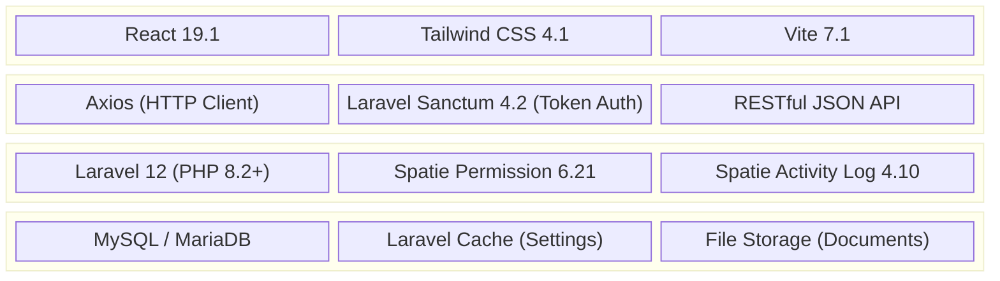

### 1.2 Frontend Stack

| Technology | Version | Purpose |
|------------|---------|---------|
| **React** | 19.1 | UI component library (SPA) |
| **React Router DOM** | 7.9 | Client-side routing, role-based route guards |
| **Tailwind CSS** | 4.1 | Utility-first CSS framework |
| **Vite** | 7.1 | Build tool and dev server |
| **Axios** | 1.12 | HTTP client for API communication |
| **TanStack React Query** | 5.90 | Server state management, caching, and synchronization |
| **Chart.js** | 4.5 | Dashboard charts and graphs |
| **react-chartjs-2** | 5.3 | React wrapper for Chart.js |
| **Framer Motion** | 12.23 | Animations and transitions |
| **SweetAlert2** | 11.23 | Modal dialogs and alerts |
| **React Icons** | 5.5 | Icon library (HeroIcons, Material Design) |
| **React Dropzone** | 14.3 | Drag-and-drop file upload |
| **React Image Crop** | 11.0 | Image cropping functionality |
| **browser-image-compression** | 2.0 | Client-side image compression |
| **ESLint** | 9.38 | Code linting and quality |

### 1.3 Backend Stack

| Technology | Version | Purpose |
|------------|---------|---------|
| **PHP** | 8.2+ | Server-side programming language |
| **Laravel Framework** | 12.0 | Web application framework |
| **Laravel Sanctum** | 4.2 | API token authentication (SPA + token) |
| **Spatie Laravel Permission** | 6.21 | Role-Based Access Control (RBAC) |
| **Spatie Laravel Activity Log** | 4.10 | Audit trail and compliance logging |
| **Intervention Image** | 3.11 | Server-side image processing |
| **Laravel Tinker** | 2.10 | REPL for debugging |
| **Laravel Pint** | 1.24 | PHP code formatter (PSR-12) |
| **Laravel Sail** | 1.41 | Docker development environment |
| **PHPUnit** | 11.5 | Unit and feature testing |
| **Faker** | 1.23 | Test data generation |
| **Mockery** | 1.6 | Mocking framework for tests |

### 1.4 Database & Infrastructure

| Technology | Purpose |
|------------|---------|
| **MySQL / MariaDB** | Primary relational database |
| **Laravel Cache** | System settings storage (key-value via database driver) |
| **Laravel File Storage** | Document storage (signature cards, NAIS, privacy forms) |
| **Laravel Queue** | Background job processing (jobs, job_batches, failed_jobs tables) |

### 1.5 Development Tools

| Tool | Purpose |
|------|---------|
| **Vite** | Frontend build and HMR (Hot Module Replacement) |
| **Concurrently** | Run Laravel server, queue worker, and Vite dev server in parallel |
| **Laravel Boost** | MCP dev tools (documentation search, tinker, database queries) |
| **Laravel Pail** | Real-time log viewer |
| **PostCSS + Autoprefixer** | CSS processing pipeline |

---

## 2. System Architecture

### 2.1 High-Level Architecture

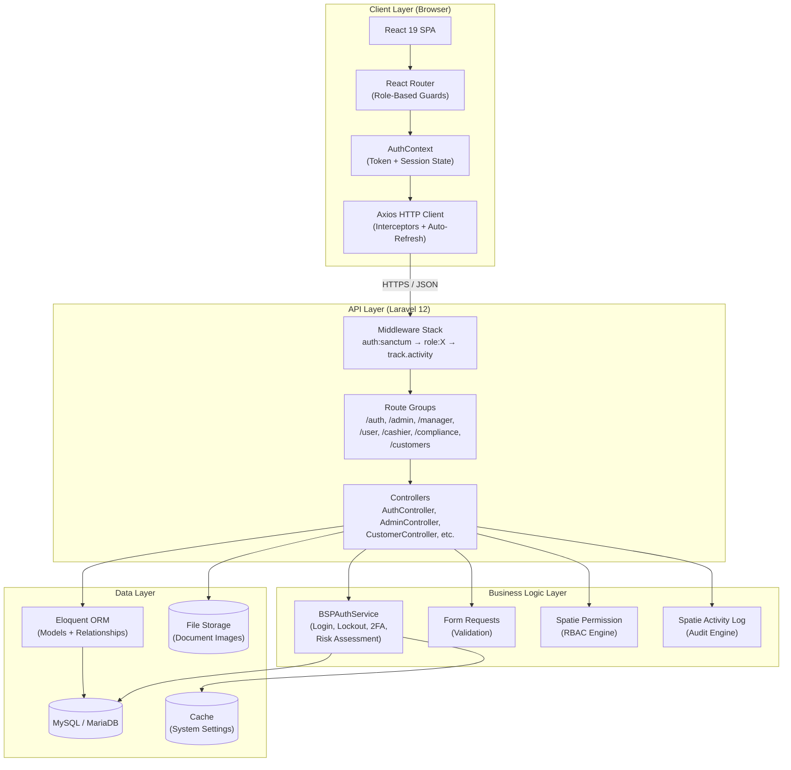

### 2.2 Frontend Architecture (React SPA)

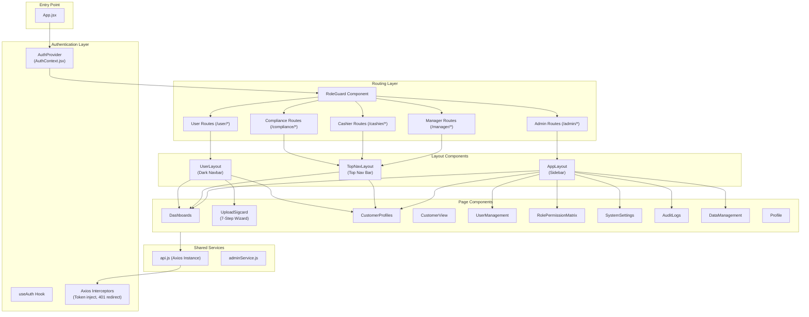

### 2.3 Backend Architecture (Laravel)

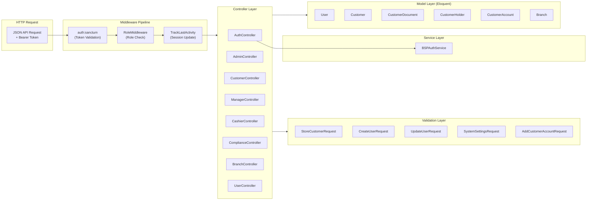

---

## 3. Software Development Methodology

### 3.1 Methodology: Agile (Iterative Incremental)

SigCard follows an **Agile Iterative-Incremental** development methodology, suited for a banking system that must evolve while maintaining BSP compliance.

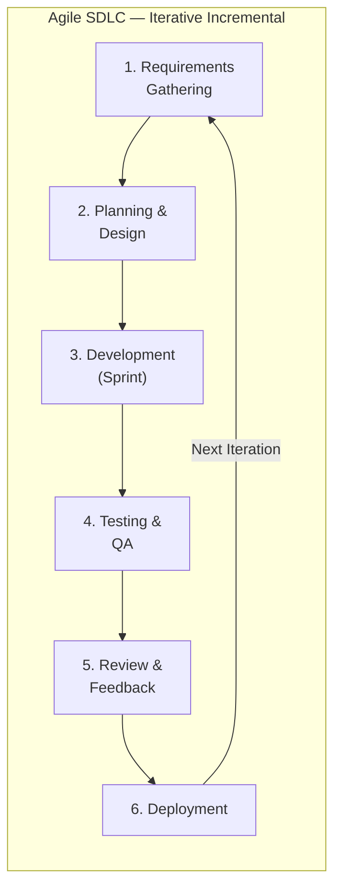

### 3.2 SDLC Phases Applied to SigCard

```mermaid
flowchart TD
    subgraph Phase1["Phase 1: Requirements Gathering"]
        R1["BSP Circular 951 & 982 compliance requirements"]
        R2["RBT Bank operational needs assessment"]
        R3["User role identification (5 roles)"]
        R4["Branch structure mapping (11 branches)"]
        R5["Document type identification<br/>(Sigcard, NAIS, Privacy, Other)"]
    end

    subgraph Phase2["Phase 2: System Design"]
        D1["Architecture: SPA + REST API (decoupled)"]
        D2["Database design: Relational (MySQL)"]
        D3["Security design: BSP-compliant auth"]
        D4["UI/UX: Role-based layouts"]
        D5["ERD and data flow design"]
    end

    subgraph Phase3["Phase 3: Iterative Development"]
        I1["Iteration 1: Auth + RBAC + User Management"]
        I2["Iteration 2: Customer CRUD + Document Upload"]
        I3["Iteration 3: Branch Hierarchy + Dashboards"]
        I4["Iteration 4: Audit Logs + Compliance Features"]
        I5["Iteration 5: Joint/Corporate Account Types"]
        I6["Iteration 6: Polish, Security Hardening, Testing"]
    end

    subgraph Phase4["Phase 4: Testing"]
        T1["PHPUnit Feature Tests"]
        T2["Manual UAT with banking staff"]
        T3["Security audit (BSP compliance check)"]
        T4["Cross-browser testing"]
    end

    subgraph Phase5["Phase 5: Deployment & Maintenance"]
        DP1["Production deployment"]
        DP2["Staff training"]
        DP3["Ongoing monitoring via audit logs"]
        DP4["Iterative enhancements"]
    end

    Phase1 --> Phase2 --> Phase3 --> Phase4 --> Phase5
```

### 3.3 Development Principles Applied

| Principle | Application in SigCard |
|-----------|----------------------|
| **Separation of Concerns** | Frontend (React SPA) completely decoupled from Backend (Laravel API) |
| **Single Responsibility** | Each controller handles one domain (Auth, Admin, Customer, etc.) |
| **DRY (Don't Repeat Yourself)** | Shared BranchDashboard component used by Manager and Cashier |
| **RBAC (Role-Based Access)** | Spatie Permission enforces access at route, controller, and UI level |
| **Defense in Depth** | Multi-layer security: token auth → role middleware → permission checks → audit log |
| **MVC Pattern** | Laravel Models → Controllers → React Views (API-driven) |
| **RESTful API Design** | Standard HTTP verbs (GET, POST, PUT, DELETE) with consistent resource paths |
| **Form Request Validation** | Validation separated from controllers into dedicated request classes |
| **Service Layer Pattern** | BSPAuthService encapsulates complex authentication business logic |
| **Audit by Default** | Spatie Activity Log tracks all mutations automatically |

---

## 4. Use Case Diagrams

### 4.1 System-Wide Use Case Diagram

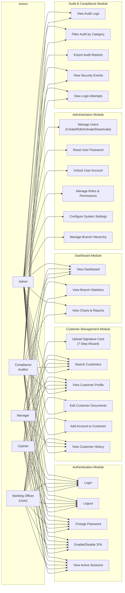

### 4.2 Use Case Matrix (Actor vs. Use Case)

| Use Case | Admin | Manager | Banking Officer | Cashier | Compliance |
|----------|:-----:|:-------:|:---------------:|:-------:|:----------:|
| Login / Logout / Change Password | Yes | Yes | Yes | Yes | Yes |
| Enable/Disable 2FA | Yes | Yes | Yes | Yes | Yes |
| Upload Signature Card | Yes | — | **Yes** | — | — |
| Search Customers | Yes | Yes | Yes | Yes | Yes |
| View Customer Profile | Yes | Yes | Yes | Yes | Yes |
| Edit Customer Documents | Yes | — | **Yes** | — | — |
| Add Account to Customer | Yes | — | **Yes** | — | — |
| View Customer History | Yes | Yes | Yes | — | Yes |
| View Dashboard | Yes | Yes | — | Yes | Yes |
| View Branch Statistics | — | Yes | — | Yes | — |
| Manage Users (CRUD) | **Yes** | — | — | — | — |
| Reset Password / Unlock | **Yes** | — | — | — | — |
| Manage Roles & Permissions | **Yes** | — | — | — | — |
| System Settings | **Yes** | — | — | — | — |
| Branch Hierarchy | **Yes** | — | — | — | — |
| View Audit Logs | Yes | — | — | — | **Yes** |
| Export Audit Reports | — | — | — | — | **Yes** |
| View Security Events | Yes | — | — | — | **Yes** |

---

## 5. Data Flow Diagrams (DFD)

### 5.1 Context Diagram (Level 0)

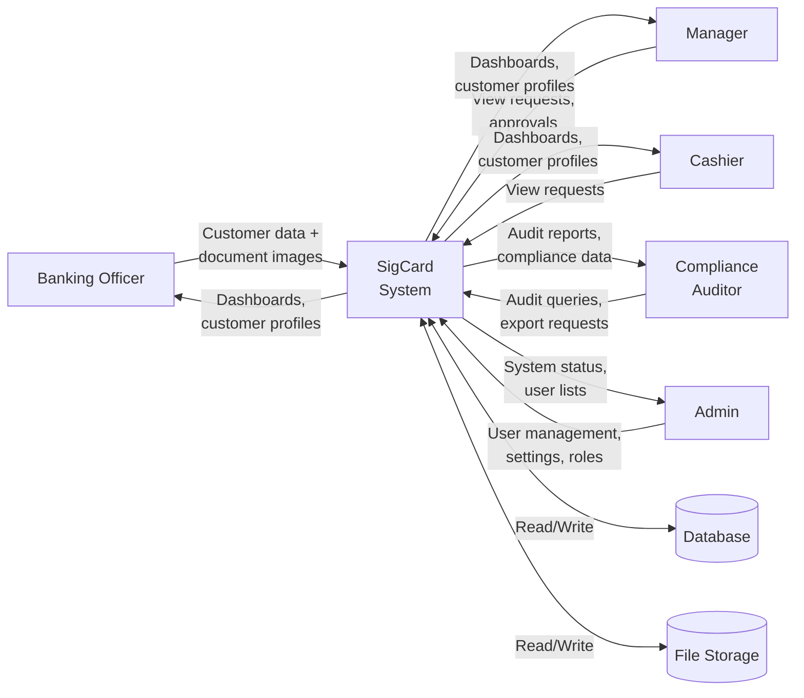

### 5.2 Level 1 DFD — Major Processes

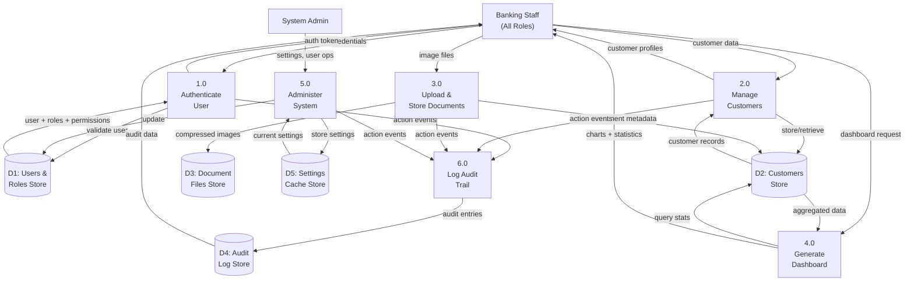

### 5.3 Level 2 DFD — Customer Document Upload Process

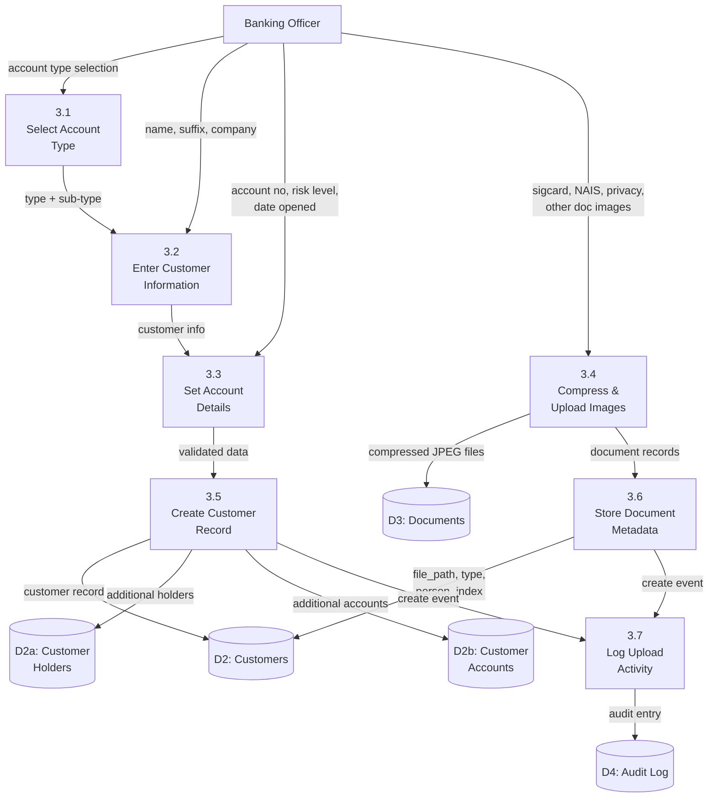

---

## 6. Process Flow Diagrams

### 6.1 Authentication Process Flow

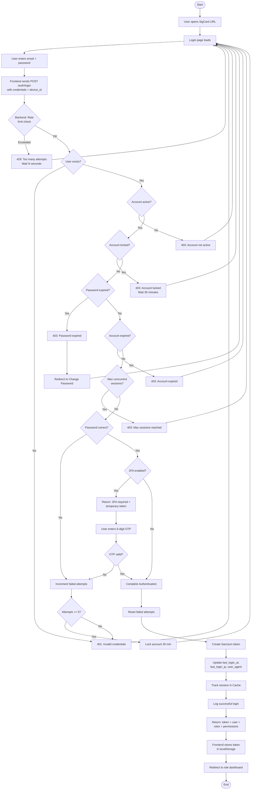

### 6.2 Signature Card Upload Process Flow

```mermaid
flowchart TD
    A([Start]) --> B["Banking Officer clicks 'Upload'"]
    B --> C["Wizard loads at Step 1"]

    C --> D["Step 1: Select Account Type"]
    D --> E{"Type selected?"}
    E -->|"Regular"| G["Step 3: Customer Info"]
    E -->|"Corporate"| G
    E -->|"Joint"| F["Step 2: Select ITF or Non-ITF"]
    F --> G

    G --> H["Enter: firstname, lastname,<br/>middlename, suffix"]
    H --> I{"Corporate?"}
    I -->|"Yes"| J["Enter: company_name +<br/>Add signatories (min 2)"]
    I -->|"No"| K{"Joint?"}
    K -->|"Yes"| L["Add persons (min 2 total)"]
    K -->|"No"| M["Single person"]
    J & L & M --> N["Step 4: Account Holder Details"]

    N --> O["Enter: account_no, date_opened,<br/>risk_level"]
    O --> P{"Multiple accounts<br/>allowed?"}
    P -->|"Yes (Regular,<br/>Non-ITF, Corporate)"| Q["Optional: Add more accounts"]
    P -->|"No (ITF)"| R["Single shared account"]
    Q & R --> S["Step 5: Upload Sigcard"]

    S --> T["Upload front & back images<br/>via drag-drop or file picker"]
    T --> U["Step 6: Upload NAIS (Optional)"]
    U --> V["Upload front & back<br/>or skip"]
    V --> W["Step 7: Data Privacy Consent"]
    W --> X["Upload front & back"]
    X --> Y["Step 8: Other Documents (Optional)"]
    Y --> Z["Upload multiple files<br/>or skip"]

    Z --> AA["Click Submit"]
    AA --> AB["Frontend: Compress all images<br/>(max 1200x1600, quality 0.82, JPEG)"]
    AB --> AC["Frontend: Build FormData<br/>(customer info + file pairs)"]
    AC --> AD["POST /api/customers<br/>multipart/form-data"]
    AD --> AE{"Backend validation<br/>passes?"}
    AE -->|"No"| AF["Show validation errors"]
    AF --> G
    AE -->|"Yes"| AG["Create customer record"]
    AG --> AH["Create additional holders"]
    AH --> AI["Create additional accounts"]
    AI --> AJ["Store document files<br/>to disk storage"]
    AJ --> AK["Create document<br/>metadata records"]
    AK --> AL["Log audit entry<br/>(customer created)"]
    AL --> AM["Return success response"]
    AM --> AN["Show success modal"]
    AN --> AO["Reset wizard form"]
    AO --> AP([End])
```

### 6.3 User Management Process Flow

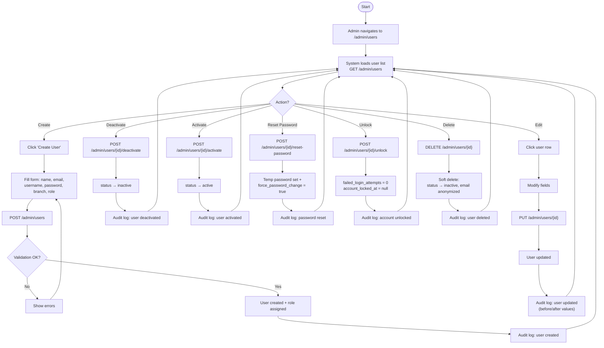

---

## 7. Sequence Diagrams

### 7.1 Login Sequence

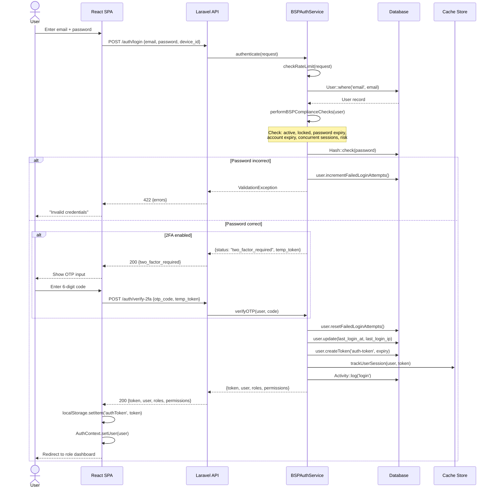

### 7.2 Document Upload Sequence

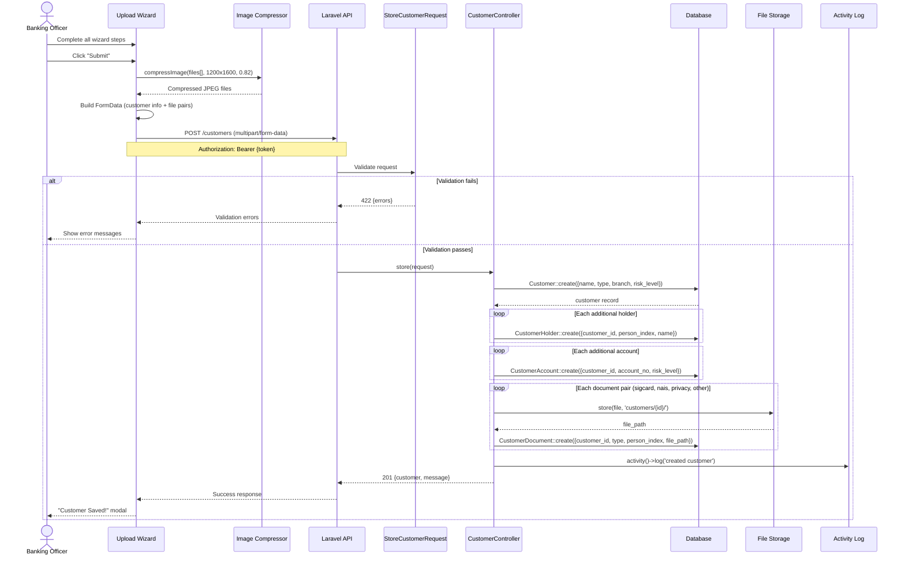

### 7.3 Token Auto-Refresh Sequence

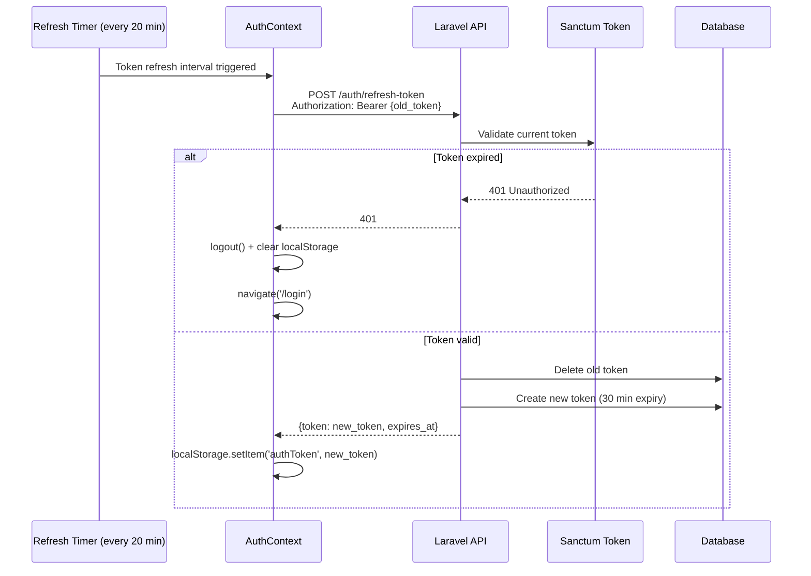

---

## 8. Component Diagram

### 8.1 System Component Diagram

```mermaid
flowchart TB
    subgraph "Frontend Application (React SPA)"
        subgraph "Core"
            AuthCtx["AuthContext<br/>(Authentication State)"]
            Router["React Router<br/>(Role Guards)"]
            AxiosInst["Axios Instance<br/>(Interceptors)"]
        end

        subgraph "Layout Components"
            AppLay["AppLayout<br/>(Admin Sidebar)"]
            TopNav["TopNavLayout<br/>(Manager/Cashier/Compliance)"]
            UserLay["UserLayout<br/>(Banking Officer Navbar)"]
        end

        subgraph "Feature Components"
            Upload["UploadSigcard<br/>(7-Step Wizard)"]
            CustProf["CustomerProfiles<br/>(Search + List)"]
            CustView["CustomerView<br/>(Profile + Documents)"]
            EditDocs["EditCustomerDocs<br/>(Replace Documents)"]
            AddAcct["AddAccount<br/>(New Account)"]
            ImgView["ImageViewer<br/>(Zoom + Pan + Navigate)"]
        end

        subgraph "Admin Components"
            UserMgmt["UserManagement"]
            RolePerm["RolePermissionMatrix"]
            SysSet["SystemSettings"]
            AuditLog["AuditLogs"]
            DataMgmt["DataManagement"]
        end

        subgraph "Dashboard Components"
            AdminDash["Admin Dashboard"]
            BranchDash["BranchDashboard<br/>(Shared: Manager + Cashier)"]
            CompDash["Compliance Dashboard"]
        end

        subgraph "Shared UI"
            DropZone["DropZone<br/>(File Upload)"]
            Charts["Chart.js Components"]
            SwalModal["SweetAlert2 Modals"]
        end
    end

    subgraph "Backend Application (Laravel 12)"
        subgraph "Middleware"
            SanctumMW["auth:sanctum"]
            RoleMW["RoleMiddleware"]
            TrackMW["TrackLastActivity"]
        end

        subgraph "Controllers"
            AuthCtrl["AuthController"]
            AdminCtrl["AdminController"]
            CustCtrl["CustomerController"]
            MgrCtrl["ManagerController"]
            CashCtrl["CashierController"]
            CompCtrl["ComplianceController"]
            BranchCtrl["BranchController"]
        end

        subgraph "Services"
            BSPAuth["BSPAuthService<br/>(Login, Lockout, 2FA, Risk)"]
        end

        subgraph "Form Requests"
            StoreCust["StoreCustomerRequest"]
            CreateUser["CreateUserRequest"]
            UpdateUser["UpdateUserRequest"]
            SysSetting["SystemSettingsRequest"]
        end

        subgraph "Models (Eloquent)"
            UserModel["User"]
            CustModel["Customer"]
            DocModel["CustomerDocument"]
            HoldModel["CustomerHolder"]
            AcctModel["CustomerAccount"]
            BranchModel["Branch"]
        end

        subgraph "Packages"
            SpatieP["Spatie Permission<br/>(RBAC)"]
            SpatieA["Spatie Activity Log<br/>(Audit)"]
            Interv["Intervention Image<br/>(Image Processing)"]
        end
    end

    subgraph "Data Stores"
        MySQL[("MySQL<br/>Database")]
        FileStore[("File Storage<br/>(storage/app)")]
        CacheStore[("Cache Store<br/>(System Settings)")]
    end

    AuthCtx <--> AxiosInst
    AxiosInst <-- "HTTPS/JSON" --> SanctumMW
    SanctumMW --> RoleMW --> TrackMW --> Controllers
    Controllers --> Services & Form Requests
    Controllers --> Models
    Models <--> MySQL
    Controllers --> FileStore
    BSPAuth --> CacheStore
    Models --> SpatieP & SpatieA
```

---

## 9. Deployment Diagram

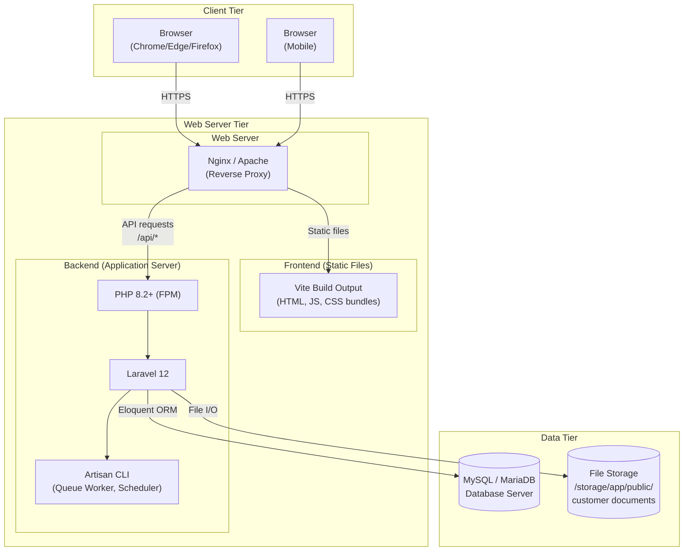

---

## 10. State Diagrams

### 10.1 User Account State Diagram

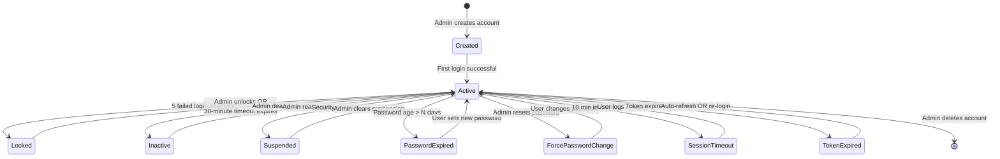

### 10.2 Customer Account Status State Diagram

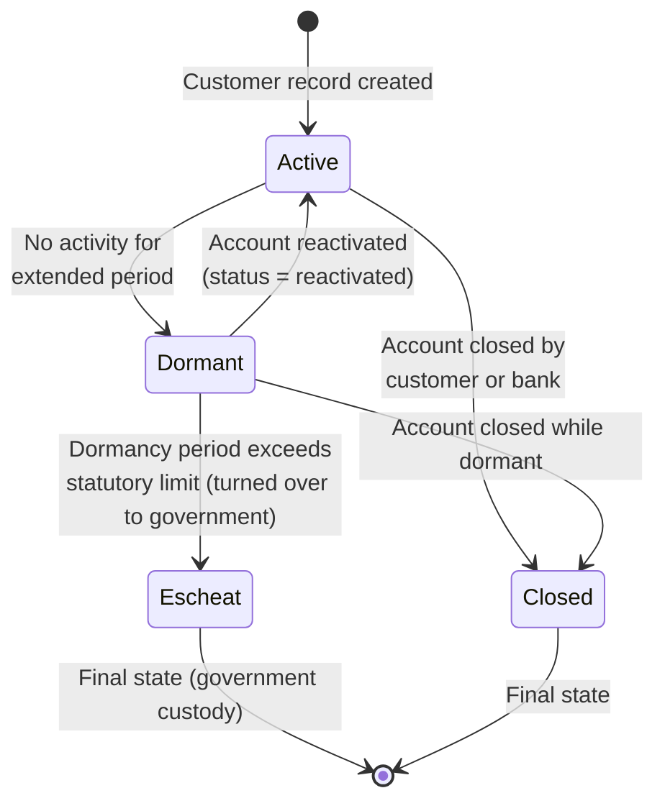

### 10.3 Document Upload State Diagram

```mermaid
stateDiagram-v2
    [*] --> Empty : Wizard opens

    Empty --> FileSelected : User selects/drops image
    FileSelected --> Previewing : Image preview renders
    Previewing --> FileSelected : User selects different file

    Previewing --> Compressing : User clicks Submit
    Compressing --> Uploading : Compression complete<br/>(JPEG, max 1200x1600)
    Uploading --> Stored : Server saves file +<br/>creates metadata record

    Stored --> Archived : Document replaced<br/>(old version archived)
    Archived --> [*] : Archived permanently

    Stored --> [*] : Document deleted

    Uploading --> Error : Upload fails
    Error --> FileSelected : User retries
```

---

## 11. Class Diagram (Backend Models)

```mermaid
classDiagram
    class User {
        +bigint id
        +string firstname
        +string lastname
        +string username
        +string email
        +string password
        +string photo
        +bigint branch_id
        +enum status
        +int failed_login_attempts
        +bool two_factor_enabled
        +bool force_password_change
        +timestamp last_login_at
        +timestamp account_expires_at
        --
        +branch() Branch
        +getFullNameAttribute() string
        +isAccountLocked() bool
        +isPasswordExpired() bool
        +incrementFailedLoginAttempts() void
        +resetFailedLoginAttempts() void
        +lockAccount(minutes) void
    }

    class Branch {
        +bigint id
        +string branch_name
        +string brak
        +string brcode
        +bigint parent_id
        --
        +parent() Branch
        +children() Collection~Branch~
        +users() Collection~User~
        +customers() Collection~Customer~
    }

    class Customer {
        +bigint id
        +string account_no
        +date date_opened
        +string firstname
        +string middlename
        +string lastname
        +string suffix
        +string company_name
        +bigint branch_id
        +bigint uploaded_by
        +enum account_type
        +string joint_sub_type
        +enum risk_level
        +enum status
        --
        +branch() Branch
        +uploader() User
        +documents() Collection~CustomerDocument~
        +holders() Collection~CustomerHolder~
        +accounts() Collection~CustomerAccount~
    }

    class CustomerDocument {
        +bigint id
        +bigint customer_id
        +enum document_type
        +tinyint person_index
        +string file_path
        +string file_name
        +string file_size
        +string mime_type
        --
        +customer() Customer
    }

    class CustomerHolder {
        +bigint id
        +bigint customer_id
        +tinyint person_index
        +string firstname
        +string middlename
        +string lastname
        +string suffix
        +string risk_level
        --
        +customer() Customer
    }

    class CustomerAccount {
        +bigint id
        +bigint customer_id
        +string account_no
        +string risk_level
        +date date_opened
        +string status
        --
        +customer() Customer
    }

    class BSPAuthService {
        +MAX_LOGIN_ATTEMPTS = 5
        +LOCKOUT_DURATION = 30
        +PASSWORD_EXPIRY_DAYS = 90
        +SESSION_TIMEOUT_MINUTES = 30
        +MAX_CONCURRENT_SESSIONS = 3
        --
        +authenticate(Request) array
        +getPasswordExpiryDays() int
        +getTokenExpirationMinutes() int
        -performBSPComplianceChecks(User, Request) void
        -handleTwoFactorAuthentication(User, Request, array) array
        -completeAuthentication(User, Request) array
        -checkRateLimit(Request) void
        -checkConcurrentSessions(User) void
        -performRiskAssessment(User, Request) void
        -trackUserSession(User, string, Request) void
    }

    Branch "1" --> "*" User : has many
    Branch "1" --> "*" Customer : has many
    Branch "1" --> "*" Branch : parent has children
    User "1" --> "*" Customer : uploaded_by
    Customer "1" --> "*" CustomerDocument : has many
    Customer "1" --> "*" CustomerHolder : has many
    Customer "1" --> "*" CustomerAccount : has many
    BSPAuthService ..> User : uses
```

---

## 12. API Route Map

### 12.1 Authentication Routes

| Method | Endpoint | Controller | Auth | Description |
|--------|----------|------------|------|-------------|
| POST | `/auth/login` | AuthController@login | Public | Login with credentials |
| POST | `/auth/register` | AuthController@register | admin | Register new user |
| POST | `/auth/verify-2fa` | AuthController@verifyTwoFactor | Public | Verify 2FA OTP code |
| GET | `/auth/me` | AuthController@me | Any | Get current user info |
| POST | `/auth/logout` | AuthController@logout | Any | Logout and revoke token |
| POST | `/auth/refresh-token` | AuthController@refreshToken | Any | Refresh auth token |
| POST | `/auth/change-password` | AuthController@changePassword | Any | Change own password |
| POST | `/auth/enable-2fa` | AuthController@enableTwoFactor | Any | Enable 2FA |
| POST | `/auth/disable-2fa` | AuthController@disableTwoFactor | Any | Disable 2FA |
| GET | `/auth/active-sessions` | AuthController@activeSessions | Any | List active sessions |

### 12.2 Admin Routes

| Method | Endpoint | Controller | Description |
|--------|----------|------------|-------------|
| GET | `/admin/dashboard` | AdminController@getDashboardStats | System-wide statistics |
| GET | `/admin/users` | AdminController@getAllUsers | List all users |
| POST | `/admin/users` | AdminController@createUser | Create user |
| PUT | `/admin/users/{user}` | AdminController@updateUser | Update user |
| DELETE | `/admin/users/{user}` | AdminController@deleteUser | Delete user |
| POST | `/admin/users/{user}/activate` | AdminController@activateUser | Activate user |
| POST | `/admin/users/{user}/deactivate` | AdminController@deactivateUser | Deactivate user |
| POST | `/admin/users/{user}/unlock` | AdminController@unlockUser | Unlock locked account |
| POST | `/admin/users/{user}/reset-password` | AdminController@resetUserPassword | Reset password |
| GET | `/admin/roles` | AdminController@getAllRoles | List roles |
| POST | `/admin/roles` | AdminController@createRole | Create role |
| PUT | `/admin/roles/{role}` | AdminController@updateRole | Update role permissions |
| DELETE | `/admin/roles/{role}` | AdminController@deleteRole | Delete role |
| GET | `/admin/permissions` | AdminController@getAllPermissions | List permissions |
| GET | `/admin/system-settings` | AdminController@getSystemSettings | Get settings |
| PUT | `/admin/system-settings` | AdminController@updateSystemSettings | Update settings |
| GET | `/admin/audit-logs` | AdminController@getAuditLogs | View audit trail |
| GET | `/admin/branch-hierarchy` | AdminController@getBranchHierarchy | Branch tree |
| PUT | `/admin/branches/{branch}/parent` | AdminController@updateBranchParent | Set parent branch |

### 12.3 Customer Routes

| Method | Endpoint | Roles | Description |
|--------|----------|-------|-------------|
| GET | `/customers` | All | List customers (branch-scoped) |
| GET | `/customers/{id}` | All | View customer details |
| GET | `/customers/{id}/documents` | All | List customer documents |
| GET | `/customers/{id}/history` | All | View change history |
| POST | `/customers` | user, manager, admin | Create customer + upload docs |
| PUT | `/customers/{id}` | user, manager, admin | Update customer info |
| DELETE | `/customers/{id}` | user, manager, admin | Delete customer |
| POST | `/customers/{id}/replace-document` | user, manager, admin | Replace a document |
| POST | `/customers/{id}/add-account` | user, manager, admin | Add account to customer |
| DELETE | `/customers/{id}/documents/{doc}` | user, manager, admin | Delete a document |

### 12.4 Role-Specific Routes

| Prefix | Roles Allowed | Key Endpoints |
|--------|---------------|---------------|
| `/manager/*` | manager, admin | Dashboard, customers, documents, reports, approvals |
| `/cashier/*` | cashier, admin | Dashboard, customers (read-only), documents |
| `/compliance/*` | compliance-audit, admin | Dashboard, audit logs, compliance reports, risk assessments |
| `/user/*` | user, manager, admin | Transactions, accounts, customers, reports |
| `/branches` | All authenticated | List all branches |

---

## 13. Security Architecture

### 13.1 Defense-in-Depth Model

```mermaid
flowchart TD
    subgraph Layer1["Layer 1: Network"]
        HTTPS["HTTPS / TLS Encryption"]
    end

    subgraph Layer2["Layer 2: Authentication"]
        CRED["Email + Password"]
        TFA["Two-Factor Auth (OTP)"]
        TOKEN["Sanctum Bearer Token"]
    end

    subgraph Layer3["Layer 3: Authorization"]
        ROLE["Role Check (Middleware)"]
        PERM["Permission Check (Spatie)"]
        BRANCH["Branch Scope Filter"]
    end

    subgraph Layer4["Layer 4: Input Validation"]
        FREQ["Form Request Validation"]
        SANIT["Input Sanitization"]
        CSRF["CSRF Protection"]
    end

    subgraph Layer5["Layer 5: Business Rules"]
        RATE["Rate Limiting (5 attempts)"]
        LOCK["Account Lockout (30 min)"]
        SESS["Session Limits (max 3)"]
        RISK["Risk-Based Assessment"]
        PEXP["Password Expiry"]
    end

    subgraph Layer6["Layer 6: Audit & Monitoring"]
        ALOG["Activity Log (all mutations)"]
        SLOG["Security Event Log"]
        LLOG["Login Attempt Log"]
    end

    Layer1 --> Layer2 --> Layer3 --> Layer4 --> Layer5 --> Layer6
```

### 13.2 BSP Compliance Mapping

| BSP Requirement | Circular | SigCard Implementation | Layer |
|----------------|----------|----------------------|-------|
| Multi-Factor Authentication | 982 | TOTP-based 2FA (optional, admin-enforceable) | Authentication |
| Access Control | 951 | 5 roles, 70+ granular permissions via Spatie | Authorization |
| Account Lockout | 951 | Auto-lock after 5 failed attempts, 30-min duration | Business Rules |
| Password Complexity | 951 | Min 8 chars, uppercase, lowercase, number, special char | Authentication |
| Password Rotation | 951 | Configurable expiry (default 90 days, toggleable) | Business Rules |
| Session Management | 982 | Configurable timeout, max 3 concurrent sessions | Business Rules |
| Audit Trail | 951/982 | Spatie Activity Log — all actions with before/after values | Audit |
| Data Privacy | DPA | Digital consent forms stored with customer records | Business |
| Record Retention | 951 | Configurable audit log retention (min 365 days) | Audit |
| Risk Assessment | 982 | Login risk scoring (IP, device, timing factors) | Business Rules |
| Principle of Least Privilege | 951 | Role-based UI + API enforcement, branch scoping | Authorization |

---

*Document maintained by the IT Department of RBT Bank Inc.*
*Version: 1.0 — March 2026*
