# SigCard System — User Manual

**Rural Bank of Talisayan, Inc. (RBT Bank)**
**Misamis Oriental, Philippines**

**Version:** 1.0
**Date:** March 2026
**Classification:** Internal Use Only — BSP-Compliant System Documentation

---

## Table of Contents

- [1. System Overview](#1-system-overview)
  - [1.1 What is SigCard?](#11-what-is-sigcard)
  - [1.2 Key Features](#12-key-features)
  - [1.3 User Roles](#13-user-roles)
  - [1.4 Branch Structure](#14-branch-structure)
- [2. Getting Started](#2-getting-started)
  - [2.1 Accessing the System](#21-accessing-the-system)
  - [2.2 Logging In](#22-logging-in)
  - [2.3 First-Time Login](#23-first-time-login)
  - [2.4 Password Requirements](#24-password-requirements)
  - [2.5 Session Timeout and Auto-Logout](#25-session-timeout-and-auto-logout)
  - [2.6 Logging Out](#26-logging-out)
- [3. Navigation Guide](#3-navigation-guide)
  - [3.1 Admin Navigation (Sidebar)](#31-admin-navigation-sidebar)
  - [3.2 Manager Navigation (Top Bar)](#32-manager-navigation-top-bar)
  - [3.3 Cashier Navigation (Top Bar)](#33-cashier-navigation-top-bar)
  - [3.4 Banking Officer Navigation (Dark Theme)](#34-banking-officer-navigation-dark-theme)
  - [3.5 Compliance Auditor Navigation (Top Bar)](#35-compliance-auditor-navigation-top-bar)
  - [3.6 Role-to-Layout Map](#36-role-to-layout-map)
- [4. Signature Card Upload](#4-signature-card-upload)
  - [4.1 Overview](#41-overview)
  - [4.2 Starting a New Upload](#42-starting-a-new-upload)
  - [4.3 Step 1 — Account Type](#43-step-1--account-type)
  - [4.4 Step 2 — Joint Type (Joint Only)](#44-step-2--joint-type-joint-only)
  - [4.5 Step 3 — Customer Information](#45-step-3--customer-information)
  - [4.6 Step 4 — Account Holder Details](#46-step-4--account-holder-details)
  - [4.7 Step 5 — Signature Card Upload](#47-step-5--signature-card-upload)
  - [4.8 Step 6 — NAIS Upload (Optional)](#48-step-6--nais-upload-optional)
  - [4.9 Step 7 — Data Privacy Consent](#49-step-7--data-privacy-consent)
  - [4.10 Step 8 — Other Documents (Optional)](#410-step-8--other-documents-optional)
  - [4.11 Submission](#411-submission)
  - [4.12 Upload Process Flow](#412-upload-process-flow)
- [5. Customer Profile Management](#5-customer-profile-management)
  - [5.1 Searching for Customers](#51-searching-for-customers)
  - [5.2 Viewing a Customer Profile](#52-viewing-a-customer-profile)
  - [5.3 Account Statuses](#53-account-statuses)
  - [5.4 Risk Levels](#54-risk-levels)
  - [5.5 Viewing Documents](#55-viewing-documents)
  - [5.6 Image Viewer Controls](#56-image-viewer-controls)
  - [5.7 Editing or Replacing Documents](#57-editing-or-replacing-documents)
  - [5.8 Adding Additional Accounts](#58-adding-additional-accounts)
- [6. Dashboard Guide](#6-dashboard-guide)
  - [6.1 Admin Dashboard](#61-admin-dashboard)
  - [6.2 Manager Dashboard](#62-manager-dashboard)
  - [6.3 Cashier Dashboard](#63-cashier-dashboard)
  - [6.4 Compliance Dashboard](#64-compliance-dashboard)
- [7. Administration Guide](#7-administration-guide)
  - [7.1 User Management](#71-user-management)
  - [7.2 Role and Permission Management](#72-role-and-permission-management)
  - [7.3 System Settings](#73-system-settings)
  - [7.4 Audit Logs](#74-audit-logs)
  - [7.5 Data Management](#75-data-management)
  - [7.6 User Lifecycle Flow](#76-user-lifecycle-flow)
- [8. Security Features](#8-security-features)
  - [8.1 Two-Factor Authentication (2FA)](#81-two-factor-authentication-2fa)
  - [8.2 Account Lockout](#82-account-lockout)
  - [8.3 Password Expiry](#83-password-expiry)
  - [8.4 Session Management](#84-session-management)
  - [8.5 Risk-Based Authentication](#85-risk-based-authentication)
  - [8.6 Security Flow](#86-security-flow)
- [9. Compliance and Audit](#9-compliance-and-audit)
  - [9.1 What Gets Logged](#91-what-gets-logged)
  - [9.2 Viewing Audit Trails](#92-viewing-audit-trails)
  - [9.3 BSP Compliance Features](#93-bsp-compliance-features)
- [10. Account Types Reference](#10-account-types-reference)
  - [10.1 Regular Account](#101-regular-account)
  - [10.2 Joint Account — ITF (In Trust For)](#102-joint-account--itf-in-trust-for)
  - [10.3 Joint Account — Non-ITF](#103-joint-account--non-itf)
  - [10.4 Corporate Account](#104-corporate-account)
  - [10.5 Document Requirements Comparison](#105-document-requirements-comparison)
- [11. Troubleshooting and FAQ](#11-troubleshooting-and-faq)
- [12. Glossary](#12-glossary)

---

## 1. System Overview

### 1.1 What is SigCard?

SigCard is the Signature Card Management System used by RBT Bank Inc. (Rural Bank of Talisayan). It allows banking staff to digitally capture, store, and manage customer signature cards and related documents across all branches.

The system was built to comply with **Bangko Sentral ng Pilipinas (BSP) Circular 951 and 982**, which require banks to maintain secure, auditable records of customer identity documents. By going digital, RBT Bank replaces fragile paper-based signature cards with a secure, searchable, and backed-up digital system.

### 1.2 Key Features

| Feature | Description |
|---------|-------------|
| Digital Signature Card Upload | Capture front and back images of customer signature cards |
| Multiple Account Types | Support for Regular, Joint (ITF & Non-ITF), and Corporate accounts |
| Customer Profile Management | Search, view, and manage customer records and documents |
| Role-Based Access Control | Five distinct user roles with different permissions |
| BSP-Compliant Security | Account lockout, password expiry, 2FA, session management |
| Audit Logging | Every action is recorded for compliance and accountability |
| Branch-Scoped Access | Users see only data from their assigned branch |
| Multi-Branch Support | 11 branches including main offices and Branch Lite Units |

### 1.3 User Roles

SigCard has five user roles, each with specific responsibilities:

| Role | Who Uses It | Primary Responsibilities |
|------|-------------|------------------------|
| **Admin** | System Administrator | Full system access — manage users, roles, settings, audit logs |
| **Manager** | Branch Manager | Oversee branch operations, approve transactions, manage staff |
| **User (Banking Officer)** | Banking Staff | Upload signature cards, manage customer profiles |
| **Cashier** | Teller/Cashier | View customer records and documents (branch-scoped, read-only) |
| **Compliance Auditor** | Compliance Officer | Review audit logs, compliance reports, monitor system activity |

### 1.4 Branch Structure

RBT Bank operates across 11 locations. The system organizes these as follows:

| Branch Name | Abbreviation | Code |
|-------------|-------------|------|
| Head Office | HO | 00 |
| Main Office | MO | 01 |
| Jasaan | JB | 02 |
| Salay | SB | 03 |
| CDO | CDOB | 04 |
| Maramag | MB | 05 |
| Gingoog BLU | GNG-BLU | 06 |
| Camiguin BLU | CMG-BLU | 07 |
| Butuan BLU | BXU-BLU | 08 |
| Kibawe BLU | KIBAWE-BLU | 09 |
| Claveria BLU | Claveria-BLU | 10 |

> **Note:** Branches marked "BLU" are Branch Lite Units — smaller, satellite offices that fall under the supervision of a mother branch.

---

## 2. Getting Started

### 2.1 Accessing the System

1. Open a web browser (Google Chrome, Microsoft Edge, or Mozilla Firefox recommended).
2. Navigate to the SigCard URL provided by your administrator.
3. You will see the login page with the SigCard logo and login form.

> **Tip:** Bookmark the URL for quick access. Make sure you have a stable internet connection.

### 2.2 Logging In

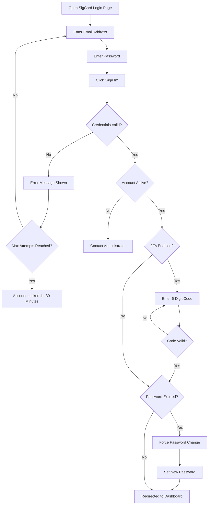

To log in:

1. Enter your **email address** (e.g., `jdelacruz@sigcard.com`).
2. Enter your **password**.
3. Click **Sign In**.
4. If two-factor authentication is enabled, you will be prompted to enter a 6-digit verification code.
5. Upon successful login, you are redirected to your role's dashboard.

### 2.3 First-Time Login

When logging in for the first time — or if an administrator has reset your password — the system may require you to change your password before proceeding. You will see a "Change Password" screen.

1. Enter your temporary or default password.
2. Create a new password that meets the requirements below.
3. Confirm your new password by typing it again.
4. Click **Change Password**.
5. You will be redirected to your dashboard.

### 2.4 Password Requirements

Your password must meet the following complexity rules:

- At least **8 characters** long
- Contains at least **one uppercase letter** (A–Z)
- Contains at least **one lowercase letter** (a–z)
- Contains at least **one number** (0–9)
- Contains at least **one special character** (!@#$%^&* etc.)

> **Tip:** Choose a password you can remember but others cannot guess. Never share your password with anyone, even fellow staff.

### 2.5 Session Timeout and Auto-Logout

For security, the system monitors your activity:

- **Inactivity timeout**: If you do not move your mouse, press a key, or touch the screen for **10 minutes** (default), you will be automatically logged out.
- **Token expiration**: Your login session token expires after **30 minutes** by default. While you are actively using the system, the token automatically refreshes every 20 minutes.
- When auto-logout occurs, you will be returned to the login page. Any unsaved work may be lost.

> **Tip:** Save your work frequently. If you need to step away, log out manually to protect your account.

### 2.6 Logging Out

To log out properly:

1. Click on your **profile avatar** or name (top-right corner of the screen).
2. From the dropdown menu, click **Logout**.
3. You will be returned to the login page.

> **Important:** Always log out when you are done. Do not simply close the browser, as your session may remain active until it expires.

---

## 3. Navigation Guide

Different roles see different navigation layouts. This is by design — each role only sees the pages they need.

### 3.1 Admin Navigation (Sidebar)

Admins use a **left sidebar** layout with a dark gradient background. The sidebar can be expanded or collapsed.

**Menu Items:**

| Icon | Label | Path | Description |
|------|-------|------|-------------|
| Dashboard | Dashboard | /admin/dashboard | System-wide statistics and charts |
| People | Users | /admin/users | Create, edit, and manage user accounts |
| Security | Roles & Permissions | /admin/roles | Configure role-permission matrix |
| History | Audit Logs | /admin/audit-logs | View all system activity logs |
| Search | Customer Profiles | /admin/customers | Search and view customer records |
| Tree | Data Management | /admin/data-management | Manage branch hierarchy and data |
| Settings | Settings | /admin/settings | Configure system-wide settings |

### 3.2 Manager Navigation (Top Bar)

Managers use a **top navigation bar** with a dark gradient background.

**Menu Items:**

| Label | Path | Description |
|-------|------|-------------|
| Dashboard | /manager/dashboard | Branch-level statistics and overview |
| Customers | /manager/customers | View customer profiles within the branch |
| Documents | /manager/documents | View and manage documents |

**Profile dropdown** (click your name, top-right):
- **Profile** — View and edit your own profile
- **Logout** — Sign out of the system

### 3.3 Cashier Navigation (Top Bar)

Cashiers use the same **top navigation bar** style as managers.

**Menu Items:**

| Label | Path | Description |
|-------|------|-------------|
| Dashboard | /cashier/dashboard | Branch-level statistics (read-only) |
| Customers | /cashier/customers | View customer profiles (read-only) |
| Documents | /cashier/documents | View documents (read-only) |

### 3.4 Banking Officer Navigation (Dark Theme)

Banking Officers (User role) use a **dark-themed top navigation bar** branded with "RBTBK."

**Menu Items:**

| Label | Path | Description |
|-------|------|-------------|
| Home | /user/dashboard | Personal dashboard and quick actions |
| Upload | /user/upload | Upload new signature cards (wizard) |
| Customer Profiles | /user/customers | Search and manage customer records |

**Profile dropdown** (click your avatar, top-right):
- **My Profile** — View and edit your profile
- **Logout** — Sign out of the system

### 3.5 Compliance Auditor Navigation (Top Bar)

Compliance Auditors use the **top navigation bar** layout.

**Menu Items:**

| Label | Path | Description |
|-------|------|-------------|
| Dashboard | /compliance/dashboard | System-wide compliance overview |
| Audit Logs | /compliance/audit-logs | Detailed audit trail with filters |
| Customer Profiles | /compliance/customers | Read-only view of all customer records |

### 3.6 Role-to-Layout Map

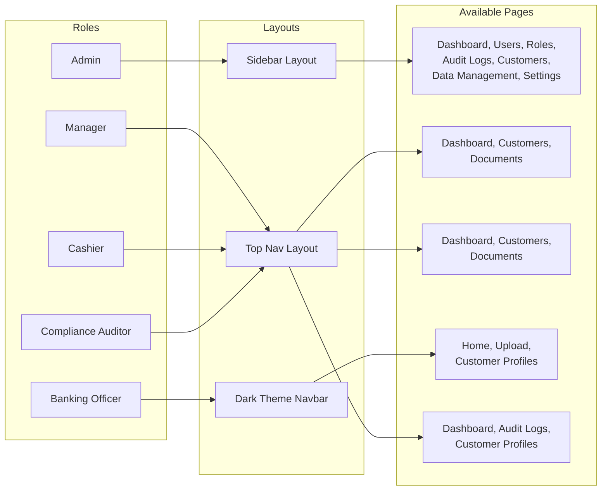

---

## 4. Signature Card Upload

### 4.1 Overview

The Signature Card Upload is the core feature of SigCard. It allows Banking Officers to capture and store digital copies of a customer's signature card, NAIS form, data privacy consent, and other supporting documents.

The process uses a **step-by-step wizard** that guides you through the entire upload.

### 4.2 Starting a New Upload

1. Log in as a **Banking Officer** (User role).
2. Click **Upload** in the top navigation bar.
3. The upload wizard opens at Step 1.

### 4.3 Step 1 — Account Type

Choose the type of account you are creating a signature card for:

| Account Type | Description | When to Use |
|-------------|-------------|-------------|
| **Regular** | Standard individual account | A single person opening a savings or checking account |
| **Joint** | Shared account by two or more people | Two or more individuals sharing one account |
| **Corporate** | Business or organization account | A company, NGO, cooperative, or other entity |

Click the card that matches the account type, then click **Next**.

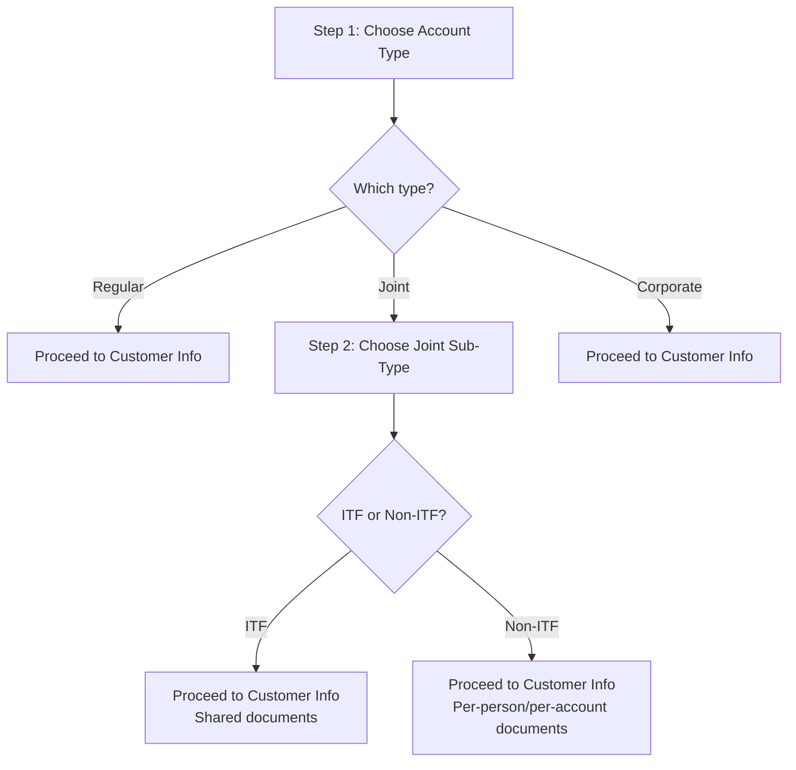

### 4.4 Step 2 — Joint Type (Joint Only)

This step only appears when you selected **Joint** in Step 1. Choose the sub-type:

| Sub-Type | Description | Document Structure |
|----------|-------------|--------------------|
| **ITF (In Trust For)** | Two or more persons share one account. All documents are shared. | One set of documents shared by all persons |
| **Non-ITF** | One customer with one or more accounts. Documents are per-person or per-account. | Signature card front is shared; back is per-person. NAIS and other docs are per-account. |

### 4.5 Step 3 — Customer Information

Enter the customer's personal details:

**For Regular and Joint accounts:**
- **First Name** (required)
- **Middle Name** (optional)
- **Last Name** (required)
- **Suffix** (optional — e.g., Jr., Sr., III)

**For Corporate accounts:**
- **Company Name** (required)
- Additional authorized signatories (persons) are added here

**For Joint accounts (ITF and Non-ITF):**
- Enter the primary person's details
- Click **Add Person** to add additional account holders (minimum 2 persons total)
- Each person requires First Name and Last Name at minimum

> **Tip:** Names are automatically formatted to Title Case (first letter capitalized). Double-check spelling before proceeding.

### 4.6 Step 4 — Account Holder Details

Set the account details:

- **Account Number** (required) — Enter the account number as it appears in the bank's records
- **Date Opened** (required) — Select the date the account was opened
- **Risk Level** (required) — Choose one:
  - **Low Risk** — Standard customers with complete documentation
  - **Medium Risk** — Customers requiring additional monitoring
  - **High Risk** — Customers flagged for enhanced due diligence

**For accounts that support multiple accounts** (Regular, Non-ITF, Corporate):
- Click **Add Account** to add additional account numbers for this customer

### 4.7 Step 5 — Signature Card Upload

Upload images of the physical signature card:

**How to upload:**
1. Click the **drop zone** area, or drag and drop an image file onto it.
2. Upload the **front** of the signature card.
3. Upload the **back** of the signature card.
4. Review the image preview to make sure it is clear and legible.
5. To replace an image, click on the preview and select a new file.

**Image requirements:**
- Supported formats: **JPG, PNG**
- Maximum file size: **10 MB** per image
- Images are automatically compressed for storage efficiency
- Ensure the signature card is well-lit and all text is readable

**Document count by account type:**

| Account Type | Sigcard Front | Sigcard Back |
|-------------|---------------|--------------|
| Regular | 1 per account | 1 per account |
| Joint ITF | Shared (1 set, can add more) | Shared (1 set, can add more) |
| Joint Non-ITF | 1 shared front | 1 per person |
| Corporate | 1 front | 1 back per authorized signatory |

### 4.8 Step 6 — NAIS Upload (Optional)

Upload the **New Account Information Sheet (NAIS)**, if available. This step is optional — you may skip it by clicking **Next**.

- Upload the **front** and **back** of the NAIS form.
- For Joint ITF accounts, NAIS documents are shared.
- For Regular and Non-ITF accounts, NAIS documents are per-account.

### 4.9 Step 7 — Data Privacy Consent

Upload the signed **Data Privacy Consent** form:

- Upload the **front** and **back** of the consent form.
- For Joint ITF accounts, privacy documents are shared among all persons.
- For Joint Non-ITF accounts, privacy documents are shared (not per-account).
- For Regular accounts, privacy documents are per-account.
- You can click **Add Another Data Privacy** if there are additional signed forms.

### 4.10 Step 8 — Other Documents (Optional)

Upload any additional supporting documents, such as:
- Valid ID copies
- Proof of address
- Business permits (Corporate)
- Board resolutions (Corporate)
- Any other bank-required documents

This step is optional. You may upload multiple files at once — click or drag files into the drop zone. Click **Next** or **Submit** when done.

### 4.11 Submission

After completing all steps:

1. Review your entries using the step navigation (click any completed step to go back and review).
2. Click **Submit** on the final step.
3. The system will:
   - Compress and upload all images
   - Create the customer record
   - Create the account record(s)
   - Store all documents with proper classifications
   - Record the action in the audit log
4. A success message will appear. You can then upload another card or go to Customer Profiles.

### 4.12 Upload Process Flow

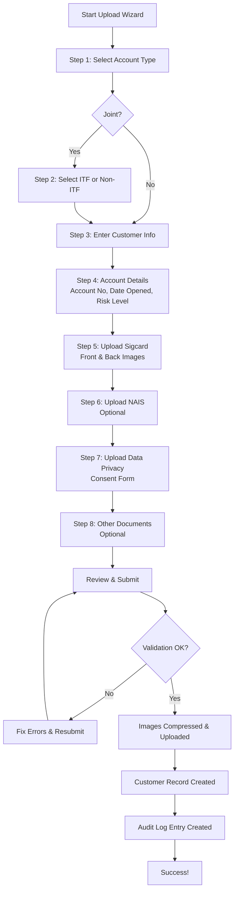

---

## 5. Customer Profile Management

### 5.1 Searching for Customers

1. Navigate to **Customer Profiles** from your menu.
2. Use the **search bar** at the top to search by:
   - Customer name (first name, last name)
   - Account number
   - Company name (Corporate accounts)
3. Results appear as cards or a list, showing:
   - Customer ID (e.g., C-0001)
   - Full name
   - Account type (Regular, Joint, Corporate)
   - Account status
   - Risk level
   - Branch
4. Click on a customer card to view their full profile.

> **Tip:** Results are paginated (10 per page). Use the pagination controls at the bottom to navigate.

### 5.2 Viewing a Customer Profile

The customer profile page shows:

- **Customer header** — Name, customer ID, account type badge, status badge
- **Account information** — Account number, date opened, risk level
- **Branch** — The branch where the account was opened
- **Documents section** — All uploaded documents organized by type:
  - Signature Card (front and back)
  - NAIS (front and back)
  - Data Privacy (front and back)
  - Other Documents
- **Joint account persons** — For Joint accounts, tabs show each person's details

### 5.3 Account Statuses

| Status | Color | Description |
|--------|-------|-------------|
| **Active** | Green | Account is open and in use |
| **Dormant** | Yellow | Account has had no transactions for a prolonged period |
| **Escheat** | Orange | Account has been turned over to the government after extended dormancy |
| **Closed** | Red | Account has been closed |
| **Reactivated** | Teal | A previously dormant account that has been reactivated |

### 5.4 Risk Levels

| Risk Level | Color | Description |
|------------|-------|-------------|
| **Low Risk** | Green | Standard customers with complete documentation and no adverse findings |
| **Medium Risk** | Yellow | Customers with some flags — additional monitoring recommended |
| **High Risk** | Red | Customers flagged for enhanced due diligence (EDD) per BSP AML requirements |

### 5.5 Viewing Documents

Documents are displayed in organized sections:

- **Signature Card** — Front and back paired together
- **NAIS** — Front and back paired together
- **Data Privacy** — Front and back paired together
- **Other Documents** — Listed individually with thumbnails

Click on any document thumbnail to open the **Image Viewer** for a full-screen view.

### 5.6 Image Viewer Controls

The image viewer opens in full-screen mode with these controls:

| Control | Action |
|---------|--------|
| **Left/Right Arrows** | Navigate between documents (or press keyboard arrow keys) |
| **Zoom In (+)** | Zoom into the image for closer inspection |
| **Zoom Out (-)** | Zoom out to see the full image |
| **Click and Drag** | Pan across a zoomed image |
| **Escape key** | Close the image viewer |
| **X button** | Close the image viewer |

> **Tip:** Use zoom to verify signatures are legible. This is especially important when comparing signature cards during customer verification.

### 5.7 Editing or Replacing Documents

Banking Officers can edit or replace documents for existing customers:

1. Navigate to the customer's profile.
2. Click the **Edit** button (pencil icon) on the document section.
3. The edit view shows all existing documents grouped into pairs.
4. To replace a document, click on the existing image and select a new file.
5. For Joint accounts:
   - **Shared documents** show a purple **"Shared"** badge
   - ITF accounts: all document types are shared
   - Non-ITF accounts: only data privacy documents are shared
6. Click **Save** to save your changes. The previous version is archived.

### 5.8 Adding Additional Accounts

To add a new account to an existing customer:

1. Navigate to the customer's profile.
2. Click **Add Account**.
3. Enter the new account number, date opened, and risk level.
4. Upload the required documents for the new account.
5. Submit the new account.

This is available for Regular and Non-ITF Joint accounts, which support multiple accounts per customer.

---

## 6. Dashboard Guide

### 6.1 Admin Dashboard

The Admin Dashboard provides a **system-wide overview** of SigCard:

**Summary Cards (top row):**
- **Total Customers** — Number of customer records across all branches
- **SigCard Uploads** — Total signature cards uploaded
- **Total Documents** — Total count of all document types
- **System Users** — Number of registered users

**Status Breakdown (second row):**
- Four cards showing Active, Dormant, Escheat, and Closed counts with percentage bars

**Charts and Graphs:**
- **Customers by Branch** — Stacked bar chart showing customer counts per branch (excludes Head Office)
- **Status Distribution** — Pie chart of active/dormant/escheat/closed ratios
- **Monthly Customer Uploads** — Line chart showing upload trends over the last 6 months
- **Account Types** — Pie chart breaking down Regular, Joint, and Corporate accounts
- **SigCard Uploads by Branch** — Bar chart comparing upload volumes across branches
- **Risk Level Distribution** — Horizontal bars showing Low, Medium, and High risk customer counts

**Tables:**
- **Branch Breakdown** — Detailed table with all statuses per branch
- **Recent Customer Uploads** — The 8 most recent uploads showing customer name, branch, type, status, uploader, and date

### 6.2 Manager Dashboard

The Manager Dashboard is **scoped to your branch** and shows a personalized greeting ("Welcome, [Your Name]") with your branch name.

**Summary Cards (5 cards, clickable):**
- **Total Customers** — Customers in your branch (click to view list)
- **Total Documents** — Documents in your branch (click to view)
- **Today's Uploads** — Uploads made today
- **Branch Users** — Staff members in your branch
- **Active Customers** — Currently active customer accounts

**Additional Sections:**
- **Status Breakdown** — Active, Dormant, Escheat, Closed cards (interactive)
- **Account Types** — Horizontal bar showing Regular/Joint/Corporate breakdown
- **Risk Level Distribution** — Low/Medium/High risk counts
- **Monthly Uploads** — Last 6 months upload bar visualization
- **Branch Summary** — If your branch has assigned Branch Lite Units, a table showing the hierarchy
- **Recent Customer Uploads** — Latest uploads with customer name, type, status, and date

### 6.3 Cashier Dashboard

The Cashier Dashboard is **scoped to your branch** and provides the same layout as the Manager Dashboard (read-only access):

- Same 5 summary cards (Total Customers, Total Documents, Today's Uploads, Branch Users, Active Customers)
- Same status breakdown, account types, risk levels, and monthly uploads views
- Same branch summary and recent uploads table
- All data is read-only — you can view but not modify records

### 6.4 Compliance Dashboard

The Compliance Dashboard provides a **system-wide audit view** with BSP compliance focus:

**Header:** "Compliance & Audit Dashboard" with a shield icon and the tagline "BSP-compliant oversight, all branches."

**Summary Cards:** Total Customers, SigCard Uploads, Total Documents, System Users (system-wide counts)

**Charts (similar to Admin Dashboard):**
- Customers by Branch (stacked bar chart)
- Status Distribution (pie chart)
- Monthly Customer Uploads (line chart)
- SigCard Uploads by Branch (bar chart)
- Account Types (pie chart)
- Risk Level Distribution (bars)
- Branch Summary (top 5 branches with quick stats)

**Tables:**
- Branch Breakdown (detailed table with all statuses)
- Recent Customer Uploads (8 most recent across all branches)

---

## 7. Administration Guide

> **Note:** This section is for **Admin** users only. If you do not have admin access, you will not see these features.

### 7.1 User Management

Navigate to **Users** from the admin sidebar.

**Viewing Users:**
- All users are listed in a table with columns for name, email, role, branch, and status.
- Use search and filters to find specific users.

**Creating a New User:**
1. Click **Create User** (or the **+** button).
2. Fill in the required fields:
   - First Name, Last Name
   - Email Address (must be unique)
   - Username
   - Password (or generate a temporary one)
   - Branch assignment (select from dropdown)
   - Role assignment (Admin, Manager, User, Cashier, or Compliance Auditor)
   - Account expiration date (optional)
   - Two-Factor Authentication toggle (optional)
3. Click **Save**. The user can now log in with their credentials.

**Editing a User:**
1. Click on the user's row or the **Edit** button.
2. Modify any fields as needed.
3. Click **Save**.

**Activating / Deactivating a User:**
- Click the **Activate** or **Deactivate** toggle for the user.
- Deactivated users cannot log in but their records are preserved.

**Resetting a Password:**
1. Click the **Reset Password** option for the user.
2. A temporary password is assigned to the account.
3. The user will be required to change their password on next login (force password change is enabled automatically).

**Unlocking an Account:**
- If a user has been locked out due to too many failed login attempts, click **Unlock** to restore their access immediately.

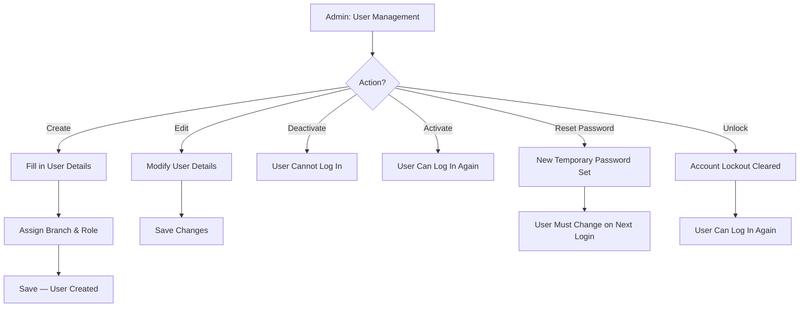

### 7.2 Role and Permission Management

Navigate to **Roles & Permissions** from the admin sidebar.

The **Permission Matrix** page displays a table showing:
- Roles as columns (Admin, Manager, User, Cashier, Compliance Auditor)
- Permissions as rows (e.g., view-users, create-users, edit-users, etc.)
- Checkboxes indicating which roles have which permissions

> **Note:** Permission names use hyphens (e.g., `view-users`, not `view users`). This is a system convention.

**To modify permissions:**
1. Check or uncheck the permission checkbox for the desired role.
2. Changes are saved when you click **Save** or may auto-save depending on the configuration.

> **Warning:** Be careful when changing permissions for the Admin role. Removing critical permissions could lock you out of management features.

### 7.3 System Settings

Navigate to **Settings** from the admin sidebar. Settings are organized into three sections:

**Session & Token Management:**

| Setting | Description | Default |
|---------|-------------|---------|
| Inactivity Timeout (minutes) | How long before inactive users are auto-logged out | 10 min |
| Token Expiration (minutes) | How long login tokens remain valid | 30 min |
| Account Lockout Duration (minutes) | How long a locked account stays locked | 30 min |

**Password & Authentication:**

| Setting | Description | Default |
|---------|-------------|---------|
| Enable Password Expiration | Toggle password expiry on/off | Off |
| Password Expiry Period (days) | Days before a password must be changed | 90 days |
| Max Login Attempts | Failed attempts before lockout | 5 |
| Require Two-Factor Authentication | Force all users to set up 2FA | Off |

**System Configuration:**

| Setting | Description | Default |
|---------|-------------|---------|
| Audit Log Retention (days) | How long logs are kept (BSP minimum: 365) | 365 days |
| Timezone | System timezone for timestamps | Asia/Manila |
| Currency Code | Default currency | PHP |
| Notification Email | Email for system alerts | — |
| Maintenance Mode | Lock out all non-admin users | Off |

**To change settings:**
1. Modify the value in the field.
2. Click **Save Settings**.
3. A success message will confirm the update.

### 7.4 Audit Logs

Navigate to **Audit Logs** from the admin sidebar.

The audit log page displays a chronological list of all system events:

- **Date & Time** — When the action occurred
- **User** — Who performed the action
- **Action** — What was done (created, updated, deleted, logged in, etc.)
- **Subject** — What was affected (user, customer, document, etc.)
- **Details** — Specific details of the change (before and after values)
- **IP Address** — The IP address of the user

**Log Categories (tabs):**

| Category | What It Shows |
|----------|--------------|
| All Activity | Every logged event in the system |
| Login Activity | Successful logins, failed login attempts, logouts |
| Customer Records | Customer created, updated, documents uploaded/replaced |
| Staff Accounts | User created, edited, activated, deactivated, password reset |
| Security | Account lockouts, password resets, failed attempts, rate limits |
| System | Settings changes, maintenance mode, backup events |

**Filtering audit logs:**
- Filter by date range
- Filter by user
- Filter by category (using the tabs above)
- Search by keyword
- Click on any entry to view full details including before/after values

### 7.5 Data Management

Navigate to **Data Management** from the admin sidebar.

This page manages the **branch hierarchy** — how Branch Lite Units (BLUs) are assigned to their parent (mother) branches.

**How it works:**
1. **Step 1 — Select Parent Branch**: Choose a main branch (branches without "BLU" in their name, excluding Head Office). For example: Main Office, Jasaan, Salay, CDO, Maramag.
2. **Step 2 — Assign Branch Lite Units**: Select which BLU branches belong to the chosen parent. For example, assign "Gingoog BLU" and "Camiguin BLU" under the Jasaan branch.
3. The current hierarchy is displayed, showing each parent branch with its assigned child branches.

**Why this matters:** Managers of parent branches can view customer data from both their own branch and their assigned Branch Lite Units. This allows branch oversight without requiring separate logins.

### 7.6 User Lifecycle Flow

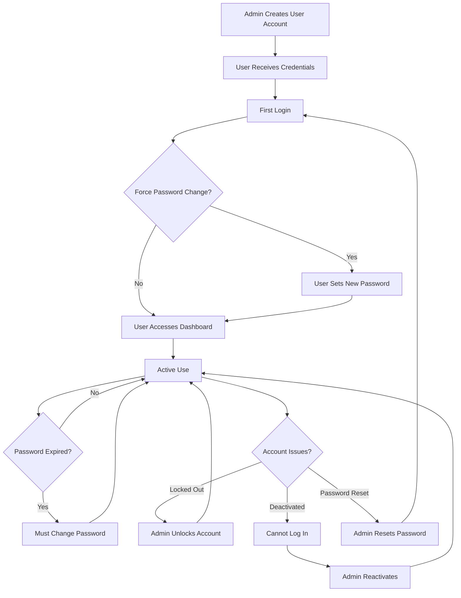

---

## 8. Security Features

SigCard implements multiple layers of security as required by BSP Circular 951 and 982.

### 8.1 Two-Factor Authentication (2FA)

When 2FA is enabled for your account:

1. After entering your email and password, you will be asked for a **6-digit verification code**.
2. Open your authenticator app (e.g., Google Authenticator, Microsoft Authenticator).
3. Enter the code shown in the app.
4. If the code is valid, you are logged in.

> **Note:** 2FA is disabled by default for all accounts. The admin can enable the "Require Two-Factor Authentication" setting to enforce it system-wide.

### 8.2 Account Lockout

To prevent unauthorized access through guessing:

- After **5 failed login attempts** (default), your account is **locked for 30 minutes**.
- During lockout, you cannot log in even with the correct password.
- An admin can **unlock** your account immediately from User Management.
- All lockout events are recorded in the audit log.

### 8.3 Password Expiry

When enabled by the admin:

- Passwords expire after a configured number of days (default: **90 days**).
- When your password expires, you will be prompted to create a new one at your next login.
- You cannot access the system until you set a new password.
- This feature is **disabled by default** and must be turned on in System Settings.

### 8.4 Session Management

- **Maximum concurrent sessions**: You can be logged in on up to **3 devices** simultaneously. If you exceed this limit, you will need to log out from another device first.
- **Inactivity timeout**: Sessions expire after **10 minutes** of inactivity (configurable by admin).
- **Token auto-refresh**: While you are actively using the system, your session token is automatically refreshed every 20 minutes, so you do not get logged out during active work.

### 8.5 Risk-Based Authentication

The system evaluates login attempts based on:
- IP address patterns
- Device and browser information (user agent)
- Login timing and frequency

Unusual activity may trigger additional verification steps or be flagged in the audit log.

### 8.6 Security Flow

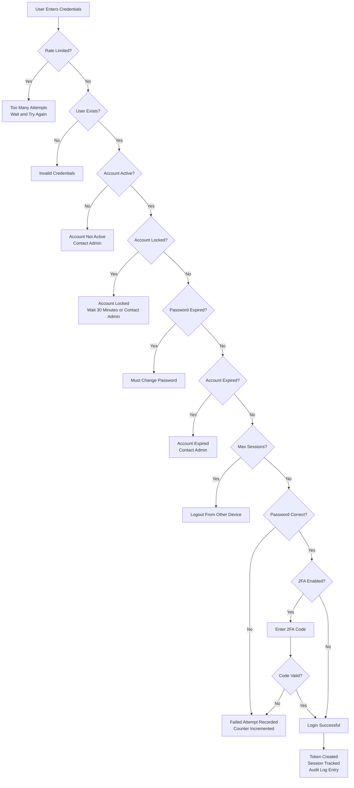

---

## 9. Compliance and Audit

### 9.1 What Gets Logged

SigCard uses **Spatie Activity Log** to record every meaningful action. The following events are captured:

| Category | Events Logged |
|----------|--------------|
| **Authentication** | Successful login, failed login, logout, 2FA attempts, account lockout |
| **User Management** | User created, updated, activated, deactivated, password reset, role changed |
| **Customer Records** | Customer created, updated, documents uploaded, documents replaced |
| **Documents** | Document uploaded, replaced, viewed, deleted |
| **System Settings** | Any setting changed (before and after values) |
| **Security Events** | Rate limit exceeded, account locked, concurrent session blocked |

Each log entry records:
- **Who** — The user who performed the action
- **What** — The action taken and the subject
- **When** — Timestamp of the action
- **Where** — IP address and user agent
- **Before/After** — For updates, the previous and new values

### 9.2 Viewing Audit Trails

**Admins** access audit logs via **Audit Logs** in the sidebar.
**Compliance Auditors** access audit logs via **Audit Logs** in the top navigation.

Both views provide the same data with filtering capabilities:
1. Select a date range.
2. Filter by user, action type, or subject.
3. Use the search bar for specific keywords.
4. Click on an entry to view full details including before/after values.

### 9.3 BSP Compliance Features

| BSP Requirement | SigCard Implementation |
|----------------|----------------------|
| Multi-Factor Authentication (Circular 982) | Optional 2FA with authenticator apps |
| Account Lockout Policy | Auto-lock after 5 failed attempts (configurable) |
| Password Complexity | Minimum 8 characters with mixed case, numbers, and symbols |
| Password Rotation | Configurable password expiry (default 90 days, off by default) |
| Session Management | Configurable inactivity timeout, concurrent session limits |
| Audit Trail | Complete activity logging with Spatie Activity Log |
| Data Privacy | Signed consent forms digitally stored with customer records |
| Record Retention | Configurable audit log retention (minimum 365 days per BSP) |
| Access Control | Role-based access with granular permissions |
| Risk Assessment | Customer risk level classification (Low, Medium, High) |

---

## 10. Account Types Reference

### 10.1 Regular Account

A standard individual account — one person, one or more accounts.

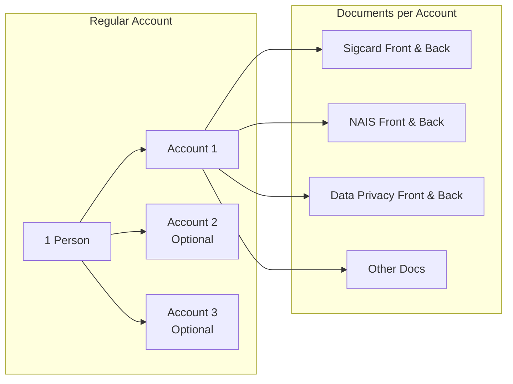

**Key Points:**
- One customer with their personal information
- One or more account numbers
- Documents are **per account** — each account has its own set
- You can add additional accounts later

### 10.2 Joint Account — ITF (In Trust For)

Two or more persons sharing one account. All documents are shared among all persons.

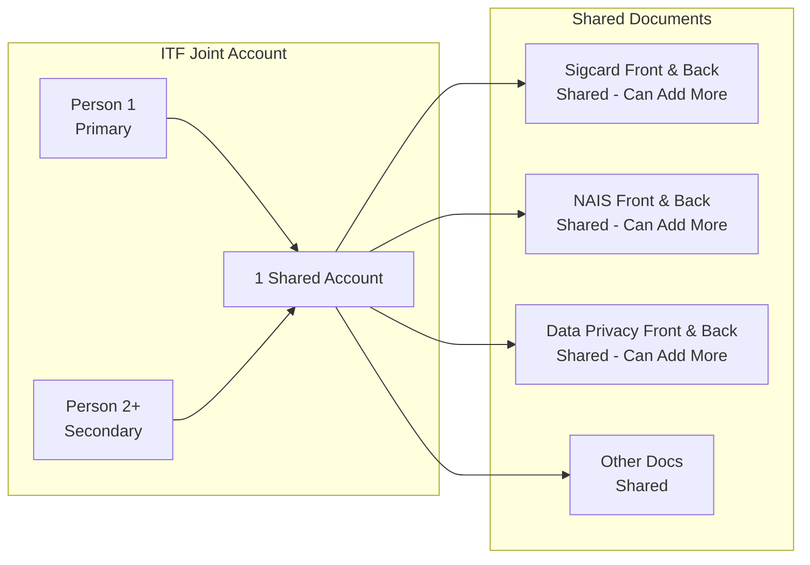

**Key Points:**
- Two or more persons (minimum 2)
- **One shared account** — no "Add Account" option
- All documents are **shared** — one set applies to all persons
- You can add multiple sets of documents using **"Add Another"** buttons
- Documents are sent with person_index=1 (primary person)

### 10.3 Joint Account — Non-ITF

One customer with one or more accounts. Some documents are per-person, others are per-account.

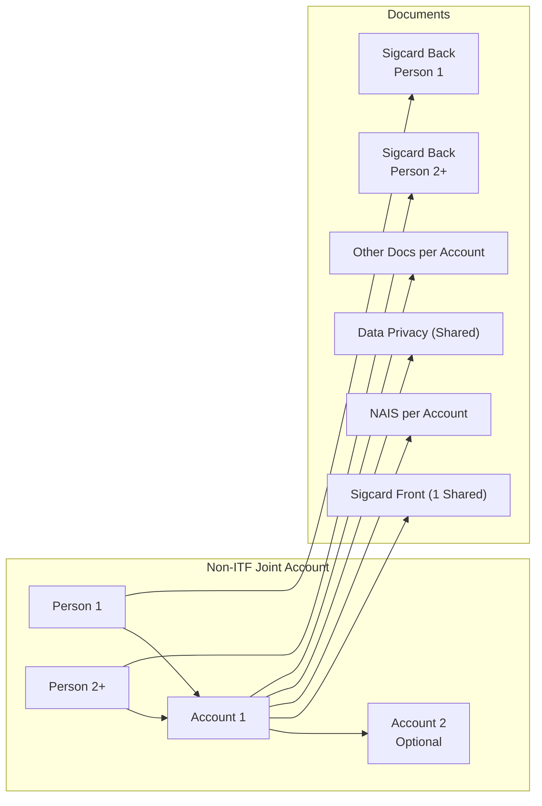

**Key Points:**
- Two or more persons (minimum 2)
- One or more accounts (can add more)
- **Sigcard Front**: ONE shared front — regardless of number of persons
- **Sigcard Back**: One per person — the count matches the number of persons
- **NAIS**: Per account (like Regular)
- **Data Privacy**: Shared among all persons (not per-account)
- **Other Docs**: Per account (like Regular)

### 10.4 Corporate Account

A business or organization account with authorized signatories.

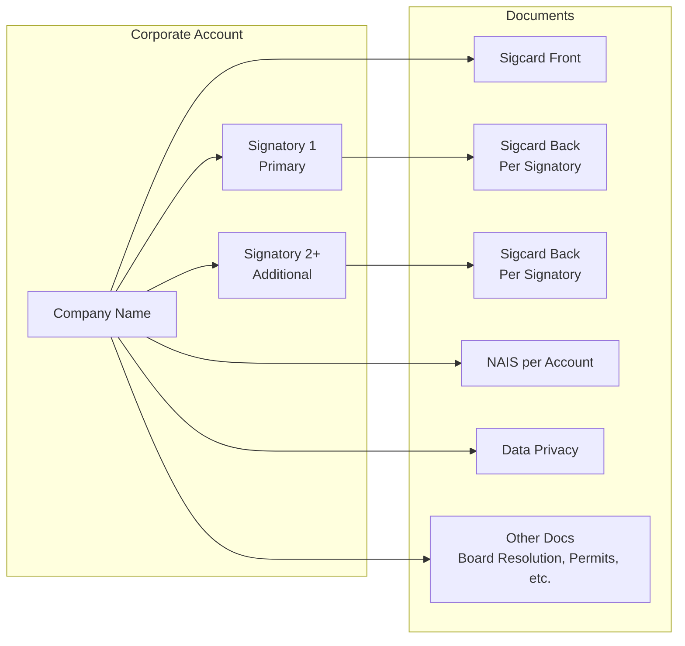

**Key Points:**
- Uses **Company Name** instead of personal name
- Two or more authorized signatories (persons)
- One sigcard front, one sigcard back per signatory
- Other documents may include board resolutions, business permits, SEC/DTI registration

### 10.5 Document Requirements Comparison

| Document | Regular | Joint ITF | Joint Non-ITF | Corporate |
|----------|---------|-----------|---------------|-----------|
| **Sigcard Front** | 1 per account | Shared (can add more) | 1 shared | 1 |
| **Sigcard Back** | 1 per account | Shared (can add more) | 1 per person | 1 per signatory |
| **NAIS Front** | 1 per account | Shared (can add more) | 1 per account | 1 per account |
| **NAIS Back** | 1 per account | Shared (can add more) | 1 per account | 1 per account |
| **Data Privacy Front** | 1 per account | Shared (can add more) | Shared | 1 |
| **Data Privacy Back** | 1 per account | Shared (can add more) | Shared | 1 |
| **Other Docs** | Per account | Shared | Per account | Per account |
| **Persons** | 1 | 2+ | 2+ | 2+ signatories |
| **Accounts** | 1+ | 1 only | 1+ | 1+ |

---

## 11. Troubleshooting and FAQ

### Common Issues

**"Account is temporarily locked. Try again later."**
- **Cause:** You (or someone) entered the wrong password too many times (default: 5 attempts).
- **Solution:** Wait 30 minutes for the lockout to expire, or contact your Admin to unlock your account immediately.

**"Password has expired. Please reset your password."**
- **Cause:** Password expiry is enabled and your password is older than the configured period.
- **Solution:** Follow the on-screen prompts to create a new password that meets the requirements.

**"Account is not active. Contact administrator."**
- **Cause:** Your account has been deactivated by an administrator.
- **Solution:** Contact your Admin or branch manager to have your account reactivated.

**"Maximum concurrent sessions reached."**
- **Cause:** You are already logged in on 3 devices.
- **Solution:** Log out from one of your other devices (or close the browser on those devices) and try again.

**I was suddenly logged out.**
- **Cause:** This is likely the inactivity timeout (default: 10 minutes without mouse/keyboard activity) or token expiration.
- **Solution:** Log in again. Save your work frequently to prevent data loss.

**Image upload fails or shows an error.**
- **Cause:** The file may be too large (over 10 MB), in an unsupported format, or the internet connection may be unstable.
- **Solution:** Ensure the image is JPG or PNG and under 10 MB. Try again with a stable connection.

**I cannot see certain menu items.**
- **Cause:** Your role does not have permission to access those pages. Each role sees only the features assigned to it.
- **Solution:** If you need access to additional features, ask your Admin to review your role and permissions.

**The page is not loading or looks broken.**
- **Cause:** Browser cache issue, slow internet, or a temporary system error.
- **Solution:** Try refreshing the page (Ctrl+F5 or Cmd+Shift+R). Clear your browser cache. Try a different browser.

### Who to Contact

| Issue | Contact |
|-------|---------|
| Cannot log in or account locked | Your branch's System Administrator |
| Need a different role or permissions | System Administrator |
| System errors or bugs | IT Department / System Administrator |
| Questions about BSP compliance | Compliance Officer |
| Document or customer data questions | Branch Manager |

---

## 12. Glossary

| Term | Definition |
|------|-----------|
| **2FA** | Two-Factor Authentication — a security process requiring two forms of identification to log in |
| **AML** | Anti-Money Laundering — regulations to prevent financial crimes |
| **Audit Log** | A chronological record of all actions performed in the system |
| **BLU** | Branch Lite Unit — a smaller satellite branch office |
| **BSP** | Bangko Sentral ng Pilipinas — the central bank of the Philippines |
| **Corporate Account** | A bank account opened in the name of a business or organization |
| **Dormant Account** | An account with no customer-initiated activity for a specified period |
| **EDD** | Enhanced Due Diligence — additional investigation for high-risk customers |
| **Escheat** | The process of turning over dormant accounts to the government after a statutory period |
| **ITF** | In Trust For — a type of joint account where a trustor holds funds for a beneficiary |
| **Joint Account** | A bank account shared by two or more individuals |
| **KYC** | Know Your Customer — the process of verifying the identity of bank customers |
| **NAIS** | New Account Information Sheet — a form completed when opening a new bank account |
| **Non-ITF** | A joint account type where multiple persons share accounts without a trust arrangement |
| **OTP** | One-Time Password — a temporary code used for two-factor authentication |
| **RBAC** | Role-Based Access Control — a system where access is determined by user roles |
| **Regular Account** | A standard individual bank account |
| **Risk Level** | A classification (Low, Medium, High) indicating the level of risk associated with a customer |
| **Sanctum** | Laravel Sanctum — the authentication system used by SigCard |
| **Session** | A period of activity between logging in and logging out |
| **Sigcard** | Signature Card — a physical card containing a customer's specimen signature |
| **Token** | A digital key that authenticates your session with the server |

---

*This manual is maintained by the IT Department of RBT Bank Inc. For questions or updates, contact the System Administrator.*

*Document Version: 1.0 — March 2026*
