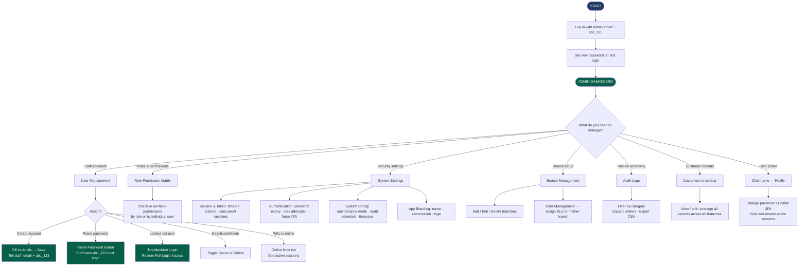

# DIGICUR — User Manual
## For: IT Administrator
### Digital Signature Card Management System · RBT Bank Inc.

---

> **Your role in the system:** As the IT Administrator, you have the highest level of access in DIGICUR. You manage staff accounts, control who can do what through roles and permissions, configure system-wide security settings, manage branches, and review audit logs. You are responsible for keeping the system properly set up and compliant with BSP security requirements.

---

## Table of Contents

1. [First Login & Setting Your Password](#1-first-login--setting-your-password)
2. [Two-Factor Authentication (2FA)](#2-two-factor-authentication-2fa)
3. [Admin Dashboard](#3-admin-dashboard)
4. [Sidebar Navigation — Where Everything Is](#4-sidebar-navigation--where-everything-is)
5. [User Management — Managing Staff Accounts](#5-user-management--managing-staff-accounts)
6. [Role & Permission Matrix](#6-role--permission-matrix)
7. [System Settings](#7-system-settings)
8. [Branch Management](#8-branch-management)
9. [Data Management — Branch Hierarchy](#9-data-management--branch-hierarchy)
10. [Audit Logs](#10-audit-logs)
11. [Customer Records (Admin Access)](#11-customer-records-admin-access)
12. [Your Profile Page](#12-your-profile-page)
13. [Common IT Tasks & How To Do Them](#13-common-it-tasks--how-to-do-them)
14. [Flowchart — Admin Workflow (Diagram)](#14-flowchart--admin-workflow-diagram)

---

## 1. First Login & Setting Your Password

Your admin account is set up during initial system installation. Log in with the admin email and the temporary password.

### Steps:
1. Open a web browser (Chrome, Edge, or Firefox).
2. Go to the DIGICUR system URL.
3. Type your **admin email address** and the **temporary password:** `abc_123`
4. Click **Sign in**.

A **Password Change Required** screen appears. You must set a new password before continuing.

- **Temporary Password:** `abc_123`
- **New Password:** choose a strong password
- **Confirm New Password:** type it again

**Password requirements:** Minimum 6 characters, with uppercase, lowercase, a number, and a special character.

Click **Set New Password** — you will be taken to the Admin Dashboard.

> For security, never use the temporary password as your permanent password. Use a unique, strong password.

---

## 2. Two-Factor Authentication (2FA)

It is strongly recommended that the admin account use 2FA. See Section 12 (Your Profile Page) to set it up.

**Login with 2FA active:**
1. After your password, open your authenticator app (**Google Authenticator** or **Authy**) and find RBT Bank / DIGICUR.
2. Enter the 6-digit code (refreshes every 30 seconds).
3. Click **Verify Code**.

You can also enforce 2FA for all staff bank-wide through System Settings (see Section 7).

---

## 3. Admin Dashboard

After logging in, you see the **Admin Dashboard** with a summary of system-wide activity.

| Tile | What it shows |
|---|---|
| Total Customers | All customers enrolled in DIGICUR |
| Signature Card Uploads | Total signature card files in the system |
| Total Documents | All document files stored |
| Today's Uploads | New enrollments done today |

All tiles link to the Customer Profiles list.

---

## 4. Sidebar Navigation — Where Everything Is

The left sidebar is your main navigation. It shows all available admin sections:

| Section | What it manages |
|---|---|
| **Dashboard** | System-wide overview |
| **User Management** | Create and manage staff accounts |
| **Role Permission Matrix** | Control what each role can do |
| **Audit Logs** | View all system activity by all users |
| **System Settings** | Configure security, sessions, branding |
| **Branch Management** | Create and edit bank branches |
| **Data Management** | Set up branch hierarchy (mother/child branches) |
| **Customers** | View all customer records system-wide |
| **Upload Sigcard** | Enroll a new customer (same as other roles) |
| **Status Tracking** | Bank-wide account status analytics |
| **Documents** | Browse all uploaded documents |

The sidebar collapses on smaller screens — look for the menu icon (☰) if it is hidden.

---

## 5. User Management — Managing Staff Accounts

Go to **User Management** in the sidebar to create, edit, and manage all staff accounts.

### The User List

The **All Users** tab shows every staff account with these columns:
- Name, Email, Role, Branch, Status
- Security indicators: 2FA status, currently online indicator, number of active sessions
- Joined date and last login date and IP
- Action buttons

### Creating a New User

Click the **Create User** button at the top right:

| Field | What to enter |
|---|---|
| First Name | Staff member's first name |
| Last Name | Staff member's last name |
| Username | A unique username (no spaces) |
| Email | Staff member's email (this is their login username) |
| Branch | Assign to a branch from the dropdown |
| Status | Active or Inactive |
| Account Expires At | Optional — set an expiry date for temporary staff |
| Role | Select: admin, manager, user, cashier, compliance-audit |
| Two-Factor Authentication | Toggle on or off |

Click **Save** — the account is created with the temporary password `abc_123`. The staff member will be required to change it on their first login.

> Always inform new staff of their email address and the temporary password: **abc_123**

### Editing a User

Click the **Edit** button next to any user to modify their name, email, branch, status, role, account expiry, or 2FA setting.

### Resetting a Password

Click **Reset Password** to immediately set a user's password back to `abc_123`. The system will force the user to change it at their next login.

Use this when a staff member forgets their password and cannot log in.

### Troubleshoot Login

If a staff member says they cannot log in, click **Troubleshoot Login** next to their account. This opens a detailed panel showing:

| Item | What it means |
|---|---|
| Failed login attempts | How many wrong passwords were entered |
| Lockout status | Whether the account is temporarily locked |
| Active sessions | Which browsers/devices are logged in, with IP addresses and expiry times |
| Force Password Change flag | Is the user required to change their password? |
| Password Expiry | Is the password expired? |
| Account Expiry | Has the account passed its expiry date? |
| Account Status | Is the account Active or Inactive? |
| 2FA Status | Is 2FA set up? |

**Quick-fix buttons:**
- **Restore Full Login Access** — one button that clears lockout, failed attempts, and all blocks at once
- **Unlock** — clears the account lockout only
- **Revoke Sessions** — logs the user out of all active devices
- **Clear Force Password Change** — removes the forced password change requirement
- **Reset 2FA** — removes 2FA from the account (user will need to set it up again)

### Activating / Deactivating a User

Click **Toggle Status** to switch a user between Active and Inactive. Inactive users cannot log in.

### Deleting a User

Click **Delete** to permanently remove a user account. This action cannot be undone — use it only when a staff member has left the bank and their account is no longer needed.

### Online Now Tab

Click the **Online Now** tab to see which staff members are currently logged in, along with their branch, IP address, and session start time. You can force-logout any active session from this view.

### Exporting User List

Click **Export CSV** to download the full list of user accounts to a spreadsheet.

---

## 6. Role & Permission Matrix

Go to **Role Permission Matrix** in the sidebar to control exactly what each role can do in the system.

### Role Matrix Tab

Roles are shown as columns. Permissions are shown as rows, grouped by category:

| Category | Examples of permissions |
|---|---|
| User Management | view-users, create-users, edit-users, delete-users |
| Role Management | manage-roles |
| Customer Management | view-customers, create-customers, edit-customers |
| Audit | view-audit-logs |
| Compliance | view-reports |
| Reporting | generate-reports |
| System Admin | manage-settings, manage-branches |
| Authentication | manage-2fa |
| Branch Operations | view-branch-data |

Each cell in the matrix is a **checkbox**:
- Checked = this role has this permission
- Unchecked = this role does not have this permission

Click a checkbox to toggle it. Changes are saved in real time.

Click a **group header** (e.g., "Customer Management") to select or deselect all permissions in that category for all roles at once.

### User Permissions Tab

Search for a specific staff member to see their individual permission breakdown:

- **Blue rows:** permissions inherited from their role
- **Green rows:** permissions granted directly to this individual (overrides)
- **Red rows:** permissions blocked for this individual

Use **Grant All** or **Revoke All** buttons to quickly set or clear all permissions for that user.

---

## 7. System Settings

Go to **System Settings** in the sidebar. All settings here are marked with a BSP Compliance badge where relevant.

Settings are organized into four tabs:

### Session & Token Tab

| Setting | What it controls |
|---|---|
| Inactivity Timeout | How long a user can be idle before being automatically logged out (5–480 minutes) |
| Token Expiration | How long login tokens are valid (5–1,440 minutes) |
| Account Lockout Duration | How long an account stays locked after too many wrong passwords (seconds or minutes) |
| Concurrent Session Limit | How many devices one user can be logged in on at the same time (0 = unlimited) |

### Authentication Tab

| Setting | What it controls |
|---|---|
| Password Expiration | Enable or disable password expiry bank-wide |
| Password Expiry Period | How many days until passwords expire (30–365 days) — shown only if Password Expiration is on |
| Max Login Attempts | How many wrong password attempts before an account is locked (0 = no limit) |
| Require 2FA System-Wide | Force all users to set up Two-Factor Authentication to log in |

### System Config Tab

| Setting | What it controls |
|---|---|
| Audit Log Retention | How many days audit logs are kept before being cleared (90–2,555 days) |
| System Timezone | The timezone used for all timestamps |
| Currency Code | Display currency (e.g., PHP) |
| Notification Email | Email address that receives system alerts |
| Maintenance Mode | Put the system in maintenance mode so only admins can log in |

> **Maintenance Mode warning:** When turned on, all other users will see a maintenance screen and cannot access the system. A confirmation dialog will appear before this is activated.

### App Branding Tab

| Setting | What it controls |
|---|---|
| App Name | The full display name of the system (e.g., "Digital Signature Card Management System") |
| App Abbreviation | Short code shown in the header and login page (e.g., "DIGICUR") |
| App Logo | Upload a custom logo — appears on the login screen, navigation, and error pages |

Changes to the app name and logo take effect immediately across all screens for all users.

---

## 8. Branch Management

Go to **Branch Management** in the sidebar to create and manage bank branches.

### Summary stats at the top:
- Total Branches, Mother Branches, Total Employees, Total Customers

### Two view modes:

**Hierarchy view** (default):
- Shows mother branches as expandable cards
- Each card lists the branch's employees (name, role, data access scope, status) and child BLU branches underneath it
- Click the expand arrow on a mother branch to see its details

**List view:**
- A flat table of all branches with columns: Name, Code, Type (Mother or BLU), Employees, Status
- Edit and Delete buttons per row

### Creating a branch:
Click **Add Branch** and fill in:
- **Branch Name** — full name (e.g., "Claveria Branch")
- **BRAK** — the branch abbreviation code (e.g., "Claveria-BLU")
- **Branch Code** — numeric code (e.g., "10")
- **Parent Branch** — select a mother branch if this is a BLU (child) branch

### Editing a branch:
Click **Edit** next to any branch to update its name, code, or parent branch assignment.

### Deleting a branch:
Click **Delete** to remove a branch. Branches with active users or customers cannot be deleted.

---

## 9. Data Management — Branch Hierarchy

Go to **Data Management** to set up or change the parent-child relationships between branches (which BLU branches belong to which mother branch).

This is a two-step wizard:

**Step 1:** Select a mother branch from the list of non-BLU branches.

**Step 2:** Use the checkboxes to assign child BLU branches to that mother branch.

Click **Save** to confirm. The hierarchy summary shows the current assignment: Mother Branch → child BLUs listed below it.

---

## 10. Audit Logs

Go to **Audit Logs** to review everything that has happened in the system.

### Filtering by category (click the stat cards at the top):
- All Activity
- Login Activity — sign-ins, failures, lockouts
- Customer Records — enrollments, status changes, document uploads
- Staff Accounts — user created, password reset, 2FA changes
- Security — lockouts, suspicious logins
- System — settings changes, maintenance events

### Each log entry shows:
- Staff member name and photo
- Color-coded action badge (e.g., "Signed In", "Customer Created", "Document Replaced", "Settings Updated")
- Plain-English description of what happened
- Timestamp (relative and absolute)
- IP address

**Click any entry to expand it** and see the full details:
- Exact field changes (before → after)
- For documents: side-by-side old vs. new comparison
- For status changes: a visual of the transition
- Browser, device, and IP of the action

**Export Audit Logs:** Click the export button to download the full log as a CSV file for BSP submission or external review.

---

## 11. Customer Records (Admin Access)

The Admin has the same access to customer records as all other roles, with full read and write capability across all branches.

Go to **Customers** in the sidebar to search, view, edit, and manage customer records. These work the same way as described in the New Account Staff manual, with the addition that you can see all branches, not just one.

---

## 12. Your Profile Page

Click your **name or photo** in the top navigation bar or sidebar footer:

- **View your info:** Name, email, branch, role, last login.
- **Change password:** Change Password → fill in fields → save.
- **Enable 2FA:** Enable → scan QR code → enter code → confirm.
- **Disable 2FA:** Disable → enter password and code → confirm.
- **Active sessions:** View all devices currently logged in with your account; revoke individual sessions or all sessions at once.

---

## 13. Common IT Tasks & How To Do Them

### A staff member forgot their password
Go to **User Management** → find the user → click **Reset Password**.
Their password is reset to `abc_123`. Tell them their temporary password and that they will be required to change it on next login.

### A staff member is locked out
Go to **User Management** → find the user → click **Troubleshoot Login** → click **Restore Full Login Access**.
This clears the lockout, failed attempts, and any other login blocks in one action.

### A new staff member needs an account
Go to **User Management** → click **Create User** → fill in all details → click Save.
Inform the staff member of their email address and the temporary password: `abc_123`.

### A staff member left the bank
Go to **User Management** → find the user → click **Toggle Status** to deactivate the account (or **Delete** to permanently remove it).

### Force all staff to use 2FA
Go to **System Settings** → **Authentication** tab → turn on **Require Two-Factor Authentication** → Save.
All staff will be prompted to set up 2FA on their next login.

### Change how long before users are auto-logged out
Go to **System Settings** → **Session & Token** tab → change **Inactivity Timeout** → Save.

### Put the system in maintenance mode
Go to **System Settings** → **System Config** tab → toggle **Maintenance Mode** → confirm in the dialog.
Only admins will be able to log in while maintenance mode is active.

### Add a new branch
Go to **Branch Management** → click **Add Branch** → fill in name, code, and abbreviation → Save.

### Assign a BLU branch to a mother branch
Go to **Data Management** → select the mother branch → check the BLU branches → Save.

### Update the system logo or name
Go to **System Settings** → **App Branding** tab → upload the new logo or change the name → Save.

---

## 14. Flowchart — Admin Workflow (Diagram)

---

## Quick Reference

| Task | How to get there |
|---|---|
| Create new user account | Sidebar → User Management → Create User |
| Reset a user's password | User Management → Reset Password |
| Unlock a locked account | User Management → Troubleshoot Login → Restore Full Login Access |
| See who is online | User Management → Online Now tab |
| Change role permissions | Sidebar → Role Permission Matrix |
| Change inactivity timeout | Sidebar → System Settings → Session & Token tab |
| Force 2FA for all staff | System Settings → Authentication → Require 2FA |
| Add a new branch | Sidebar → Branch Management → Add Branch |
| Set branch hierarchy | Sidebar → Data Management |
| Review all system activity | Sidebar → Audit Logs |
| Update system logo or name | System Settings → App Branding tab |
| Change your own password | Your name → Profile → Change Password |
| Log out | Your name → Log Out |

---

*DIGICUR v1.0 · May 2026 · RBT Bank Inc. — Rural Bank of Talisayan, Misamis Oriental*
