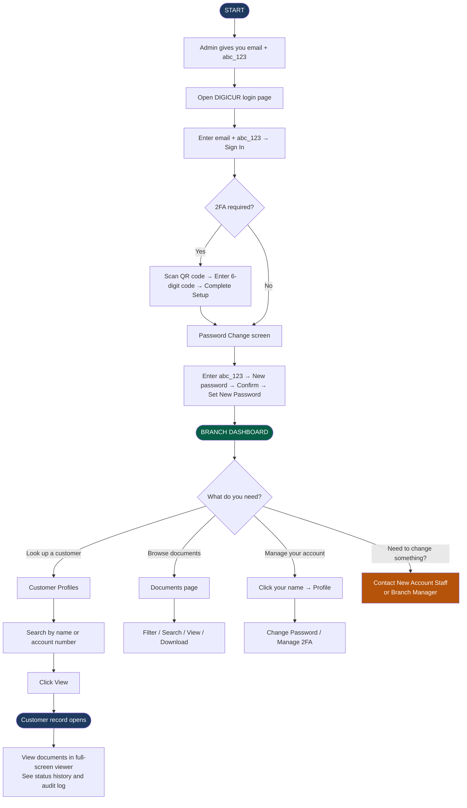

# DIGICUR — User Manual
## For: Cashiers
### Digital Signature Card Management System · RBT Bank Inc.

---

> **Your role in the system:** As a Cashier, you have read-only access to customer records at your branch. You can look up any customer's signature card and documents, and browse branch-level document files. You cannot upload new customers or change account information — those actions are done by New Account Staff or the Branch Manager.

---

## Table of Contents

1. [First Login & Setting Your Password](#1-first-login--setting-your-password)
2. [Two-Factor Authentication (2FA)](#2-two-factor-authentication-2fa)
3. [Your Branch Dashboard](#3-your-branch-dashboard)
4. [Navigation Bar — Where Everything Is](#4-navigation-bar--where-everything-is)
5. [Looking Up a Customer](#5-looking-up-a-customer)
6. [Viewing a Customer's Documents](#6-viewing-a-customers-documents)
7. [Branch Documents Page](#7-branch-documents-page)
8. [Your Profile Page](#8-your-profile-page)
9. [Common Problems & What To Do](#9-common-problems--what-to-do)
10. [Flowchart — Cashier Workflow (Diagram)](#10-flowchart--cashier-workflow-diagram)

---

## 1. First Login & Setting Your Password

The IT Administrator will create your account and give you an email address. That email is your username to log in.

### Steps:
1. Open a web browser (Chrome, Edge, or Firefox).
2. Go to the DIGICUR address provided by your branch.
3. Type your **email address**.
4. Type the **temporary password:** `abc_123`
5. Click **Sign in**.

A **Password Change Required** screen will appear right away. You must complete this before you can use the system.

### Setting your new password:
- In **Temporary Password**, type: `abc_123`
- In **New Password**, choose your own password.
- In **Confirm New Password**, type it again.

**Password requirements:** At least 6 characters, with at least one uppercase letter, one lowercase letter, one number, and one special character (e.g., `!`, `@`, `_`).

Example: `Cashier@2025`

Click **Set New Password** — you will be taken to your dashboard.

> Never share your password. Contact your branch admin if you need it reset.

---

## 2. Two-Factor Authentication (2FA)

If your branch requires 2FA, you will need a 6-digit code from an authenticator app (**Google Authenticator** or **Authy**) after typing your password.

**First-time setup** (if required):
1. A QR code appears on screen.
2. Open your authenticator app, tap **+**, and scan the QR code.
3. Type the 6-digit code shown in the app.
4. Click **Complete Setup & Sign In**.

**Every login after setup:**
1. After your password, open your authenticator app and find RBT Bank / DIGICUR.
2. Type the 6-digit code (changes every 30 seconds).
3. Click **Verify Code**.

---

## 3. Your Branch Dashboard

After logging in, you land on the **Branch Dashboard** — a summary of your branch's customer records.

| Section | What it shows |
|---|---|
| Total Customers | Number of customers enrolled at your branch |
| Total Documents | Number of document files saved |
| Today's Uploads | New enrollments done today |
| Branch Users | Staff accounts at your branch |
| Monthly Upload Chart | How many customers were enrolled each month |
| Account Type Chart | Regular vs Joint vs Corporate accounts |
| Risk Level Breakdown | Low, Medium, and High Risk account counts |
| Status Breakdown | Active, Dormant, Escheat, Closed account counts |

---

## 4. Navigation Bar — Where Everything Is

The dark bar at the top of every screen:

| Link | What it opens |
|---|---|
| **Home** | Your branch dashboard |
| **Customer Profiles** | Look up any customer at your branch |
| **Documents** | Browse all document files uploaded at your branch |
| **Your name/photo** | Your profile, password settings, and 2FA |

> As a Cashier, you do **not** have access to Upload Sigcard or Status Tracking. If you need to enroll a customer or change an account status, please ask New Account Staff or your Branch Manager.

---

## 5. Looking Up a Customer

Click **Customer Profiles** in the navigation bar.

**How to search:**
- Type a name or account number in the search box and press Enter.
- Filter by: account status (Active, Dormant, etc.), account type (Regular, Joint, Corporate), or risk level.
- All results shown belong to your branch.

**What each row shows:**
- Customer name and account type badge
- Account number
- Status badge (green = Active, yellow = Dormant, red = Closed, etc.)
- Risk level
- Date enrolled
- A **View** button to open the full record

> There is also a fingerprint search button on the search bar. If the customer's signature card image has a visible thumbmark, this can be used to search by fingerprint. It may not always find a match.

---

## 6. Viewing a Customer's Documents

Click **View** on any customer to open their complete record.

**What you see:**

- Customer's name, status badge, account type, risk level, and branch at the top.
- **Customer Info card:** account number, date opened, account type and sub-type.
- **Account tabs** (if the customer has more than one account): click each tab to switch between accounts and see their documents.
- **Documents section — organized by type:**

| Document Type | What it is |
|---|---|
| Signature Card | The customer's signed signature card — front and back |
| NAIS Form | New Account Information Sheet — front and back (if uploaded) |
| Data Privacy Form | Customer consent form — front and back |
| Other Documents | IDs, CIFs, and any other supporting files |

- Click any image to open it in a **full-screen viewer**. You can:
  - Zoom in and out using the buttons or your mouse scroll wheel
  - Navigate between images using the left/right arrows or the thumbnail strip at the bottom
  - Close the viewer by pressing Escape or clicking the X button

- **Status Change History:** A collapsible section showing every status change, who made it, when, and what documents were on file at that time.
- **Audit History:** A log of every action taken on this customer record.

> As a Cashier, you can **view** all documents but you cannot edit, replace, or delete them.

---

## 7. Branch Documents Page

Click **Documents** in the navigation bar to browse all uploaded files for your branch.

**What you can do:**
- Filter by document type (Signature Card, NAIS, Data Privacy, Other).
- Search by customer name or account number.
- Filter by date range.
- Click **View** on any file to open it in the document viewer.
- Click **Download** to save a copy to your computer if needed.

---

## 8. Your Profile Page

Click your **name or photo** in the top-right corner of the navigation bar.

**What you can do here:**
- **View your information:** Your name, email, branch, role, and the date and time you last logged in.
- **Change your password:**
  1. Click **Change Password**.
  2. Type your current password.
  3. Type your new password (follow the requirements from Section 1).
  4. Type the new password again to confirm.
  5. Click **Update Password**.
- **Enable Two-Factor Authentication:**
  1. Click **Enable Two-Factor Authentication**.
  2. Scan the QR code with your authenticator app.
  3. Enter the 6-digit code.
  4. Click **Confirm Setup**.
- **Disable Two-Factor Authentication** (if it was previously enabled):
  1. Click **Disable Two-Factor Authentication**.
  2. Enter your password and the current 6-digit code from your app.
  3. Click **Confirm Disable**.

---

## 9. Common Problems & What To Do

| Problem | What to do |
|---|---|
| Wrong password too many times | Wait for the countdown timer to reach zero, then try again |
| Cannot find a customer | Try searching by account number; clear all filters; ask New Account Staff if the customer is enrolled |
| The images on a customer's profile are blurry | The account is marked Dormant — click the image to view it clearly in the full-screen viewer |
| Session timed out and you were logged out | Log in again; this happens automatically after a period of inactivity to protect customer data |
| You need to change a customer's information or status | You do not have this access — please ask New Account Staff or your Branch Manager |
| You need to upload a new customer | You do not have this access — please ask New Account Staff or your Branch Manager |
| Forgot your password | Ask your IT Administrator to reset it |

---

## 10. Flowchart — Cashier Workflow (Diagram)

---

## Quick Reference

| Task | How to get there |
|---|---|
| Look up a customer | Navigation → Customer Profiles → search |
| View customer documents | Customer Profiles → View |
| Open an image full-screen | Click the document image |
| Browse all branch documents | Navigation → Documents |
| Change your password | Your name → Profile → Change Password |
| Enable or disable 2FA | Your name → Profile → 2FA section |
| Log out | Your name → Log Out |
| Enroll a new customer | Not available — ask New Account Staff |
| Change an account status | Not available — ask New Account Staff |

---

*DIGICUR v1.0 · May 2026 · RBT Bank Inc. — Rural Bank of Talisayan, Misamis Oriental*
