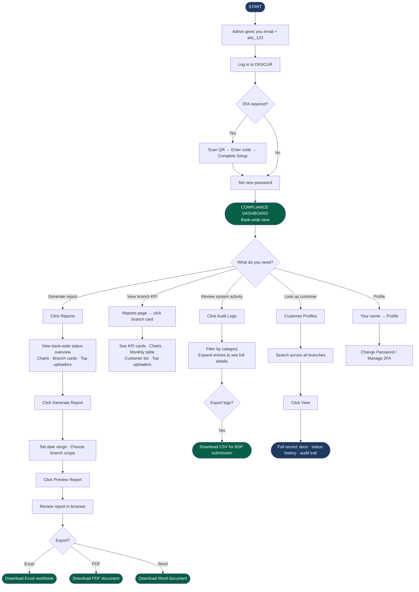

# DIGICUR — User Manual
## For: Compliance Officers · Auditors
### Digital Customer Record System · RBT Bank Inc.

---

> **Your role in the system:** Compliance Officers and Auditors have bank-wide read access — you can see records across all branches, not just one. Your main tools are the **Reports** page (for generating and exporting account activity reports) and the **Audit Logs** page (for reviewing every action taken by all staff). You can also look up individual customer records and browse branch documents for verification purposes.

---

## Table of Contents

1. [First Login & Setting Your Password](#1-first-login--setting-your-password)
2. [Two-Factor Authentication (2FA)](#2-two-factor-authentication-2fa)
3. [Your Dashboard](#3-your-dashboard)
4. [Navigation Bar — Where Everything Is](#4-navigation-bar--where-everything-is)
5. [Account Monitoring Reports](#5-account-monitoring-reports)
6. [Generating a Custom Report](#6-generating-a-custom-report)
7. [Report Preview & Exporting](#7-report-preview--exporting)
8. [Branch KPI Detail](#8-branch-kpi-detail)
9. [Audit Logs — Reviewing All System Activity](#9-audit-logs--reviewing-all-system-activity)
10. [Viewing Customer Records](#10-viewing-customer-records)
11. [Branch Documents Page](#11-branch-documents-page)
12. [Your Profile Page](#12-your-profile-page)
13. [Common Problems & What To Do](#13-common-problems--what-to-do)
14. [Flowchart — Compliance / Audit Workflow (Diagram)](#14-flowchart--compliance--audit-workflow-diagram)

---

## 1. First Login & Setting Your Password

The IT Administrator will create your account and provide your email address. Use that email to log in.

### Steps:
1. Open a web browser (Chrome, Edge, or Firefox).
2. Go to the DIGICUR address for your bank.
3. Type your **email address** and the **temporary password:** `abc_123`
4. Click **Sign in**.

A **Password Change Required** screen appears immediately.

- **Temporary Password:** type `abc_123`
- **New Password:** choose your own secure password
- **Confirm New Password:** type it again

**Password requirements:** At least 6 characters including uppercase, lowercase, a number, and a special character (e.g., `!`, `@`, `_`).

Click **Set New Password** to continue.

> Contact your IT admin if you forget your password.

---

## 2. Two-Factor Authentication (2FA)

If 2FA is required, you will enter a 6-digit code from **Google Authenticator** or **Authy** after your password.

**First-time setup:**
1. A QR code appears — open your authenticator app, tap **+**, and scan it.
2. Enter the 6-digit code shown.
3. Click **Complete Setup & Sign In**.

**Every login after setup:**
1. Open your authenticator app, find RBT Bank / DIGICUR.
2. Enter the 6-digit code (refreshes every 30 seconds).
3. Click **Verify Code**.

---

## 3. Your Dashboard

After logging in, you see the **Compliance/Audit Dashboard** — a bank-wide summary (not limited to one branch).

| Section | What it shows |
|---|---|
| Total Customers | All customers across all branches of RBT Bank |
| Signature Card Uploads | Total signature card files stored system-wide |
| Total Documents | All document files in the system |
| Today's Uploads | New enrollments done today, bank-wide |

The subtitle reads: *"RBT Bank Inc. — BSP-compliant oversight, all branches"*

Click any tile to navigate to the customer list for further review.

---

## 4. Navigation Bar — Where Everything Is

| Link | What it opens |
|---|---|
| **Home** | Your bank-wide dashboard |
| **Customer Profiles** | Browse all customers across all branches |
| **Documents** | Browse uploaded documents |
| **Reports** | Account Monitoring Reports with charts and export tools |
| **Audit Logs** | Full system activity log of everything done by all staff |
| **Your name/photo** | Your profile and security settings |

---

## 5. Account Monitoring Reports

Click **Reports** in the navigation bar. This is your main tool for BSP account monitoring compliance.

### What you see on the Reports page:

**Customer Status Overview** (stat cards at the top):
- Total Accounts (all branches)
- Active accounts with percentage
- Dormant accounts with percentage
- Closed accounts with percentage
- Escheated accounts with percentage
- Reactivated accounts with percentage

Click any stat card to filter the view to that status group.

**This Month banner** — a highlighted section showing what happened in the current calendar month:
- Accounts Opened
- Became Dormant
- Became Closed
- Became Escheated
- Reactivated

**Charts:**
- **Monthly Activity bar chart** — last 12 months, showing opens, dormant, closed, escheat, and reactivated side by side for each month
- **Status Distribution doughnut chart** — visual breakdown of all accounts by current status
- **Yearly Activity bar chart** — last 5 years of activity at a glance

**Top Uploaders** — ranked list of staff who uploaded the most customer records, with medal icons for the top 3.

**Status Breakdown progress bars** — horizontal bars showing each status count and percentage of total.

**Branch Overview grid** — one card per branch showing:
- Branch name and code
- Total accounts at that branch
- Mini status bars for Active, Dormant, Closed, Escheat, and Reactivated with percentages
- "New accounts opened this month" count
- Click any branch card to open the **Branch KPI Detail** page

---

## 6. Generating a Custom Report

Click the **Generate Report** button on the Reports page to create a report for a specific time period or branch.

A dialog box opens with these options:

| Option | What to fill in |
|---|---|
| Date From | Start date of the reporting period |
| Date To | End date of the reporting period |
| Branch Scope | Choose "All Branches (excluding Head Office)" or "Specific Branch" |
| Specific Branch | Select from a dropdown list (only shown if you chose Specific Branch above) |

Click **Preview Report** to view the generated report. Click **Cancel** to close without generating.

---

## 7. Report Preview & Exporting

After clicking Preview Report, a full report opens in the browser. This report is ready to be exported.

### What the report contains:

**Header section:**
- Report title: "Customer Account Activity Report"
- Reporting period and branch scope
- Generation date and time

**Event Summary cards:**
- Total events in the period
- Opened accounts (count and percentage)
- Became Dormant (count and percentage)
- Became Closed (count and percentage)
- Reactivated (count and percentage)
- Escheated (count and percentage)

**Breakdowns:**
- By Account Type (Regular, Joint, Corporate) — bar charts with counts
- By Risk Level (Low, Medium, High) — bar charts with counts

**Account Events by Status** (expandable sections):
Each event type (Opened, Dormant, Closed, Reactivated, Escheat) has its own section. Click the section heading to expand it and see the full table of accounts.

**Each account table shows:**
- Account number
- Customer full name
- Account type
- Current status
- Date opened
- Event date (when this status event occurred)
- Branch
- Risk level
- Uploaded by (which staff member)

### Exporting the report:

Click one of the export buttons in the top-right corner:

| Export Format | What you get |
|---|---|
| **Excel** | Multi-sheet workbook — one Summary sheet + one sheet per status type, with full customer lists and RBT Bank branding |
| **PDF** | Multi-page document — cover page with summary cards, breakdown tables, then one page per status event with full customer table. Includes page numbers and confidentiality footer. |
| **Word** | Formatted document with cover section, event summary, breakdown tables, and one section per event type — ready to print or share |

---

## 8. Branch KPI Detail

Click any branch card on the Reports page (or go to **Reports → [branch name]**) to open that branch's Key Performance Indicator report.

### What you see:

**KPI Cards (7 cards):**
- Total Accounts
- Active (with percentage of total)
- Dormant (with percentage)
- Closed (with percentage)
- Escheated (with percentage)
- Opened This Month
- Reactivated (with percentage)

**Charts:**
- Monthly Activity bar chart for the last 12 months
- Status Split doughnut chart

**Monthly Status Count table:** 12 rows (one per month) showing how many accounts opened, became dormant, closed, escheated, or reactivated each month.

**Top Uploaders in this Branch:** Ranked list of staff who uploaded the most records, with medal icons for the top 3.

**Customer List:** All customers at this branch with search, status filter tabs, and a table showing:
- Name / Account number
- Account type
- Status badge
- Date opened
- Uploaded by
- View link to open the customer's full record

---

## 9. Audit Logs — Reviewing All System Activity

Click **Audit Logs** in the navigation bar to see a complete record of every action taken by all staff across all branches.

### What you see:

**Activity Categories** (stat cards at top — click to filter):
- All Activity
- Login Activity (sign-ins, failed attempts, lockouts)
- Customer Records (enrollments, edits, status changes)
- Staff Accounts (user created, password reset, 2FA changes)
- Security (lockouts, suspicious activity)
- System (settings changes, maintenance mode, etc.)

**Each log entry shows:**
- Staff member's name and photo
- Action badge (color-coded): e.g., "Signed In", "Login Failed", "Customer Created", "Document Uploaded", "Account Locked", "Password Changed", "Status Changed"
- A plain-English description of what happened
- What it affected (customer record, staff account, document, etc.)
- Timestamp (e.g., "3 minutes ago" with exact date and time on hover)
- IP address of the device used

**Click any log entry to expand it** and see full details:
- What changed (before and after values for each field)
- For documents: a side-by-side comparison of old vs. new versions
- For status changes: a visual showing the transition (e.g., Active → Dormant)
- Who, when, and from where (browser, IP)

**Exporting audit logs:**
Click **Export Audit Logs** to download the full log as a CSV file for further analysis or BSP submission.

---

## 10. Viewing Customer Records

Click **Customer Profiles** to browse all customers across all branches.

**Searching:**
- Type a name or account number in the search box.
- Filter by account type, status, risk level, or **branch** (since you have access to all branches).

**Viewing a customer:**
Click **View** on any customer to open their full profile, which shows:
- All account details and sub-type information
- Complete document set: Signature Card, NAIS Form, Data Privacy Form, Other Documents
- Status Change History — full timeline with documents uploaded at each change
- Audit History — every action taken on this record

You can open any document in the full-screen viewer to zoom in and inspect signatures and form details.

> As a Compliance/Audit officer, you can view all records but cannot make changes to customer data or documents.

---

## 11. Branch Documents Page

Click **Documents** to browse uploaded files:

- Filter by document type, customer name, date range.
- View any document in the full-screen viewer.
- Download files as needed for external review.

---

## 12. Your Profile Page

Click your **name or photo** in the top-right corner:

- **View your info:** Name, email, branch, role, last login.
- **Change password:** Change Password → fill in current and new password → Update Password.
- **Enable 2FA:** Enable → scan QR code → enter code → Confirm Setup.
- **Disable 2FA:** Disable → enter password and code → Confirm Disable.

---

## 13. Common Problems & What To Do

| Problem | What to do |
|---|---|
| Report shows no data | Check that the date range is correct and the branch selection matches what you intended |
| Cannot find a specific customer | Make sure no branch filter is limiting the results; search by account number |
| PDF or Excel export is slow | Large reports with many accounts take a moment — wait for the progress indicator to finish |
| Session timed out | Log in again; the system logs out automatically after inactivity to protect data |
| Forgot your password | Contact your IT Administrator to reset it |
| Need to correct customer data | You cannot edit records — report the issue to the Branch Manager or New Account Staff |

---

## 14. Flowchart — Compliance / Audit Workflow (Diagram)

---

## Quick Reference

| Task | How to get there |
|---|---|
| Bank-wide account summary | Home dashboard |
| Generate account monitoring report | Navigation → Reports → Generate Report |
| Export report to PDF / Excel / Word | Reports → Preview Report → export buttons |
| View branch KPI | Reports page → click a branch card |
| Review all system activity | Navigation → Audit Logs |
| Export audit logs | Audit Logs → Export Audit Logs |
| Look up any customer | Navigation → Customer Profiles |
| View customer documents | Customer Profiles → View |
| Browse documents | Navigation → Documents |
| Change password | Your name → Profile → Change Password |
| Log out | Your name → Log Out |

---

*DIGICUR v1.0 · May 2026 · RBT Bank Inc. — Rural Bank of Talisayan, Misamis Oriental*
