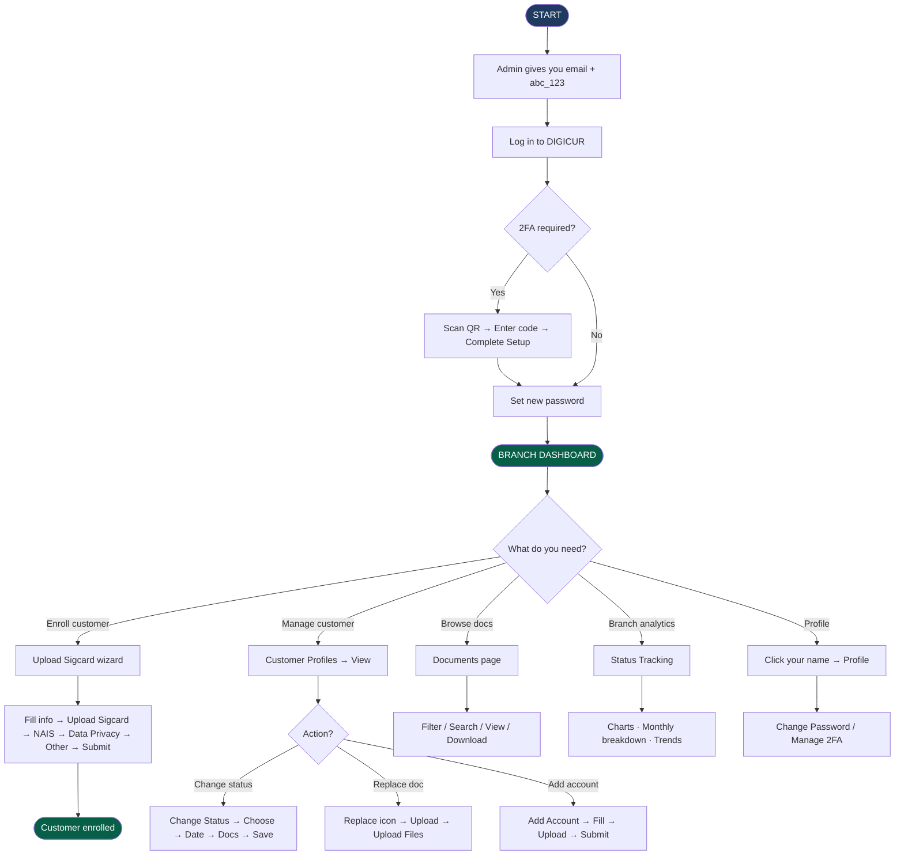

# DIGICUR — User Manual
## For: Branch Managers
### Digital Customer Record System · RBT Bank Inc.

---

> **Your role in the system:** As Branch Manager, you have the widest access among branch-level staff. You can see your branch's complete customer records, upload new customers, manage documents, change account statuses, and monitor branch performance through charts and analytics. Your access is limited to your assigned branch only.

---

## Table of Contents

1. [First Login & Setting Your Password](#1-first-login--setting-your-password)
2. [Two-Factor Authentication (2FA)](#2-two-factor-authentication-2fa)
3. [Your Branch Dashboard](#3-your-branch-dashboard)
4. [Navigation Bar — Where Everything Is](#4-navigation-bar--where-everything-is)
5. [Customer Profiles — Your Branch's Records](#5-customer-profiles--your-branchs-records)
6. [Viewing a Customer's Full Record](#6-viewing-a-customers-full-record)
7. [Enrolling a New Customer](#7-enrolling-a-new-customer)
8. [Changing an Account Status](#8-changing-an-account-status)
9. [Replacing or Adding Documents](#9-replacing-or-adding-documents)
10. [Adding Another Account](#10-adding-another-account)
11. [Branch Documents Page](#11-branch-documents-page)
12. [Status Tracking — Branch Analytics](#12-status-tracking--branch-analytics)
13. [Your Profile Page](#13-your-profile-page)
14. [Common Problems & What To Do](#14-common-problems--what-to-do)
15. [Flowchart — Manager Workflow (Diagram)](#15-flowchart--manager-workflow-diagram)

---

## 1. First Login & Setting Your Password

The IT Administrator creates your account and gives you an email address. That email is your username.

### Steps:
1. Open a web browser (Chrome, Edge, or Firefox).
2. Go to the DIGICUR address provided by your branch.
3. Type your **email address** and the **temporary password:** `abc_123`
4. Click **Sign in**.

A **Password Change Required** screen appears immediately. You cannot skip it.

- In **Temporary Password**, type: `abc_123`
- In **New Password**, type your chosen password.
- In **Confirm New Password**, type it again.

**Password requirements:** Minimum 6 characters, including uppercase, lowercase, a number, and a special character (e.g., `!`, `@`, `_`).

Click **Set New Password** to proceed to your dashboard.

> If you forget your password later, ask your IT admin to reset it.

---

## 2. Two-Factor Authentication (2FA)

If 2FA is required, you will be prompted after your password to enter a 6-digit code from an authenticator app (**Google Authenticator** or **Authy**).

**First-time setup:**
1. A QR code appears — open your authenticator app, tap **+**, and scan it.
2. Type the 6-digit code displayed in the app.
3. Click **Complete Setup & Sign In**.

**Every login after setup:**
1. After your password, open your authenticator app and find RBT Bank / DIGICUR.
2. Type the current 6-digit code (changes every 30 seconds).
3. Click **Verify Code**.

---

## 3. Your Branch Dashboard

After logging in, you arrive at the **Branch Dashboard** — a real-time summary of your branch's records.

| Section | What it shows |
|---|---|
| Total Customers | All customers enrolled at your branch |
| Total Documents | All document files saved for your branch |
| Today's Uploads | New customers enrolled today |
| Branch Users | Staff accounts at your branch |
| Monthly Upload Chart | Bar chart of enrollment activity by month |
| Account Type Chart | Breakdown of Regular, Joint, and Corporate accounts |
| Risk Level Breakdown | Low, Medium, and High Risk account counts |
| Status Breakdown | Active, Dormant, Escheat, Closed, and Reactivated counts |

Click any card to drill down into detailed monthly data.

---

## 4. Navigation Bar — Where Everything Is

The navigation bar appears at the top of every screen:

| Link | What it opens |
|---|---|
| **Home** | Your branch dashboard |
| **Upload Sigcard** | Enroll a new customer |
| **Customer Profiles** | View and manage all customer records in your branch |
| **Documents** | Browse all uploaded documents at your branch |
| **Status Tracking** | Branch-wide account status analytics |
| **Your name/photo** | Your profile, password settings, and 2FA |

---

## 5. Customer Profiles — Your Branch's Records

Click **Customer Profiles** to see and manage all customers in your branch.

**Searching and filtering:**
- Type a name or account number in the search box.
- Filter by: account type (Regular, Joint, Corporate), account status, or risk level.
- All results shown belong to your branch only.

**What each row shows:**
Name, account type, account number, status badge (color-coded), risk level, date enrolled, enrolled by (which staff), and action buttons.

**Action buttons:**
- **View** — Open the full customer record
- **Edit** — Go to the document edit screen (if you have permission)
- **Add Account** — Add a new account to this customer

---

## 6. Viewing a Customer's Full Record

Click **View** on any customer to open their complete profile.

**What you see:**
- Customer name, status badge, account type, risk level, and branch at the top.
- All account details: account number, date opened, account type and sub-type.
- **Account tabs** (if customer has multiple accounts) — click each tab to switch between accounts.
- **Documents section:** Signature Card (front/back), NAIS Form, Data Privacy Form, and Other Documents.
  - Click any image to open it in a full-screen viewer with zoom and navigation controls.
- **Status Change History:** A timeline showing every status change, who made it, when, and what documents were uploaded.
- **Audit History:** Every action ever taken on this record.

**Available actions:**

| Button | What it does |
|---|---|
| Edit Info | Update customer name, photo, or account details |
| Change Status | Move account to Active, Dormant, Reactivated, Escheat, or Closed |
| Add Account | Open a new account for this customer |
| Replace (on image) | Swap a document for a newer version |

---

## 7. Enrolling a New Customer

Click **Upload Sigcard** in the navigation bar to register a new customer.

**Have these ready:**
- Signature Card — front and back (required)
- NAIS Form — New Account Information Sheet — front and back (optional but recommended)
- Data Privacy Form — front and back (required)
- Other supporting documents — IDs, CIFs, etc. (optional)

You go through a wizard with one step per screen:

| Step | What to do |
|---|---|
| 1 — Customer Info | Fill in name, account type, risk level, status (usually Active), account number, date opened, branch |
| 2 — Signature Card | Upload front AND back — both required |
| 3 — NAIS Form | Upload front and back — optional, click Next to skip |
| 4 — Data Privacy | Upload front AND back — required |
| 5 — Other Docs | Upload any additional files — optional |
| Submit | Click Submit and wait for the confirmation message |

For **Joint accounts**, fill in each holder's name and upload shared or per-holder documents depending on the sub-type (ITF or Non-ITF).

For **Corporate accounts**, enter the company name and each signatory's name, then upload one Sigcard front and back per signatory.

---

## 8. Changing an Account Status

Account statuses and their meanings:

| Status | Meaning |
|---|---|
| Active | Open and operating normally |
| Dormant | No activity for a long time — BSP rules apply |
| Reactivated | A previously dormant account made active again |
| Escheat | Long-dormant; funds transferred to BSP as required by law |
| Closed | Permanently closed |

**Steps:**
1. Open the customer's profile.
2. Click **Change Status**.
3. Choose the new status.
4. Set the **effective date** (when the change actually took place).
5. Select and upload any documents required for this change (updated Sigcard, NAIS, Data Privacy, or other).
6. Click **Upload & Save**.

All previous documents are archived in the Status Change History — nothing is ever erased, keeping the bank BSP-compliant.

---

## 9. Replacing or Adding Documents

**To replace a document:**
1. Open the customer's profile.
2. Click the **Replace** icon on the image.
3. Upload the new file and click **Upload Files**.

The old file moves to the history archive automatically.

**To add more files:**
1. In the **Other Documents** section, click **Add Documents**.
2. Select the files you want to add.
3. Click **Upload Files**.

---

## 10. Adding Another Account

A regular customer can have more than one account (e.g., savings + time deposit).

1. Open the customer's profile.
2. Click **Add Account**.
3. Fill in the new account details (account number, risk level, status, date opened).
4. Upload the documents for the new account.
5. Click **Submit**.

A new tab appears on the customer's profile for the second account.

---

## 11. Branch Documents Page

Click **Documents** in the navigation bar to browse all files uploaded at your branch.

**What you can do:**
- Filter by document type (Signature Card, NAIS, Data Privacy, Other).
- Search by customer name or account number.
- Filter by date range or the staff member who uploaded the file.
- Click **View** to open any document in the viewer.
- Click **Download** to save a copy locally.

---

## 12. Status Tracking — Branch Analytics

Click **Status Tracking** for in-depth analytics on your branch's accounts:

- Donut charts showing the breakdown by account status and account type.
- Risk level distribution (Low, Medium, High).
- Monthly bar chart for the last 12 months — click any bar to see that month's detail.
- Trend arrows showing changes compared to the previous month.

This is useful for preparing branch reports and keeping track of dormant account trends.

---

## 13. Your Profile Page

Click your **name or photo** in the top-right corner:

- **View your info:** Name, email, branch, role, last login date and IP.
- **Change password:** Click Change Password → fill in current and new password → save.
- **Enable 2FA:** Click Enable → scan QR code with authenticator app → enter 6-digit code → confirm.
- **Disable 2FA:** Click Disable → enter password and 6-digit code → confirm.

---

## 14. Common Problems & What To Do

| Problem | What to do |
|---|---|
| Wrong password too many times | Wait for the countdown, then try again |
| Next button is grayed out | Check all required fields and that both sides of required documents are uploaded |
| Uploaded wrong image (not submitted yet) | Click the image in the upload box to replace it |
| Uploaded wrong image (already submitted) | Go to the customer's profile and click Replace |
| Cannot find a customer | Try account number search; clear all filters; check if the customer is enrolled |
| Session timed out | Log in again; click Submit before stepping away from your workstation |
| Images appear blurry on a customer | The account is Dormant — click the image to view it clearly |

---

## 15. Flowchart — Manager Workflow (Diagram)

---

## Quick Reference

| Task | How to get there |
|---|---|
| Enroll new customer | Navigation → Upload Sigcard |
| Browse customers | Navigation → Customer Profiles |
| View customer documents | Customer Profiles → View |
| Change account status | Customer Profile → Change Status |
| Replace a document | Customer Profile → Replace icon |
| Add another account | Customer Profile → Add Account |
| Browse branch documents | Navigation → Documents |
| Branch analytics | Navigation → Status Tracking |
| Change password | Your name → Profile → Change Password |
| Log out | Your name → Log Out |

---

*DIGICUR v1.0 · May 2026 · RBT Bank Inc. — Rural Bank of Talisayan, Misamis Oriental*
