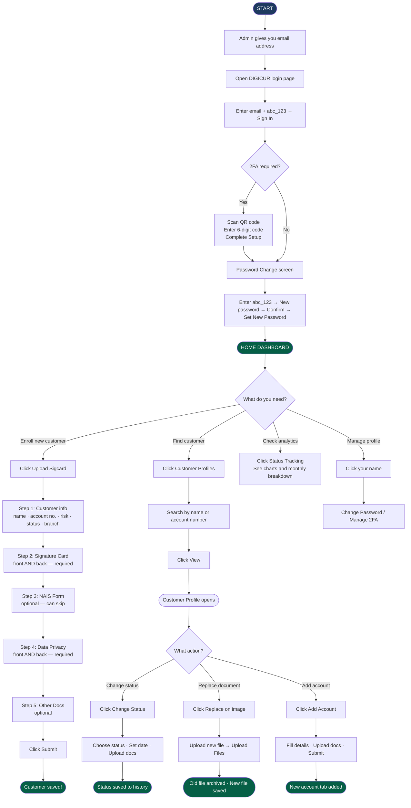

# DIGICUR — User Manual
## For: New Account Staff · Customer Associates
### Digital Customer Record System · RBT Bank Inc.

---

> **Your role in the system:** You are responsible for enrolling new customers, uploading all their required documents (signature card, NAIS form, Data Privacy form, and other supporting papers), and keeping customer records up to date when account statuses change.

---

## Table of Contents

1. [First Login & Setting Your Password](#1-first-login--setting-your-password)
2. [Two-Factor Authentication (2FA)](#2-two-factor-authentication-2fa)
3. [Your Home Dashboard](#3-your-home-dashboard)
4. [Navigation Bar — Where Everything Is](#4-navigation-bar--where-everything-is)
5. [Enrolling a New Customer](#5-enrolling-a-new-customer)
6. [Looking Up a Customer](#6-looking-up-a-customer)
7. [Viewing a Customer's Full Record](#7-viewing-a-customers-full-record)
8. [Changing an Account Status](#8-changing-an-account-status)
9. [Replacing or Adding Documents](#9-replacing-or-adding-documents)
10. [Adding Another Account to an Existing Customer](#10-adding-another-account-to-an-existing-customer)
11. [Status Tracking Page](#11-status-tracking-page)
12. [Your Profile Page](#12-your-profile-page)
13. [Common Problems & What To Do](#13-common-problems--what-to-do)
14. [Flowchart — Your Workflow (Text)](#14-flowchart--your-workflow-text)
15. [Flowchart — Your Workflow (Diagram)](#15-flowchart--your-workflow-diagram)

---

## 1. First Login & Setting Your Password

Your IT admin will create your account and give you an email address. Use that email to log in.

### Steps:
1. Open a web browser (Chrome, Edge, or Firefox).
2. Go to the DIGICUR address your branch provided.
3. Type your **email address**.
4. Type the **temporary password:** `abc_123`
5. Click **Sign in**.

The system will immediately show a **Password Change Required** screen. You must complete this before anything else.

### Setting your new password:
- In the **Temporary Password** box, type: `abc_123`
- In **New Password**, type your chosen password.
- In **Confirm New Password**, type it again.

**Password requirements:** At least 6 characters including one uppercase letter, one lowercase letter, one number, and one special character (e.g., `!`, `@`, `_`).

Example of a valid password: `RbtBank@2025`

Click **Set New Password** — you will be taken straight to your dashboard.

> Do not share your password with anyone. Ask your admin to reset it if you forget it.

---

## 2. Two-Factor Authentication (2FA)

Some accounts require an extra security step called 2FA. After your password, you also type a 6-digit code from an authenticator app on your phone.

### If required on first login:
1. A QR code appears on screen.
2. Open **Google Authenticator** or **Authy** on your phone.
3. Tap **+** and scan the QR code.
4. Type the 6-digit number shown in the app.
5. Click **Complete Setup & Sign In**.

### On regular logins after setup:
1. Type your email and password as usual.
2. A code entry screen appears.
3. Open your authenticator app, find RBT Bank / DIGICUR.
4. Type the 6-digit code (it changes every 30 seconds).
5. Click **Verify Code**.

---

## 3. Your Home Dashboard

After logging in, you land on your **Home Dashboard** — a summary of your branch's customer records.

| Card / Section | What it shows |
|---|---|
| Total Customers | Total number of customers enrolled at your branch |
| Total Accounts | Total number of accounts across all customers |
| Uploads This Month | How many customers were enrolled this month |
| Documents Saved | Total document files stored |
| Status Breakdown | Count of Active, Dormant, Escheat, and Closed accounts |
| Risk Level Breakdown | Count of Low, Medium, and High Risk accounts |
| Upload Trend Chart | Month-by-month graph of new enrollments |
| Account Type Chart | Donut chart: Regular vs Joint vs Corporate |
| Recent Activity | The most recently updated customer records |
| Quick Actions | Shortcut buttons for the most common tasks |

Click any stat card to see a detailed monthly breakdown on the right side of the screen.

---

## 4. Navigation Bar — Where Everything Is

The dark bar at the top of every screen has these links:

| Link | What it opens |
|---|---|
| **Home** | Your dashboard |
| **Upload Sigcard** | Start enrolling a new customer |
| **Customer Profiles** | Search and browse all customer records |
| **Status Tracking** | Monthly account status analytics |
| **Your name/photo** | Your profile, password, and 2FA settings |

---

## 5. Enrolling a New Customer

Click **Upload Sigcard** to start. You will go through a step-by-step process (one screen per step). A progress bar at the top shows where you are.

**Have these ready before starting:**
- Photo or scan of the customer's **Signature Card** (front and back) — required
- Photo or scan of the **NAIS Form** — New Account Information Sheet (front and back) — optional but recommended
- Photo or scan of the **Data Privacy Form** (front and back) — required
- Any **other documents** (IDs, CIFs, etc.) — optional

### Account Types

**Regular (Individual) Account:**

| Step | What to fill in |
|---|---|
| 1 — Customer Info | First name, middle name, last name, suffix, account type (Regular), risk level, account status (usually Active), account number, date opened, branch |
| 2 — Signature Card | Upload front AND back — both required |
| 3 — NAIS Form | Upload front and back — optional, click Next to skip |
| 4 — Data Privacy | Upload front AND back — required |
| 5 — Other Docs | Upload any extra files — optional |
| 6 — Submit | Click Submit, wait for the progress bar to finish |

**Joint Account (two or more holders):**

Choose a sub-type:
- **ITF (In Trust For):** One set of shared documents covers all holders.
- **Non-ITF:** Each holder has their own Sigcard back and NAIS; the Sigcard front and Data Privacy form are shared.

Fill in each holder's name, then upload documents following the same steps. The system clearly labels which upload box belongs to which holder (e.g., "Sigcard Back — Holder 2").

**Corporate Account (business):**

Choose a sub-type:
- **Standard:** Multiple signatories (authorized signers). Upload one Sigcard front per signatory and one back per signatory.
- **Sole Proprietorship:** One owner. One Sigcard front and back, one Data Privacy form.

Fill in the company name and signatory names, then upload documents for each person.

---

## 6. Looking Up a Customer

Click **Customer Profiles** in the navigation bar.

- **Search box:** Type a name or account number and press Enter.
- **Filters:** Narrow results by account type, status, or risk level.
- Each row shows: name, account type badge, account number, status (color-coded), risk level, branch, date enrolled.
- Click **View** to open the full customer record.

> There is also a fingerprint button on the search bar. It searches by thumbmark on the signature card image — only works when the thumbmark is clearly visible in the uploaded photo.

---

## 7. Viewing a Customer's Full Record

After clicking **View**, you see the customer's complete profile:

- **Top:** Name, status badge (color-coded), account type, risk level, branch.
- **Customer Info card:** Account number, date opened, sub-type (e.g., ITF, Sole Proprietorship).
- **Account Tabs** (for customers with multiple accounts): Click each tab to see that account's documents.
- **Documents section:** Signature Card, NAIS Form, Data Privacy Form, and Other Documents — all organized by type.
  - Click any image to open it full-screen with zoom and navigation arrows.
- **Status Change History:** A collapsible timeline of every status change, who made it, and what documents were uploaded at that time.
- **Audit History:** Every action ever taken on this record (created, edited, documents replaced, etc.).

### Buttons on the profile:

| Button | What it does |
|---|---|
| Edit Info | Update the customer's name, photo, or account details |
| Change Status | Move the account to Active, Dormant, Reactivated, Escheat, or Closed |
| Add Account | Open a new account for this customer |
| Replace (on image) | Swap out a document for a newer version |

---

## 8. Changing an Account Status

Account statuses and what they mean:

| Status | Meaning |
|---|---|
| **Active** | Account is open and operating normally |
| **Dormant** | No customer activity for a long time (BSP rule applies) |
| **Reactivated** | A dormant account that was made active again |
| **Escheat** | Funds transferred to BSP (long-dormant, legally required) |
| **Closed** | Account has been permanently closed |

### How to change a status:
1. Open the customer's profile.
2. Click **Change Status**.
3. Choose the new status.
4. Set the **effective date** (the date the change actually happened).
5. Choose which documents to upload along with this change:
   - **Signature Card** — updated or re-signed card
   - **NAIS Form** — updated information sheet
   - **Data Privacy Form** — re-signed consent form
   - **Other Documents** — any supporting papers
6. Upload the selected documents using the drag-and-drop boxes.
7. Click **Upload & Save**.

The old documents are automatically archived in the Status Change History — nothing is ever deleted, which keeps the bank compliant with BSP audit requirements.

> Dormant accounts show blurred images as a visual reminder. You can still click to view them in the full-screen viewer.

---

## 9. Replacing or Adding Documents

**To replace a document** (e.g., customer signed a new signature card):
1. Open the customer's profile.
2. Click the **Replace** icon on the document image.
3. An edit screen opens — click the current image or drag a new file into the box.
4. Click **Upload Files**.

The old document moves to the Status Change History archive automatically.

**To add more files** (other documents section):
1. Open the customer's profile.
2. Scroll to **Other Documents** and click **Add Documents**.
3. Pick one or more files.
4. Click **Upload Files** to save.

---

## 10. Adding Another Account to an Existing Customer

A regular customer can open more than one account (e.g., savings and time deposit).

1. Open the customer's profile.
2. Click **Add Account**.
3. Fill in the new account's details (account number, risk level, status, date opened).
4. Upload the documents for the new account.
5. Click **Submit**.

A new account tab will appear on the customer's profile for the additional account.

---

## 11. Status Tracking Page

Click **Status Tracking** in the navigation bar to see branch-wide account analytics:

- Donut charts: accounts by status and by account type
- Risk level breakdown
- Monthly bar chart for the last 12 months — click any bar to see that month's detail
- Trend arrows showing whether counts went up or down vs. the previous month

---

## 12. Your Profile Page

Click your **name or photo** in the top-right corner.

- **View your info:** Name, email, branch, role, last login date.
- **Change password:** Click Change Password, fill in current and new password, save.
- **Enable 2FA:** Click Enable, scan the QR code with your authenticator app, enter the 6-digit code, confirm.
- **Disable 2FA:** Click Disable, enter your password and the 6-digit code, confirm.

---

## 13. Common Problems & What To Do

| Problem | What to do |
|---|---|
| Wrong password too many times | Wait for the countdown timer to finish, then try again |
| "Next" button is grayed out | Check that all required fields and both sides of required documents are filled in |
| Uploaded the wrong image (not yet submitted) | Click the image in the upload box and pick the correct file |
| Uploaded the wrong image (already submitted) | Go to the customer's profile and use the Replace button |
| Cannot find the customer | Try searching by account number; clear all filters; the customer may not be enrolled yet |
| Session timed out | Log in again; unsaved work may be lost — always click Submit before stepping away |
| Customer images are blurry | The account is marked Dormant; click the image to view it clearly in the viewer |

---

## 14. Flowchart — Your Workflow (Text)

```
START — Admin creates your account and gives you an email
  |
  v
Open DIGICUR login page
  |
  v
Type email + temporary password: abc_123 → Click Sign In
  |
  +----- 2FA required? --YES--> Scan QR code → Enter 6-digit code → Complete Setup
  |
  NO
  |
  v
Password Change Required screen
  → Type abc_123 → Type new password (twice) → Click Set New Password
  |
  v
HOME DASHBOARD
  |
  +--[Enroll new customer]--> Upload Sigcard
  |                               → Fill info → Upload Sigcard → NAIS → Data Privacy → Other → Submit
  |                               → SUCCESS: customer saved
  |
  +--[Find customer]----------> Customer Profiles
  |                               → Search → Click View → Customer Profile
  |                               → Change Status / Replace Document / Add Account
  |
  +--[Check analytics]--------> Status Tracking
  |
  +--[Manage your account]----> Click your name → Profile
  |                               → Change Password / Enable or Disable 2FA
  v
Log out: Click your name → Log Out
```

---

## 15. Flowchart — Your Workflow (Diagram)



---

## Quick Reference

| Task | How to get there |
|---|---|
| Enroll new customer | Navigation → Upload Sigcard |
| Find a customer | Navigation → Customer Profiles → search |
| View customer documents | Customer Profiles → View |
| Change account status | Customer Profile → Change Status |
| Replace a document | Customer Profile → Replace icon on image |
| Add another account | Customer Profile → Add Account |
| Check analytics | Navigation → Status Tracking |
| Change password | Your name → Profile → Change Password |
| Log out | Your name → Log Out |

---

*DIGICUR v1.0 · May 2026 · RBT Bank Inc. — Rural Bank of Talisayan, Misamis Oriental*
